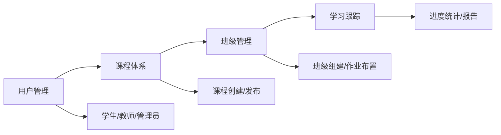

<div align="center">

  

  # 智云星课 NovaCloudEdu

  **AI 驱动的智慧教育云平台**

  [](https://openjdk.org/)
  [](https://spring.io/projects/spring-boot)
  [](https://react.dev/)
  [](https://www.typescriptlang.org/)
  [](https://flutter.dev/)
  [](https://github.com/langchain4j/langchain4j)
  [](LICENSE)

  融合多模型 AI 助手、知识库、语音交互与智能推荐，为教育场景提供全方位智能化解决方案

  [文档](#) · [快速开始](#快速开始) · [功能特性](#核心功能) · [架构设计](#架构设计) · [贡献指南](#贡献指南)

</div>

---

## 目录

- [项目简介](#项目简介)
- [技术栈](#技术栈)
- [核心功能](#核心功能)
- [项目结构](#项目结构)
- [架构设计](#架构设计)
- [快速开始](#快速开始)
- [环境配置](#环境配置)
- [开发指南](#开发指南)
- [贡献指南](#贡献指南)
- [许可证](#许可证)

---

## 项目简介

**智云星课** 是一款面向教育领域的智能化 SaaS 平台，支持多端访问（Web + 移动端），集成了课程管理、班级管理、电子书阅读、学习进度跟踪等核心教育功能，并通过 AI 智能助手、知识库和推荐系统提升学习体验。

### 产品亮点

| 特性 | 说明 |
|:---:|:---|
| AI 赋能 | 集成 Langchain4j 多模型路由，支持通义千问/GPT/DeepSeek/Moonshot/智谱/Ollama 等 |
| 多端同步 | Web 管理后台 + Flutter 移动端，数据实时同步 |
| 智能推荐 | 基于 Neo4j 知识图谱的个性化学习路径推荐 |
| 语音交互 | 集成阿里云 NLS，支持语音识别 (ASR) 与语音合成 (TTS) |
| 内容安全 | 支持书籍内容 AES 加密，守护知识产权 |

---

## 技术栈

### 前端技术

[](https://react.dev/)
[](https://www.typescriptlang.org/)
[](https://vitejs.dev/)
[](https://tailwindcss.com/)
[](https://flutter.dev/)
[](https://dart.dev/)

```
┌─────────────────────────────────────────────────────────────┐
│                         前端层                               │
├─────────────────────┬───────────────────────────────────────┤
│  Web 前端           │  移动端 (Flutter)                      │
├─────────────────────┼───────────────────────────────────────┤
│  React 19.2         │  Flutter 3.10+                        │
│  TypeScript 5.9     │  Dart 3.10+                           │
│  Vite 7.2           │  TDesign 组件库                       │
│  TailwindCSS 4.1    │  OpenAPI 代码生成                     │
│  Lucide Icons       │                                       │
└─────────────────────┴───────────────────────────────────────┘
```

### 后端技术

[](https://openjdk.org/)
[](https://spring.io/projects/spring-boot)
[](https://spring.io/projects/spring-security)
[](https://baomidou.com/)
[](https://jwt.io/)

```
┌─────────────────────────────────────────────────────────────┐
│                       后端服务层                             │
├─────────────────────────────────────────────────────────────┤
│  核心:     Java 21 + Spring Boot 3.5.8                      │
│  持久化:   MyBatis Plus 3.5.5                               │
│  安全:     Spring Security + JWT (jjwt 0.12.6)             │
│  AI:       Langchain4j 0.36.2 + 阿里云 DashScope SDK       │
├─────────────────────────────────────────────────────────────┤
│  数据存储  │  PostgreSQL (主数据库)                          │
│            │  Redis (缓存/会话)                              │
│            │  Elasticsearch (全文检索)                       │
│            │  Neo4j (知识图谱)                               │
├─────────────────────────────────────────────────────────────┤
│  外部服务  │  阿里云 OSS (对象存储)                          │
│            │  WebSocket (实时通信)                           │
└─────────────────────────────────────────────────────────────┘
```

### 数据库 & 存储

[](https://www.postgresql.org/)
[](https://redis.io/)
[](https://www.elastic.co/)
[](https://neo4j.com/)

### AI & 云服务

[](https://github.com/langchain4j/langchain4j)
[](https://docs.langchain4j.dev)
[](https://www.aliyun.com/)
[](https://www.aliyun.com/product/oss)
[](https://ai.aliyun.com/nls)
[](https://websocket.org/)
---

## 核心功能

### 教育管理



### 智能化服务

| 模块 | 功能描述 |
|:---|:---|
| **AI 智能助手** | 多模型路由对话（通义千问/GPT/DeepSeek/Moonshot/智谱/Ollama），支持文本与视觉理解 |
| **RAG 知识库** | 文档解析（PDF/EPUB/DOCX）、向量 Embedding、相似度检索 |
| **语音交互** | 阿里云 NLS 语音识别 (ASR)、语音合成 (TTS)、实时转写 |
| **推荐系统** | 基于 Neo4j 知识图谱的个性化学习推荐 |
| **智能总结** | 文档自动摘要、知识点提取、测试题生成 |
| **每日学习** | 每日单词与文章推送 |

### 内容与互动

- **电子书阅读** — 支持 PDF/EPUB/DOCX 解析，AES 内容加密，阅读进度同步
- **社区互动** — 学习圈子、帖子动态、用户关注
- **反馈系统** — 学习反馈、意见收集、持续改进
- **签到系统** — 每日签到打卡，学习习惯养成
- **课程表** — 课程排期管理
- **网页爬虫** — Selenium/HtmlUnit 爬取学习资源

---

## 项目结构

```
NovaCloudEdu/
├── 📁 backend/                 # Spring Boot 后端服务
│   ├── src/main/java/com/novacloudedu/backend/
│   │   ├── interfaces/rest/    # 接口层 (22 个 REST 模块)
│   │   ├── application/        # 应用层 (业务编排)
│   │   ├── domain/             # 领域层 (22 个领域模块)
│   │   ├── infrastructure/     # 基础设施层 (AI/OSS/Neo4j/搜索/语音/爬虫等)
│   │   ├── config/             # 配置类
│   │   ├── common/             # 通用类
│   │   └── exception/          # 异常处理
│   ├── sql/                    # 数据库 SQL 脚本 (19 个表)
│   └── pom.xml
│
├── 📁 web/                     # React Web 管理后台
│   ├── src/
│   │   ├── pages/              # 页面 (登录/注册/后台管理)
│   │   ├── components/         # 通用组件 (布局/UI)
│   │   ├── context/            # 全局状态管理
│   │   ├── api/generated/      # OpenAPI 自动生成的 API 客户端
│   │   └── data/               # 静态数据
│   └── package.json
│
├── 📁 app/                     # Flutter 移动端
│   ├── lib/
│   │   ├── features/           # 功能模块 (auth/chat/circle/course/home/profile/data)
│   │   ├── core/               # 核心 (网络/存储/主题/数据库/常量)
│   │   ├── models/             # 数据模型
│   │   ├── services/           # 服务层
│   │   ├── widgets/            # 通用组件 (按钮/卡片/对话框/输入框/Toast)
│   │   ├── routes/             # 路由配置
│   │   ├── api/generated/      # OpenAPI 自动生成的 API 客户端
│   │   └── utils/              # 工具类
│   └── pubspec.yaml
│
├── 📁 english-vocabulary/      # 英语词库资源 (初中~SAT 共 7 级别)
│   ├── json/                   # 顺序 JSON 词库
│   ├── json_original/          # 原始多版本 JSON
│   └── 乱序sql/                # SQL 导入脚本
│
├── 📄 logo.svg                 # 项目 Logo
├── 📄 README.md                # 项目文档
└── 📄 LICENSE                  # CC BY-NC-SA 4.0 许可证
```

---

## 架构设计

### DDD 四层架构

本项目采用 **领域驱动设计 (DDD)** 架构，确保业务逻辑与技术实现清晰分离。

```
┌─────────────────────────────────────────────────────────────┐
│                    Interfaces 接口层                         │
│  处理 HTTP 请求、参数校验、DTO 转换                          │
│  ┌───────────┐  ┌───────────┐  ┌───────────────────┐       │
│  │Controller │  │   DTO     │  │    Assembler      │       │
│  └─────┬─────┘  └───────────┘  └───────────────────┘       │
└────────┼────────────────────────────────────────────────────┘
         │ 调用
┌────────▼────────────────────────────────────────────────────┐
│                   Application 应用层                         │
│  业务流程编排、事务管理、权限控制                             │
│  ┌───────────────────┐  ┌───────────┐  ┌─────────────┐     │
│  │ApplicationService │  │  Command  │  │    Query    │     │
│  └─────────┬─────────┘  └───────────┘  └─────────────┘     │
└────────────┼────────────────────────────────────────────────┘
             │ 调用
┌────────────▼────────────────────────────────────────────────┐
│                      Domain 领域层                           │
│  核心业务逻辑、领域模型、业务规则（无框架依赖）                │
│  ┌──────────┐  ┌─────────────┐  ┌─────────────────────┐    │
│  │  Entity  │  │ ValueObject │  │ Repository (接口)    │    │
│  └──────────┘  └─────────────┘  └─────────────────────┘    │
└─────────────────────────────────────────────────────────────┘
             ▲ 实现
┌────────────┴────────────────────────────────────────────────┐
│                Infrastructure 基础设施层                      │
│  数据持久化、外部服务、技术支撑                               │
│  ┌──────────┐  ┌─────────────┐  ┌─────────────────────┐    │
│  │  Mapper  │  │     PO      │  │ Repository (实现)    │    │
│  └──────────┘  └─────────────┘  └─────────────────────┘    │
└─────────────────────────────────────────────────────────────┘
```

### 各层职责

| 层级 | 职责 | 依赖方向 |
|:---:|:---|:---:|
| **Interfaces** | 处理 HTTP 请求，参数校验，DTO 转换 | → Application |
| **Application** | 编排领域服务，事务管理，权限控制 | → Domain |
| **Domain** | 核心业务逻辑，领域模型，业务规则 | 无外部依赖 |
| **Infrastructure** | 数据持久化，外部服务调用，技术实现 | → Domain |

### 数据流转

```
HTTP Request
     │
     ▼
┌─────────────────┐
│   Controller    │ ←── 接收请求，参数校验
└────────┬────────┘
         │ Request DTO
         ▼
┌─────────────────┐
│   Assembler     │ ←── DTO → Command 转换
└────────┬────────┘
         │ Command
         ▼
┌─────────────────┐
│ AppService      │ ←── 编排用例流程
└────────┬────────┘
         │ 调用领域对象
         ▼
┌─────────────────┐
│ Domain Entity   │ ←── 执行业务逻辑
└────────┬────────┘
         │ Repository 接口
         ▼
┌─────────────────┐
│ RepositoryImpl  │ ←── 数据持久化
└────────┬────────┘
         │
         ▼
┌─────────────────┐
│    Database     │
└─────────────────┘
```

---

## 快速开始

### 前置要求

| 组件 | 版本要求 |
|:---:|:---|
| JDK | 21+ |
| Node.js | 18+ |
| Flutter | 3.10+ |
| PostgreSQL | 15+ |
| Redis | 7+ |
| Elasticsearch | 8+ |
| Neo4j | 5+ |

### 后端启动

```bash
# 进入后端目录
cd backend

# 复制并编辑配置文件
cp src/main/resources/application-dev.example.yml src/main/resources/application-dev.yml
# 编辑 application-dev.yml，填入数据库、Redis、Neo4j、阿里云等配置

# 初始化数据库（PostgreSQL）
psql -U postgres -d NovaCloudEdu -f sql/init.sql

# 启动服务（Maven）
mvn spring-boot:run

# 访问 Swagger API 文档
open http://localhost:8080/swagger-ui.html
```

### Web 前端启动

```bash
# 进入前端目录
cd web

# 安装依赖
npm install

# 启动开发服务器
npm run dev

# 访问应用
open http://localhost:5173
```

### 移动端启动

```bash
# 进入移动端目录
cd app

# 获取依赖
flutter pub get

# 运行应用
flutter run

# 构建发布版本
flutter build apk      # Android
flutter build ios       # iOS
```

---

## 环境配置

后端使用 Spring Profiles 管理多环境配置：

- **`application.yml`** — 公共配置（JWT、MyBatis-Plus、SpringDoc 等）
- **`application-dev.yml`** — 开发环境（从 `application-dev.example.yml` 复制）
- **`application-prod.yml`** — 生产环境

### 关键配置项

| 配置项 | 说明 |
|:---|:---|
| `spring.datasource` | PostgreSQL 数据库连接 |
| `spring.data.redis` | Redis 缓存连接 |
| `spring.neo4j` | Neo4j 知识图谱连接 |
| `aliyun.oss` | 阿里云 OSS 对象存储 |
| `aliyun.nls` | 阿里云 NLS 语音交互 (ASR/TTS) |
| `ai.dashscope` | 阿里云 DashScope 大模型 API Key |
| `ai.chat-models.providers` | Langchain4j 多模型路由（DashScope/OpenAI/DeepSeek/Moonshot/智谱/SiliconFlow/Ollama） |
| `ai.rag` | RAG 检索增强生成配置 |
| `sms` | 短信验证码配置 |
| `book.content.encryption` | 书籍内容 AES 加密 |

> 详见 `backend/src/main/resources/application-dev.example.yml`

## 许可证

本项目采用 **CC BY-NC-SA 4.0** (署名-非商业性使用-相同方式共享) 许可证。

```
Creative Commons BY-NC-SA 4.0

您可以：
  • 分享 — 复制和转载本项目的材料
  * 修改 — 混合、转换和基于本材料进行构建

须遵守以下条件：
  • 署名 — 您必须提供适当的版权声明和许可证链接
  • 非商业 — 禁止将本项目用于任何商业目的
  • 相同方式共享 — 若您修改本项目，必须使用相同的许可证分发
```

> ⚠️ **商业合作请联系**: longxin_liu@qq.com

---

## 联系我们
- **微信**: Ubanillx
- **微信公众号**: 智云星课

---

<div align="center">

  **⭐ 如果觉得这个项目有帮助，请给我们一个 Star！**

  Made with ❤️ by NovaCloudEdu Team


</div>
