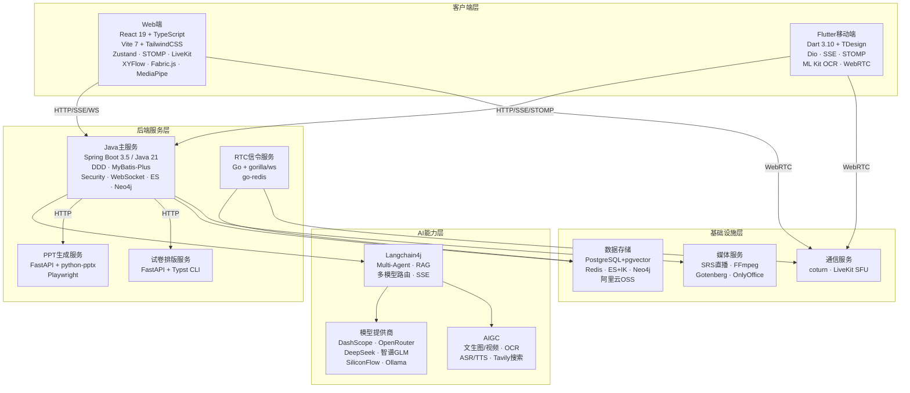
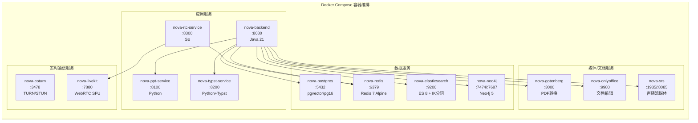

# NovaCloudEdu 技术栈全景图

## 一、技术栈分类汇总

### 1. 后端主服务 (Java)
| 类别 | 技术 | 版本 | 用途 |
|------|------|------|------|
| 语言/运行时 | Java | 21 | 主语言 |
| 框架 | Spring Boot | 3.5.8 | 应用框架 |
| ORM | MyBatis-Plus | 3.5.5 | 数据持久化 |
| 安全 | Spring Security + JWT | - | 认证授权 |
| 搜索 | Spring Data Elasticsearch | - | 全文搜索 |
| 缓存 | Spring Data Redis | - | 缓存/会话 |
| 图数据库 | Spring Data Neo4j | - | 知识图谱 |
| 实时通信 | Spring WebSocket (STOMP) | - | 弹幕/聊天 |
| API文档 | SpringDoc OpenAPI | 2.7.0 | Swagger |
| AI框架 | Langchain4j | 1.11.0 | Multi-Agent/RAG |
| AI SDK | DashScope SDK | 2.22.6 | 通义千问 |
| OCR | 百度AI SDK | 4.16.24 | 图片文字识别 |
| 语音 | 阿里云NLS SDK | 2.1.6 | ASR/TTS |
| 对象存储 | 阿里云OSS SDK | 3.17.4 | 文件上传 |
| 文档解析 | Apache PDFBox + POI | - | PDF/Word提取 |
| 沙箱 | Docker Java + GraalJS | - | Python/JS代码沙箱 |
| 爬虫 | Selenium | 4.31.0 | 网页抓取 |

### 2. 前端Web (React)
| 类别 | 技术 | 版本 | 用途 |
|------|------|------|------|
| 框架 | React | 19.2.0 | UI框架 |
| 语言 | TypeScript | 5.9.3 | 类型安全 |
| 构建 | Vite (SWC) | 7.2.4 | 打包工具 |
| 路由 | React Router DOM | 7.13.0 | 路由管理 |
| 状态管理 | Zustand | 5.0.11 | 全局状态 |
| 样式 | TailwindCSS | 4.1.18 | 原子化CSS |
| HTTP | Axios | 1.7.7 | API请求 |
| Markdown | react-markdown + KaTeX | - | MD/LaTeX渲染 |
| 视频 | ArtPlayer + HLS.js | - | 视频播放 |
| WebSocket | @stomp/stompjs | 7.3.0 | 实时通信 |
| 音视频 | livekit-client | 2.17.2 | WebRTC SFU |
| AI视觉 | @mediapipe/tasks-vision | 0.10.32 | 端侧AI检测 |
| 工作流 | @xyflow/react + Fabric.js | - | 可视化编排/画布 |
| API生成 | openapi-generator-cli | 2.7.0 | TS Axios客户端 |

### 3. 移动端 (Flutter)
| 类别 | 技术 | 版本 | 用途 |
|------|------|------|------|
| 框架 | Flutter (Dart SDK) | ^3.10.1 | 跨平台移动 |
| UI组件 | TDesign Flutter | 0.2.6 | 组件库 |
| HTTP | Dio + SSE | 5.9.0 | 网络请求/流式 |
| WebSocket | stomp_dart_client | 2.0.0 | 实时通信 |
| 本地存储 | sqflite + SecureStorage | - | SQLite/安全存储 |
| 相机/OCR | camera + ML Kit Text | - | 拍照+端侧文字识别 |
| 音视频 | flutter_webrtc + livekit_client | - | WebRTC通话 |
| 视频播放 | chewie + video_player | - | 视频播放 |
| 录音 | record + audioplayers | - | 录音/播放 |
| Markdown | markdown_widget | 2.3.2 | MD渲染 |
| API生成 | openapi_generator | 6.1.0 | Dart客户端 |

### 4. PPT生成服务 (Python)
| 类别 | 技术 | 版本 | 用途 |
|------|------|------|------|
| 框架 | FastAPI + Uvicorn | 0.115.6 | ASGI Web服务 |
| PPT | python-pptx | 1.0.2 | PPTX生成 |
| 浏览器 | Playwright | >=1.49.0 | HTML→截图渲染 |

### 5. 试卷排版服务 (Python + Typst)
| 类别 | 技术 | 版本 | 用途 |
|------|------|------|------|
| 框架 | FastAPI + Uvicorn | 0.115.6 | ASGI Web服务 |
| 排版 | Typst CLI | - | 试卷PDF/SVG/PNG编译 |

### 6. RTC信令服务 (Go)
| 类别 | 技术 | 版本 | 用途 |
|------|------|------|------|
| 语言 | Go | 1.22 | 主语言 |
| WebSocket | gorilla/websocket | 1.5.3 | 信令通道 |
| Redis | go-redis | 9.7.0 | 在线状态/房间 |

### 7. 基础设施 / DevOps
| 类别 | 技术 | 版本 | 用途 |
|------|------|------|------|
| 数据库 | PostgreSQL + pgvector | 16 | 主库+向量 |
| 缓存 | Redis | 7 (Alpine) | 缓存/会话/在线状态 |
| 搜索 | Elasticsearch + IK分词 | 8.x | 全文搜索 |
| 图数据库 | Neo4j Community | 5 | 知识图谱 |
| 文档编辑 | OnlyOffice DocumentServer | 8.2 | 在线文档 |
| PDF转换 | Gotenberg | 8 | HTML→PDF |
| 直播 | SRS (Simple Realtime Server) | 5 | RTMP/HTTP-FLV/HLS |
| 通话中继 | coturn | latest | TURN/STUN |
| SFU | LiveKit Server | latest | WebRTC SFU |
| 容器化 | Docker + Docker Compose | - | 全服务编排 |
| 对象存储 | 阿里云OSS | - | 文件/视频/图片 |
| 视频转码 | FFmpeg | - | HLS转码 |

### 8. AI模型提供商 (多模型路由)
| 提供商 | 模型 | 能力 |
|--------|------|------|
| 阿里云DashScope | qwen-max/plus/turbo/long, qwen-vl-max/plus, qwen3-235b, wan2.6(文生图/视频) | 文本/视觉/Embedding/Rerank/图像/视频 |
| OpenAI | gpt-4o, gpt-4o-mini | 文本/视觉 |
| DeepSeek | deepseek-chat, deepseek-reasoner | 文本/推理 |
| Moonshot | moonshot-v1-128k/32k | 长文本 |
| 智谱GLM | glm-4, glm-4v | 文本/视觉 |
| SiliconFlow | DeepSeek-V3, Qwen2.5-72B, FLUX.1(文生图) | 文本/图像 |
| Ollama | llama3, llava | 本地文本/视觉 |
| OpenRouter | gpt-5.2, gemini-3-flash, claude-sonnet-4, deepseek-r1 | 多模型聚合路由 |
| 百度 | OCR API | 图片文字识别 |
| 阿里云NLS | ASR/TTS/实时转写 | 语音识别/合成 |
| Tavily | Search API | AI联网搜索 |

---

## 二、架构设计模式

- **后端架构**: DDD四层架构 (interfaces → application → domain → infrastructure)
- **领域模块**: 28个 (user, book, course, exam, grading, ai, ppt, livestream, membership, post, social, ...)
- **ID策略**: 雪花算法 (前端json-bigint处理精度)
- **API规范**: OpenAPI 3.0 自动生成客户端 (TypeScript-Axios / Dart)
- **实时通信**: WebSocket STOMP (聊天/弹幕) + 原生WebSocket (语音/信令)
- **AI架构**: Multi-Agent + RAG + 多模型路由 + 流式SSE

---

## 三、Mermaid 技术栈全景图

---

## 四、按业务域汇总

```mermaid
graph LR
    subgraph BIZ_TEACH["教学核心"]
        COURSE["课程管理<br/>视频HLS · 进度追踪"]
        BOOK["电子书库<br/>PDF/EPUB/TXT<br/>内容加密 · AI摘要"]
        EXAM["考试出题<br/>AI智能生成<br/>Typst试卷排版"]
        GRADE["智能批改<br/>OCR识别 · AI评分<br/>知识画像 · 错题推荐"]
        DAILY["每日学习<br/>文章阅读 · 单词学习<br/>打卡签到"]
    end

    subgraph BIZ_AI["AI智能"]
        CHAT["AI对话<br/>多模型路由 · RAG<br/>流式SSE · 上下文记忆"]
        PPTGEN["AI-PPT生成<br/>Multi-Agent · 视觉审查<br/>联网搜索 · 反思修复"]
        WORKFLOW["AI工作流<br/>可视化编排 · 代码沙箱<br/>条件分支 · LLM节点"]
        KNOWLEDGE["知识图谱<br/>Neo4j · 知识点提取<br/>自动关联"]
        SPEECH["语音交互<br/>ASR实时转写<br/>TTS语音合成"]
    end

    subgraph BIZ_SOCIAL["社交互动"]
        POST["帖子社区<br/>ES全文搜索<br/>评论 · 点赞 · 收藏"]
        LIVE["直播系统<br/>SRS RTMP推流<br/>HTTP-FLV/HLS拉流<br/>STOMP弹幕"]
        CALL["音视频通话<br/>WebRTC P2P<br/>TURN中继 · SFU降级<br/>Go信令服务"]
        SOCIAL["社交关系<br/>关注 · 粉丝<br/>私信 · 消息"]
    end

    subgraph BIZ_MANAGE["管理运营"]
        USER["用户体系<br/>注册登录 · JWT<br/>短信/邮件验证"]
        CLASS["班级管理<br/>教师 · 学生<br/>课表 · 学情分析"]
        MEMBER["会员系统<br/>FREE/BASIC/PRO/TEACHER<br/>AI配额 · 支付预留"]
        ANNOUNCE["公告/Banner<br/>推荐 · 反馈"]
        DOC["文档协作<br/>OnlyOffice在线编辑"]
    end

    BIZ_TEACH --> BIZ_AI
    BIZ_AI --> BIZ_SOCIAL
    BIZ_SOCIAL --> BIZ_MANAGE
```

---

## 五、服务部署拓扑

