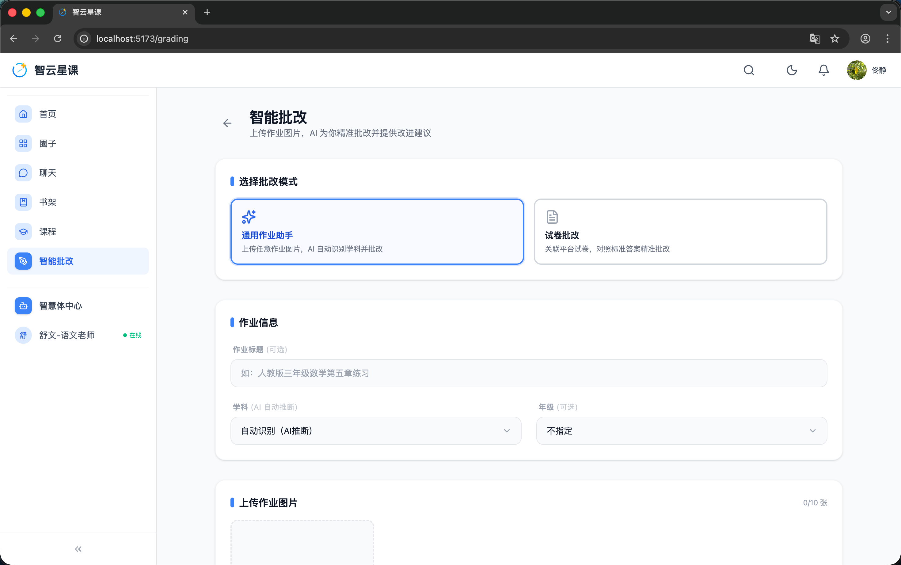
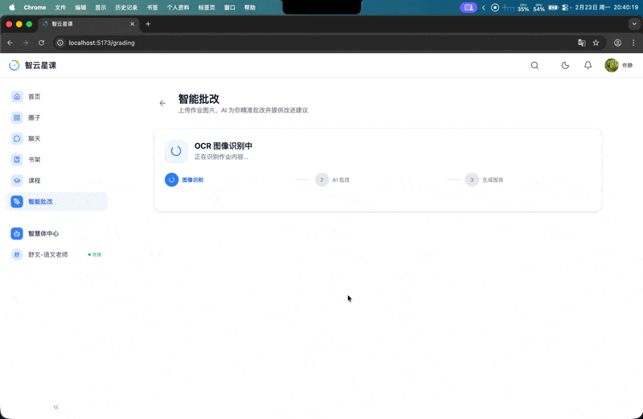

# 用户端 - AI 智能批改

> 对应源码：`web/src/pages/GradingSubmitPage.tsx`、`web/src/pages/GradingResultPage.tsx`、`web/src/pages/GradingDashboardPage.tsx`  
> 路由：`/grading`、`/grading/:submissionId`、`/grading-dashboard`

## 页面概览

AI 智能批改是平台的特色功能，学生拍照上传作业即可获得 AI 实时逐题批改、评分与学习建议。

---

### 1. 批改提交页（GradingSubmitPage）

作业上传与 AI 批改入口：

- **双模式选择**：
  - **通用模式**（GENERAL）：通用作业/日记/作文，AI 自动推断学科
  - **试卷模式**（EXAM_PAPER）：选择指定试卷进行标准化批改
- **表单信息**：标题、学科选择（数学/语文/英语/物理/化学/生物/历史/地理/政治，或自动识别）、年级
- **图片上传**：支持多张作业图片上传（最多 10 张），支持 HEIC/HEIF 格式自动转换为 JPEG
- **SSE 实时进度**：提交后通过 Server-Sent Events 接收批改进度
  - 三阶段指示器：图片上传 → OCR 识别 → AI 批改
  - 实时进度条
  - 逐题批改结果推送
  - 总评与操作按钮
- **最近批改历史**：展示历史批改记录列表

### 2. 批改结果页（GradingResultPage）

单次批改的详细结果展示：

- **分数总览**：得分环形图、得分率
- **统计概览**：正确题数、部分正确题数、错误题数
- **AI 总评**：AI 对本次作业的综合评价
- **逐题详情**（可展开）：
  - 学生答案与正确答案对比
  - 错误分类标签（计算错误/概念混淆/审题不清等）
  - 关联知识点标签
  - AI 深度解析与建议

### 3. 学习画像中心（GradingDashboardPage）

基于批改数据的学情分析面板：

- **概览卡片**：累计批改次数、平均得分率、覆盖学科数、薄弱知识点数
- **得分趋势图**：历次批改得分柱状图
- **学科得分分布**：各学科得分率进度条
- **错因深度剖析**：按错误类型统计分布
- **知识掌握度**：各学科的薄弱知识点与优势知识点展示

## 功能截图

### AI 智能批改总览

展示 AI 页面标题「智能批改」，副文案「上传作业图片，AI 为你精准批改并提供改进建议」。上方「选择批改模式」区域显示两个选项卡片：「通用作业助手」（当前选中，蓝色边框高亮，描述「上传任意作业图片，AI 自动识别学科并批改」）和「试卷批改」（描述「关联平台试卷，对照标准答案精准批改」）。中间「作业信息」区域包含：作业标题输入框（占位文案「如：人教版三年级数学第五章练习」）、学科下拉选择器（默认「自动识别（AI推断）」）、年级下拉选择器（默认「不指定」）。下方「上传作业图片」区域显示「0/10 张」计数和上传区域。

### AI 智能批改演示

动图展示完整的 AI 批改流程：从上传作业图片、实时显示 OCR 识别与批改进度、到最终呈现逐题批改结果的全过程。

## 技术要点

- **SSE 流式批改**：通过 `EventSource` 接收后端 SSE 推送，实现实时进度更新
- **HEIC 转换**：前端自动检测 HEIC/HEIF 格式图片，通过 Canvas 转换为 JPEG 后上传
- **学科推断**：通用模式下后端通过 OCR 文本内容自动推断学科类型
- **错误分类体系**：`ErrorCategory` 枚举定义了完整的错误分类（计算错误、概念混淆、审题不清等）
- **知识画像**：后端 `KnowledgeProfileApplicationService` 聚合批改数据生成学科知识画像
