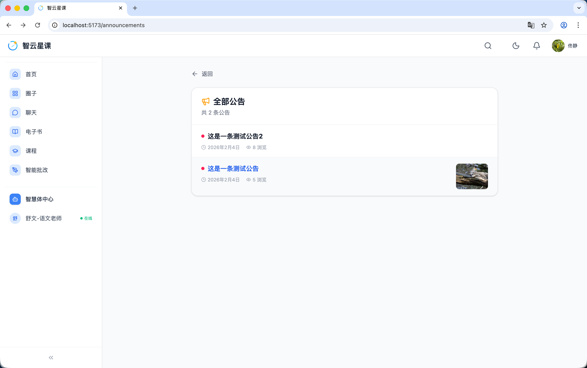

# 用户端 - 公告列表

> 对应源码：`web/src/pages/AnnouncementListPage.tsx`、`web/src/pages/AnnouncementDetailPage.tsx`  
> 路由：`/announcements`、`/announcement/:id`

## 页面概览

公告模块用于展示平台发布的官方通知与公告信息。

---

### 核心功能

- **公告列表**：按发布时间倒序展示所有公告
- **公告卡片**：显示标题、发布时间、内容摘要
- **公告详情**：点击进入公告全文页面，展示完整的富文本内容
- **分页浏览**：支持翻页查看历史公告

## 功能截图

### 公告列表页面

页面顶部「返回」导航链接，下方为白色圆角卡片区域，标题「全部公告」，副文案「共 2 条公告」。列表展示两条公告：第一条「这是一条测试公告2」，前方红色圆点标记，发布时间 2026年2月4日，浏览 8 次；第二条「这是一条测试公告」（蓝色可点击链接），红色圆点标记，发布时间 2026年2月4日，浏览 5 次，右侧附带缩略图（风景照片）。

## 技术要点

- **路由设计**：列表页 `/announcements`，详情页 `/announcement/:id`
- **数据来源**：通过 `DefaultApi` 调用后端公告管理接口获取数据
