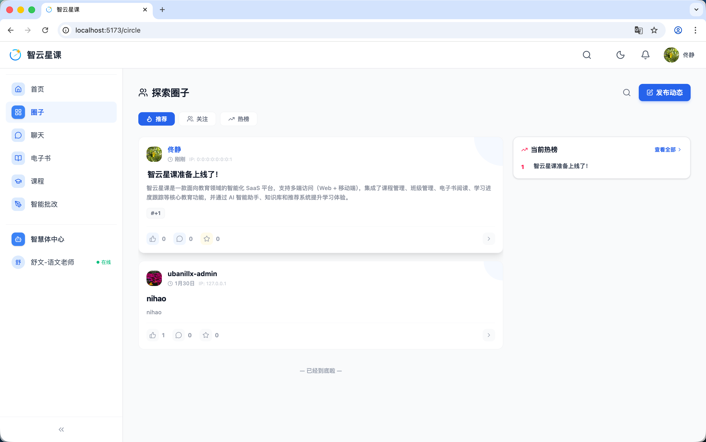

# 用户端 - 学习圈

> 对应源码：`web/src/pages/CirclePage.tsx`、`web/src/pages/PostEditPage.tsx`、`web/src/pages/PostDetailPage.tsx`  
> 路由：`/circle`、`/circle/edit`、`/circle/edit/:postId`、`/circle/post/:postId`

## 页面概览

学习圈是平台的社区功能模块，为学生提供交流互动的空间，类似校园论坛。

---

### 1. 圈子主页（CirclePage）

社区内容的浏览入口：

- **帖子信息流**：按时间倒序展示社区帖子
- **帖子卡片**：显示作者头像/昵称、发布时间、帖子内容摘要、图片预览
- **互动数据**：展示点赞数、评论数等社交指标
- **发帖入口**：快速跳转至帖子编辑页

### 2. 帖子发布/编辑页（PostEditPage）

帖子的创建与编辑功能：

- **富文本编辑**：支持文字排版、图片插入
- **图片上传**：支持多图上传与预览
- **编辑模式**：通过 `/circle/edit/:postId` 路由支持已有帖子的修改
- **发布确认**：填写完成后提交发布

### 3. 帖子详情页（PostDetailPage）

单条帖子的完整展示：

- 帖子全文内容
- 图片画廊查看
- 评论列表与回复
- 点赞互动

## 功能截图

### 圈子页面

页面标题「探索圈子」，右上角有搜索图标和蓝色「发布动态」按钮。内容区顶部有三个 Tab：「推荐」（蓝色选中）、「关注」、「热榜」。帖子以卡片流形式展示，第一条帖子显示用户「佮静」（头像 + 昵称 + IP + 「副管」标签），帖子标题「智云星课准备上线了！」，正文摘要介绍智云星课平台功能，带 #+1 标签，底部有点赞 0、评论 0、收藏 0 交互按钮。第二条帖子由 ubanillx-admin 发布，标题 nihao，点赞 1。右侧栏「当前热榜」显示 1 条热门帖子「智云星课准备上线了！」，带「查看全部」链接。页面底部显示「已经到底啦」提示。信息流，每条帖子包含作者信息、内容预览、互动数据等。

### 帖子发布编辑页面

发布页面标题「发布新动态」，右上角有「效果预览」和蓝色「立即发布」按钮。编辑区显示已输入的帖子标题「智云星课准备上线了！」（加粗大字体），标签区域显示已添加标签「#+1」（带 X 删除）和占位文案「添加标签（最多 5 个），回车确认」。下方为富文本工具栏，提供加粗、斜体、H1、H2、对齐、有序列表、引用、代码、链接、图片等格式化按钮。编辑区内容已输入平台介绍文本。左上角「返回上一页」导航链接。

## 技术要点

- **路由设计**：新建帖子走 `/circle/edit`，编辑帖子走 `/circle/edit/:postId`，共用同一组件
- **帖子详情**：`/circle/post/:postId` 路由展示单条帖子完整内容与评论
