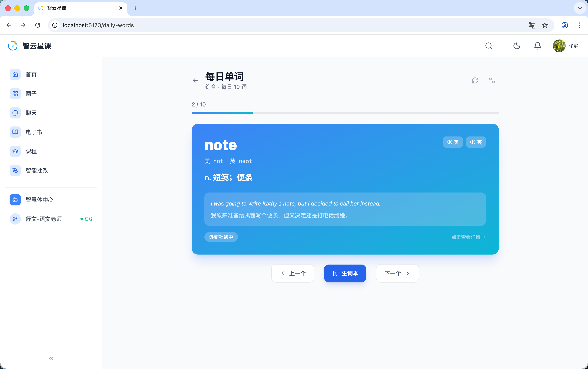
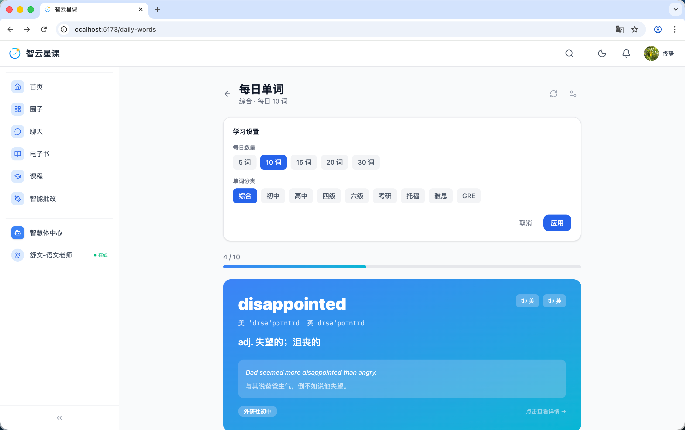
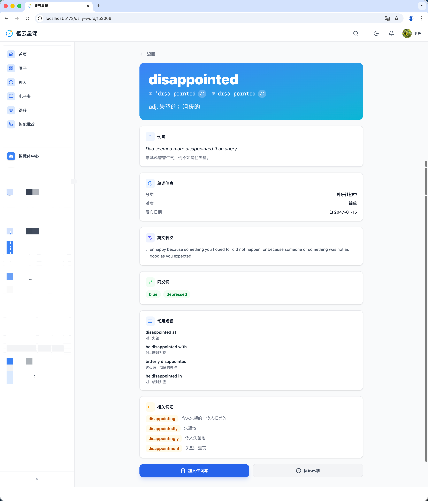
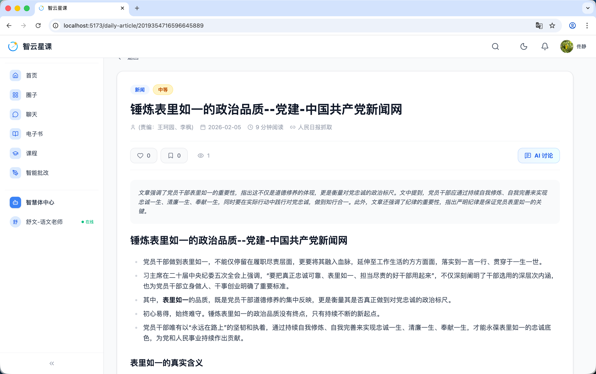
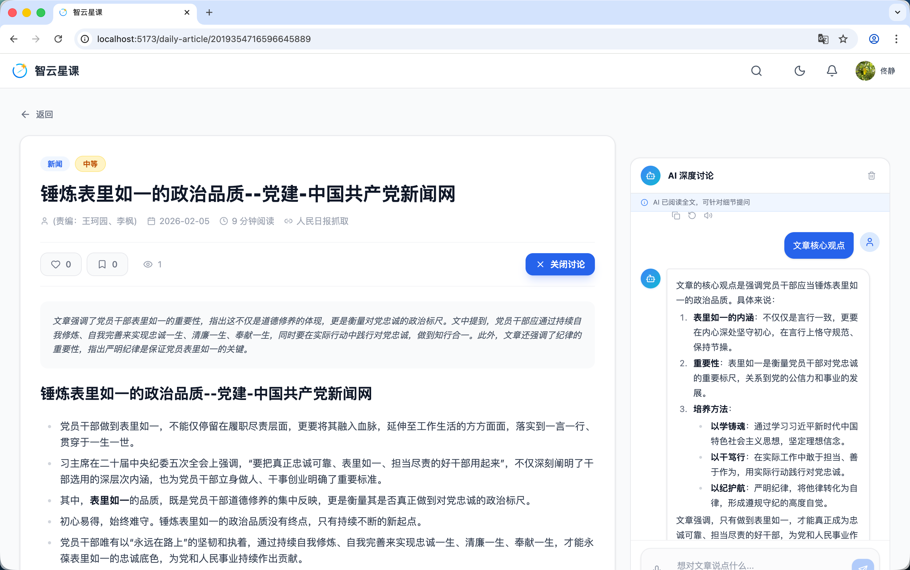

# 用户端 - 每日学习（单词与美文）

> 对应源码：`web/src/pages/DailyWordListPage.tsx`、`web/src/pages/DailyWordDetailPage.tsx`、`web/src/pages/WordBookPage.tsx`、`web/src/pages/DailyArticleDetailPage.tsx`、`web/src/pages/ArticleChatPage.tsx`  
> 路由：`/daily-words`、`/daily-word/:id`、`/word-book`、`/daily-article/:id`

## 页面概览

每日学习模块包含「每日单词」和「每日美文」两个子功能，帮助学生养成日常学习习惯。

---

### 1. 每日单词列表页（DailyWordListPage）

为学生每日推送一组英语单词进行学习：

- **单词类型选择**：支持初中、高中、四级、六级、考研、托福、雅思、GRE 共 8 种词库
- **每日数量设置**：可选 5 / 10 / 15 / 20 / 30 个单词
- **单词卡片**：逐词展示，包含单词、音标、释义
- **发音播放**：点击喇叭图标播放单词发音
- **本地缓存**：当日单词缓存至 `localStorage`，避免重复请求
- **学习设置持久化**：用户偏好（词库类型、数量）自动保存至本地

### 2. 单词学习设置页

提供单词学习的个性化配置界面：

- 词库类型切换
- 每日学习数量调整
- 学习模式偏好设置

### 3. 单词详情页（DailyWordDetailPage）

展示单个单词的完整信息：

- 单词拼写与音标
- 中英文释义
- 例句展示
- 发音播放

### 4. 每日美文详情页（DailyArticleDetailPage）

展示当日推荐美文的完整内容：

- 文章标题、作者、发布时间
- 富文本内容渲染
- 阅读时长估算

### 5. 美文 AI 问答（ArticleChatPage）

在美文详情页集成 AI 问答功能：

- 基于当前文章内容进行 AI 互动问答
- 支持提问文章相关的理解、赏析、背景知识等
- 流式输出 AI 回答

## 功能截图

### 单词列表页面

页面标题「每日单词」，副标题「综合 - 每日 10 词」，上方显示进度「2/10」和蓝色进度条。中间为渐变蓝色单词卡片，展示单词 **note**，美式音标 not、英式音标 naut，释义「n. 短笺；便条」，灰色例句区域显示英文例句及中文翻译。卡片左下角显示来源标签「外研社初中」，右下角有「点击查看详情」链接。右上角有两个按钮（美式/英式发音播放）。底部操作栏有「上一个」「生词本」（蓝色按钮）「下一个」三个导航按钮。

### 单词学习设置页面

页面上方弹出「学习设置」面板，包含两行配置项：「每日数量」提供 5 词、10 词（当前选中，蓝色高亮）、15 词、20 词、30 词五个选项按钮；「单词分类」提供综合（当前选中，蓝色高亮）、初中、高中、四级、六级、考研、托福、雅思、GRE 九个选项按钮。面板右下角有「取消」和蓝色「应用」按钮。设置面板下方仍可见当前学习中的单词卡片（**disappointed**，进度 4/10）。

### 单词详情页

单词详情页以蓝色渐变头部展示单词 **disappointed**，美式/英式音标及发音按钮。页面主体分为多个信息卡片模块：「例句」卡片显示英文例句和中文翻译；「单词信息」卡片列出分类（外研社初中）、难度（简单）、发布日期（2047-01-15）；「英文释义」卡片展示英文定义；「同义词」卡片列出 blue、depressed（蓝色可点击标签）；「常用短语」卡片列出 disappointed at、be disappointed with、bitterly disappointed、be disappointed in 等短语及释义；「相关词汇」卡片列出 disappointing、disappointedly、disappointingly、disappointment 等词形变化。底部有蓝色「加入生词本」和白色「标记已学」两个操作按钮。

### 美文详情页面

文章详情页顶部显示「新闻」「中等」两个标签，标题「锤炼表里如一的政治品质--党建-中国共产党新闻网」，元信息行显示责编（王珂园、李枫）、日期（2026-02-05）、阅读时长（9 分钟阅读）、来源（人民日报抓取）。交互区域有点赞 0、评论 0、浏览 1 计数，以及右侧蓝色「AI 讨论」按钮。文章正文以蓝色背景摘要框开头（AI 生成的文章概要），下方为富文本排版的全文内容，含加粗关键词和分段要点列表。

### 美文详情页 - AI 问答

与文章详情页相同布局，但右侧展开了「AI 深度讨论」侧边面板。面板顶部提示「AI 已阅读全文，可针对细节提问」，下方有「文章核心观点」蓝色快捷按钮。AI 回复以结构化格式展示：标题「文章的核心观点是强调党员干部应当锤炼表里如一的政治品质」，下方分为 1. 表里如一的内涵、2. 重要性、3. 培养方法三个编号段落，每段包含加粗小标题和详细解释。面板底部有输入框「想对文章说点什么...」。左侧文章区域标题旁显示红色「关闭讨论」按钮。

## 技术要点

- **本地缓存策略**：使用 `localStorage` 的 `CACHE_KEY` 缓存当日单词数据，按日期+配置作为缓存键
- **设置持久化**：学习设置通过 `SETTINGS_KEY` 保存至 `localStorage`
- **音频播放**：使用 `HTMLAudioElement` (`audioRef`) 播放单词发音
- **会话索引**：通过 `sessionStorage` 的 `INDEX_SESSION_KEY` 保持当前单词索引，刷新页面不丢失位置
