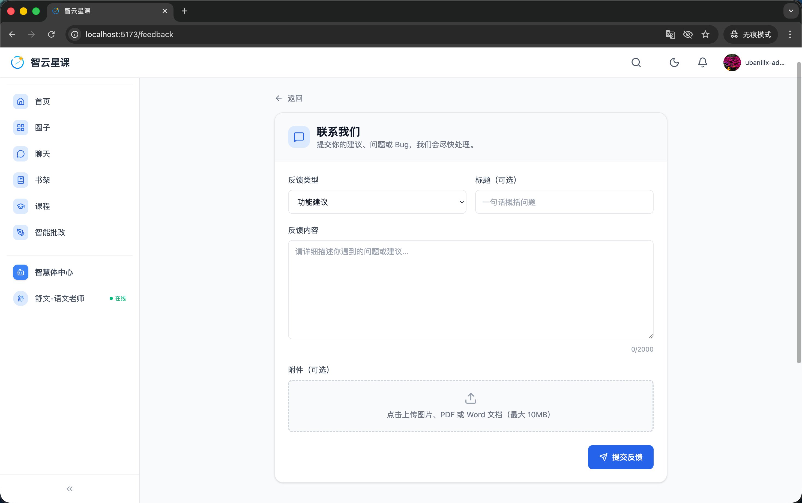

# 用户端 - 用户反馈

> 对应源码：`web/src/pages/FeedbackPage.tsx`  
> 路由：`/feedback`

## 页面概览

用户反馈页面为学生和家长提供意见反馈通道，可以向平台提交建议、问题报告或功能请求。

---

### 核心功能

- **反馈表单**：填写反馈标题与详细内容
- **反馈类型**：支持选择反馈分类（建议/Bug/其他）
- **提交确认**：表单校验通过后提交至后端
- **历史反馈**：查看已提交的反馈及处理状态

## 功能截图

### 用户反馈页面

页面顶部「返回」导航链接，下方卡片标题「联系我们」，副文案「提交你的建议、问题或 Bug，我们会尽快处理。」。表单区域包含：「反馈类型」下拉选择器（当前选中「功能建议」）、「标题（可选）」输入框（占位文案「一句话概括问题」）、「反馈内容」多行文本域（占位文案「请详细描述你遇到的问题或建议...」，底部显示字符计数 0/2000）、「附件（可选）」上传区域（提示「点击上传图片、PDF 或 Word 文档（最大 10MB）」）。底部右对齐蓝色「提交反馈」按钮。与提交入口。

## 技术要点

- **路由**：`/feedback`，同时在页脚「联系我们」链接中引用
