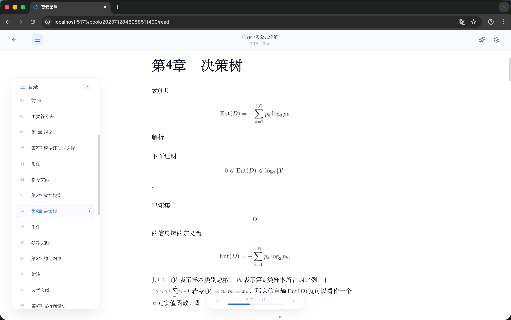

# 用户端 - 电子书

> 对应源码：`web/src/pages/EbookListPage.tsx`、`web/src/pages/EbookReaderPage.tsx`、`web/src/pages/reader/`、`web/src/pages/BookshelfPage.tsx`  
> 路由：`/ebooks`、`/ebook/:bookId`、`/bookshelf`

## 页面概览

电子书模块提供在线书籍浏览与沉浸式阅读体验，深度集成 AI 辅助阅读功能。

---

### 1. 电子书列表页（EbookListPage）

电子书的浏览入口：

- 书籍卡片网格展示：封面、标题、作者、文件类型标签
- 支持搜索与分类筛选
- 点击书籍进入在线阅读器

### 2. 电子书阅读器（EbookReaderPage）

沉浸式在线阅读器，功能丰富：

- **章节目录侧边栏**（`ReaderSidebar`）：左侧展示书籍的完整章节结构，点击跳转
- **富文本内容渲染**：支持 HTML 解析（`html-react-parser`）和数学公式渲染（KaTeX）
- **PDF 阅读器**（`PdfReaderView`）：PDF 格式书籍使用独立的 PDF 渲染器
- **阅读设置面板**（`ReaderSettingsPanel`）：
  - 主题切换（多种阅读主题）
  - 字体选择（多种字体家族）
  - 字号调节
  - 行距调节
- **书签功能**：支持添加/删除书签，书签列表管理
- **浮动进度条**（`FloatingProgressBar`）：底部显示阅读进度

### 3. AI 辅助阅读面板（ReaderAiPanel）

阅读器右侧的 AI 功能面板，提供多种智能辅助：

- **章节摘要**（`summary` Tab）：AI 生成章节内容摘要，支持「详细」/「简洁」两种风格
- **知识点提取**（`knowledge` Tab）：AI 提取章节中的关键知识点
- **AI 问答对话**（`chat` Tab）：基于当前章节内容与 AI 进行问答互动
- **阅读测验**（`quiz` Tab）：AI 根据章节内容生成理解性测试题

### 4. 我的书架（BookshelfPage）

用户收藏的书籍管理页面。

## 功能截图

### 我的书架页面

页面标题「我的书架」，副标题「1 本在架」。下方搜索栏（占位文案「搜索书名、作者...」）和蓝色「搜索」按钮。搜索栏下方有「我的书架 1」（蓝色选中状态）和「书库浏览」两个 Tab 切换。书架中展示一本书籍卡片：「机器学习公式详解」，封面为橘色南瓜图案（Pumpkin Book），作者「谢文睿」，EPUB 标签，阅读进度指示。

### 电子书阅览器页面

电子书阅读器全屏界面，顶部显示书名「机器学习公式详解」和当前章节「第 4 章 决策树 - 刘文睿」。左侧为可收缩的章节目录面板（「目录 19」 Tab 和「书签」 Tab），列出全部 20 章的目录结构，当前章节「第 4 章 决策树」蓝色高亮选中。中间内容区域渲染数学公式（信息熵 Ent(D) 等 LaTeX 公式）和解析文本。页面信息显示「2,657 字」「第 9 章节」。底部有页码导航器（当前 14/19，左右箭头翻页）。右上角有 AI 助手按钮和设置图标。为正文阅读区，支持主题与字体自定义。

### 电子书阅读器 - AI 功能展示

电子书阅读器右侧展开了「AI 智能助手」侧边面板，顶部有四个功能 Tab：「总结」「知识点」「问答」「测试」。当前选中「测试」 Tab，显示 AI 生成的测试题：第 01 题「萧炎坐在山崖之上，萧炎对面是什么地方？」，四个选项（A 加玛帝国、B 魔兽山脉、C 家族的后山、D 险峨山崖），第 02 题「萧炎间为……而且发誓不能受第二次屈辱。」。底部蓝色「提交测试答案」按钮。左侧书籍内容显示「第八章 神秘的老者」，正文为小说内容，带书签图标和页面进度指示器。

## 技术要点

- **富文本解析**：使用 `html-react-parser` 解析后端返回的 HTML 章节内容
- **数学公式**：集成 KaTeX（`katex/contrib/auto-render`）自动渲染数学公式
- **阅读设置持久化**：通过 `useReaderSettingsStore`（Zustand store）保存用户阅读偏好
- **主题系统**：`THEMES` 常量定义多套阅读主题的 CSS 变量
- **AI 接口**：使用独立的 `AIApi` 客户端调用后端 AI 服务接口
- **PDF 支持**：PDF 格式书籍使用 `PdfReaderView` 组件渲染，与富文本阅读器独立
