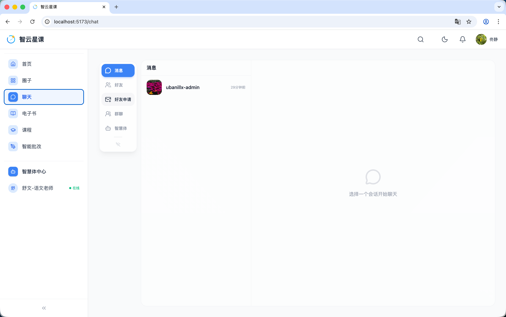
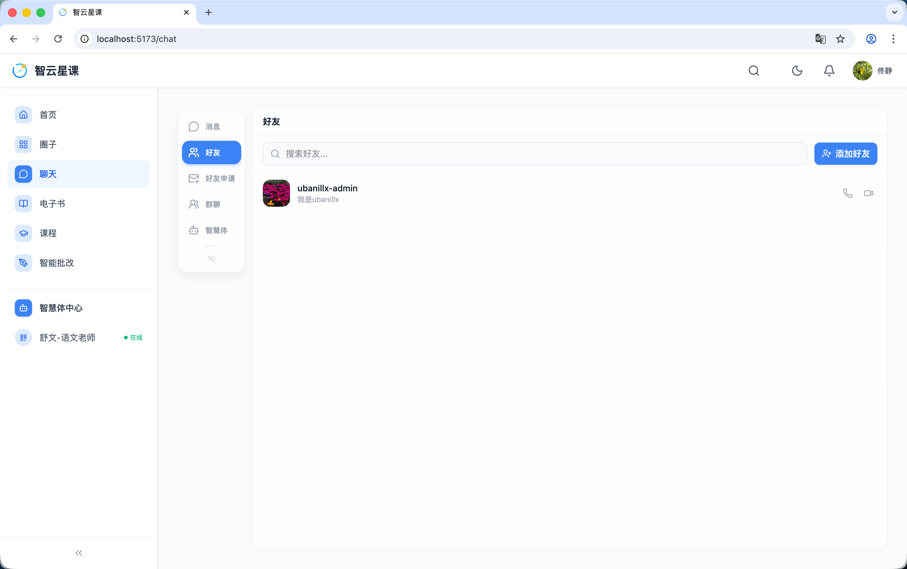
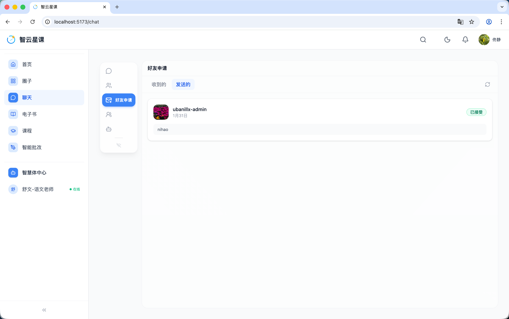
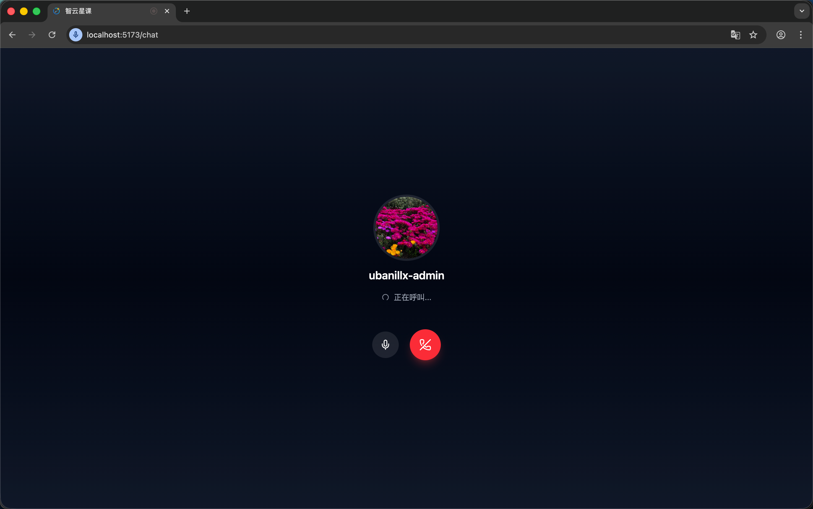
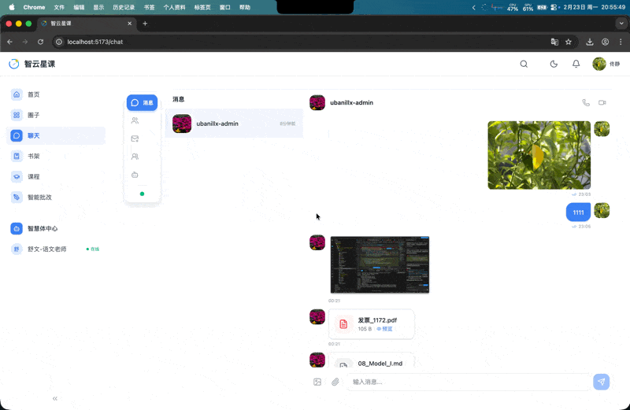
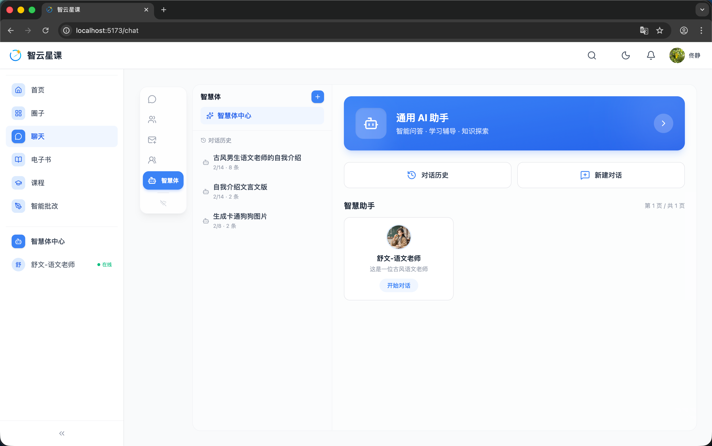
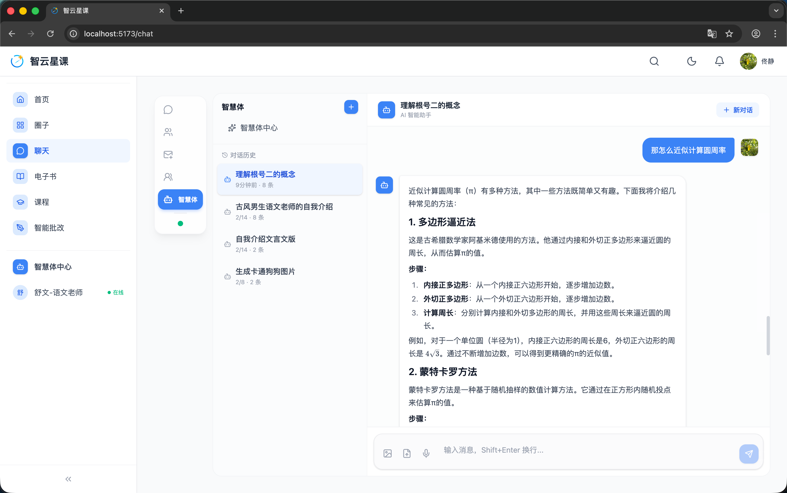
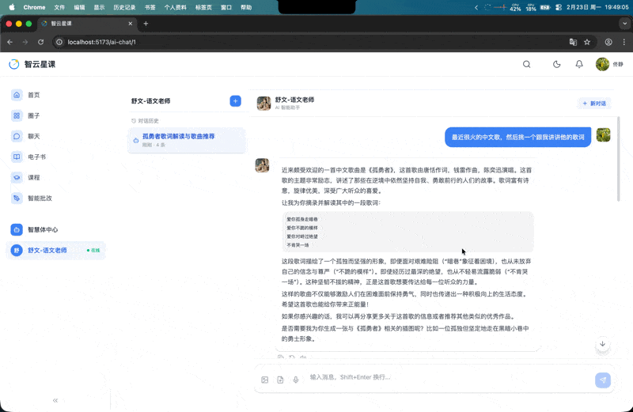

# 用户端 - 聊天与社交

> 对应源码：`web/src/pages/ChatPage.tsx`、`web/src/pages/AiAssistantChatPage.tsx`、`web/src/components/chat/`、`web/src/components/call/`  
> 路由：`/chat`、`/ai-chat`、`/ai-chat/:assistantId`

## 页面概览

聊天与社交模块是平台的即时通讯中心，集成了好友私聊、群聊、AI 智慧体对话、好友申请管理以及音视频通话功能。

---

### 1. 消息列表 Tab

聊天页面的默认视图，展示所有会话列表：

- **会话列表**（`SessionList`）：按最近消息时间排序，显示头像、昵称、最新消息预览、未读计数
- **私聊窗口**（`PrivateChatPanel`）：点击好友会话进入一对一聊天
- **消息内容渲染**（`MessageContent`）：支持文本、图片、文件、语音等多种消息类型
- **Markdown 渲染**（`MarkdownRenderer`）：AI 消息支持 Markdown 格式化输出
- **语音输入**（`VoiceInputButton`）：支持语音转文字输入消息

### 2. 好友列表 Tab

管理好友关系：

- 好友列表展示，显示头像、昵称、在线状态
- 点击好友发起私聊
- 支持发起语音/视频通话（`startCall`）
- 好友搜索功能

### 3. 好友申请 Tab

好友请求的收发管理：

- **收到的申请**（`received` Tab）：显示待处理的好友请求，可接受/拒绝
- **发出的申请**（`sent` Tab）：查看已发送的好友请求状态
- **状态徽章**：待处理（amber）、已接受（emerald）、已拒绝（rose）三种状态颜色

### 4. 群聊 Tab

群组聊天功能：

- 群聊列表展示
- **群聊窗口**（`GroupChatPanel` / `GroupChatWindow`）：群组消息收发

### 5. AI 智慧体 Tab

AI 助手入口与对话：

- **智慧体列表**：展示可用的 AI 助手/智能体
- **AI 对话面板**（`AiChatPanel`）：与 AI 助手进行流式对话
- **自定义智能体**：支持创建和配置自定义 AI 智能体
- **独立页面**：`/ai-chat/:assistantId` 路由提供全屏 AI 对话体验

### 6. 音视频通话

集成在聊天模块中的实时通话功能：

- **通话控制**（`CallControls`）：麦克风开关、摄像头开关、挂断等控制
- **通话界面**（`CallScreen`）：音视频通话的全屏展示
- **来电弹窗**（`IncomingCallModal`）：收到来电时的接听/拒绝弹窗
- **通话策略**：P2P 优先 → TURN 中继 → LiveKit SFU 降级

## 功能截图

### 聊天对话 - 消息

聊天页「消息」Tab（蓝色高亮），左侧会话列表显示多个聊天对象：「ubanillx-admin」（紫色花丛头像，最近消息预览，时间戳），以及群组和 AI 会话等。右侧对话区域顶部显示当前聊天对象名称和在线状态，消息区域展示双方的文字消息气泡（蓝色为自己发送，白色/灰色为对方发送），底部为消息输入框（占位文案「输入消息...」），左侧有附件上传、图片发送图标，右侧有语音输入和发送按钮。顶部操作栏有音频通话和视频通话图标按钮。

### 聊天对话 - 好友

聊天页切换至「好友」Tab（蓝色高亮），页面标题「好友列表」，搜索栏占位文案「搜索好友...」。好友列表以卡片形式展示每位好友：头像（紫色花丛图）、昵称「ubanillx-admin」、在线状态指示（绿色圆点表示在线）、最近互动时间。每个好友条目右侧有「发消息」和「语音通话」两个操作按钮。底部显示好友总数统计。

### 聊天对话 - 申请

聊天页切换至「好友申请」Tab（蓝色高亮），页面标题「好友申请」，下方有「收到的」和「发送的」（当前选中，蓝色文字）两个子 Tab。列表中显示一条申请记录：用户 ubanillx-admin（头像为紫色花丛图）、申请时间 1 月 31 日、申请留言「nihao」，右侧绿色「已接受」状态标签。

### 电话呼叫

全屏暗色背景的语音呼叫界面，中央显示被叫用户头像（紫色花丛圆形头像）和用户名 ubanillx-admin，下方加载动画文字「正在呼叫...」。底部操作栏有两个按钮：左侧灰色麦克风按钮（静音控制）和右侧红色挂断按钮。浏览器地址栏显示麦克风权限指示器（红色圆点）。

### 对话页面多媒体阅览展示

动图展示聊天对话中的多媒体消息交互：用户可以发送和接收图片消息，点击图片后弹出全屏预览浮层，支持缩放、下载等操作；同时展示文件消息的发送与接收效果。

### 智慧体页面

聊天页切换至「智慧体」Tab（蓝色高亮），左侧面板标题「智慧体」，顶部为「智慧体中心」入口链接和蓝色「+」新建按钮。下方「对话历史」区域列出历史会话：「古风男生语文老师的自我介绍」（2/14, 8 条）、「自我介绍文言文版」（2/14, 2 条）、「生成卡通狗狗图片」（2/8, 2 条）。右侧主区域顶部为蓝色渐变卡片「通用 AI 助手 - 智能问答 / 学习辅导 / 知识探索」（带右箭头）。下方并排「对话历史」和「新建对话」两个按钮。再下方「智慧助手」区域（第 1 页 / 共 1 页）展示一个助手卡片：「舒文-语文老师」（头像、描述「这是一位古风语文老师」、蓝色「开始对话」链接）。

### 智慧体对话页面

智慧体对话界面，左侧会话列表选中「理解根号二的概念」（9 分钟前, 8 条，蓝色高亮）。右侧对话区顶部显示「理解根号二的概念 - AI 智能助手」和「+ 新对话」按钮。用户发送蓝色气泡「那怎么近似计算圆周率」，AI 回复以 Markdown 格式呈现：标题「1. 多边形逼近法」「2. 蒙特卡罗方法」，包含加粗步骤说明、编号列表、数学公式等结构化内容。底部输入框左侧有文件上传、图片上传、语音输入图标，输入框占位文案「输入消息，Shift+Enter 换行...」，右侧蓝色发送按钮。

### 智慧体 - 自定义智能体

动图展示在智慧体中心创建自定义智能体的完整流程：用户点击新建按钮后，配置智能体的名称、头像、描述、System Prompt 等信息，设定其角色定位和对话风格，完成后智能体出现在助手列表中可供对话使用。

## 技术要点

- **即时通讯**：基于 WebSocket + STOMP 协议实现实时消息收发（`ChatContext`）
- **音视频通话**：通过 `RtcContext` 管理 WebRTC 连接，Go 语言编写的 rtc-service 负责信令处理
- **AI 对话**：`AiChatPanel` 使用 SSE（Server-Sent Events）实现流式 AI 回答
- **消息类型**：支持文本、图片、文件、语音、Markdown 等多种消息格式
- **Tab 导航**：`MainTab` 类型定义了 messages / friends / requests / groups / intelligence 五个标签页
