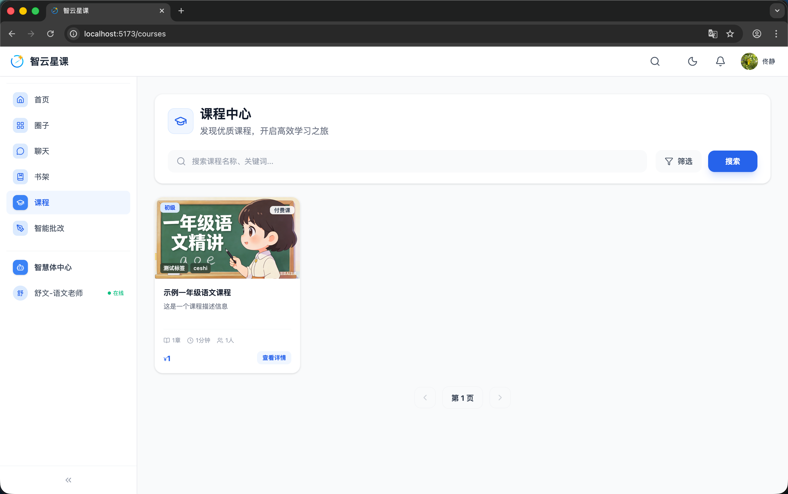
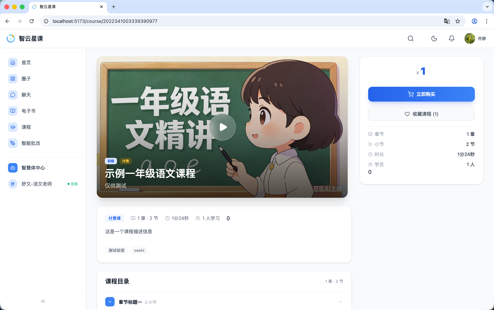
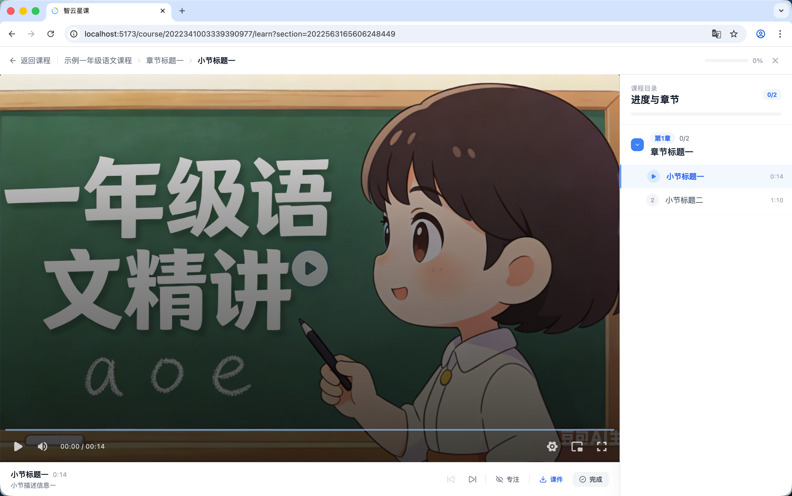
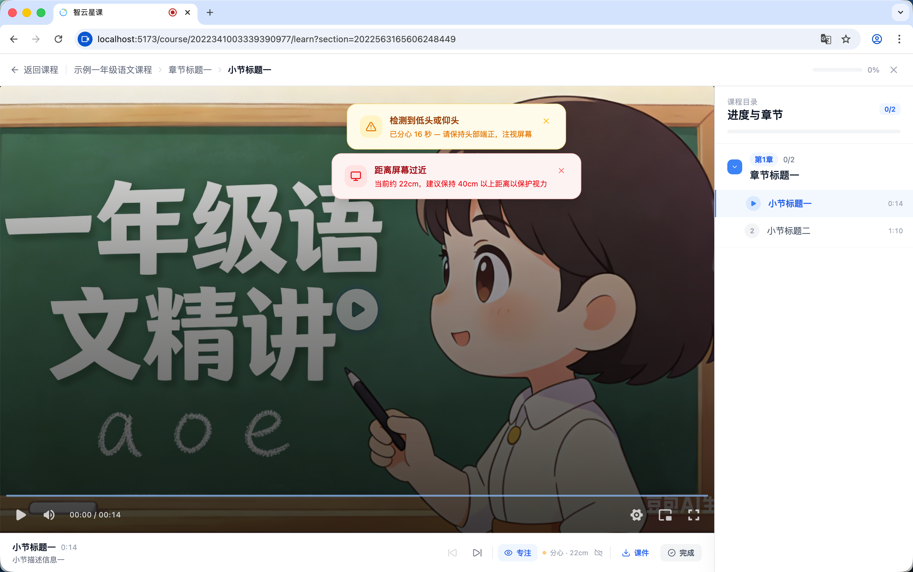

# 用户端 - 课程中心

> 对应源码：`web/src/pages/CourseListPage.tsx`、`web/src/pages/CourseDetailUserPage.tsx`、`web/src/pages/CourseLessonPage.tsx`  
> 路由：`/courses`、`/course/:courseId`

## 页面概览

课程中心是智云星课的核心学习模块，涵盖课程浏览、详情查看、视频播放三个主要页面。

---

### 1. 课程列表页（CourseListPage）

提供全部课程的浏览与筛选功能：

- **搜索栏**：支持关键词搜索课程
- **筛选器**：
  - 课程类型：全部 / 公开课 / 付费课 / 会员课
  - 难度等级：入门 / 初级 / 中级 / 高级 / 专家（五级色彩标识）
- **课程卡片网格**：每页 12 门课程，展示封面图、标题、简介、学员数、课程类型标签
- **分页导航**：支持前后翻页

### 2. 课程详情页（CourseDetailUserPage）

展示单门课程的完整信息：

- **课程封面与基础信息**：标题、副标题、描述、难度标签、学员数
- **课程结构**：按章节 → 小节的树形结构展示，每个小节标注时长
- **学习进度**：显示课程整体完成百分比（`CourseProgressSummaryResponse`）
- **收藏功能**：点击收藏/取消收藏
- **购买/开始学习**：根据课程类型（公开/付费/会员）显示不同操作按钮

### 3. 课程播放页（CourseLessonPage）

视频课程的学习播放界面：

- **视频播放器**：使用 `ArtPlayerWrapper` 组件（基于 ArtPlayer），支持进度记忆与续播
- **侧边栏课程目录**：可折叠的章节列表，已学小节有勾选标记
- **学习进度追踪**：自动记录播放进度，同步至后端
- **专注度检测**：集成 `FocusMonitor` 组件，通过摄像头实时检测学生是否分神及与屏幕的距离
- **小节切换**：支持上一节/下一节快速跳转

## 功能截图

### 课程中心页面

页面顶部显示「课程中心」标题和副文案「发现优质课程，开启高效学习之旅」。下方为搜索栏（占位文案「搜索课程名称、关键词...」）和右侧的「筛选」按钮及蓝色「搜索」按钮。课程以卡片形式展示，示例卡片「示例一年级语文课程」显示封面（橘猫老师黑板教学图）、「初级」蓝色标签、「付费课」紫色标签、课程描述、1 章 1 分钟 1 人学习、价格 1 元、「查看详情」链接。底部有分页器「第 1 页」。

### 课程详情页

页面上方为课程封面大图（含播放按钮），左下角显示「初级」「专题」标签和课程标题「示例一年级语文课程」（副标题「仅供测试」）。右侧信息面板显示价格「1 元」、蓝色「立即购买」按钮、「收藏课程 (1)」按钮，以及数据面板：1 章节、2 小节、时长 1 分 24 秒、学员 1 人。下方课程描述区域展示课程类型「付费课」、章数、时长、学员数等信息，带有「测试标签」「coshi」标签。底部「课程目录」以树形结构列出「章节标题一 - 2 小节」可展开查看。

### 课程播放页

全屏视频播放界面，顶部面包屑导航「返回课程 > 示例一年级语文课程 > 章节标题一 > 小节标题一」，右上角显示学习进度 0%。左侧为视频播放器（ArtPlayer），底部有播放/暂停、音量、时间轴（00:00/00:14）、设置、画中画、全屏按钮。视频下方工具栏包含「专注」「课件」「完成」三个快捷入口。右侧「进度与章节」面板列出第 1 章（0/2），展开显示小节标题一（0:14，当前播放，蓝色高亮）和小节标题二（1:10）。

### 课程播放页 - 专注度检测

与正常播放页相同布局，但视频区域上方叠加了两条检测提醒：黄色警告条「检测到低头或仰头 - 已分心 16 秒，请保持头部端正，注视屏幕」，红色警告条「距离屏幕过近 - 当前约 22cm，建议保持 40cm 以上距离以保护视力」。底部状态栏同步显示专注度状态（分心标记）和实时距离（22cm）。

## 技术要点

- **视频播放**：基于 ArtPlayer 封装的 `ArtPlayerWrapper`，支持 HLS/FLV 等格式
- **进度追踪**：播放过程中定时上报进度至后端，支持断点续播
- **专注度检测**：`FocusMonitor` 组件利用浏览器摄像头 + AI 模型进行实时人脸检测
- **课程结构**：后端返回 `CourseStructureResponse` 包含章节（Chapter）→ 小节（Section）的嵌套结构
- **扁平化处理**：`flattenSections` 工具函数将章节结构展平，便于实现上一节/下一节导航
