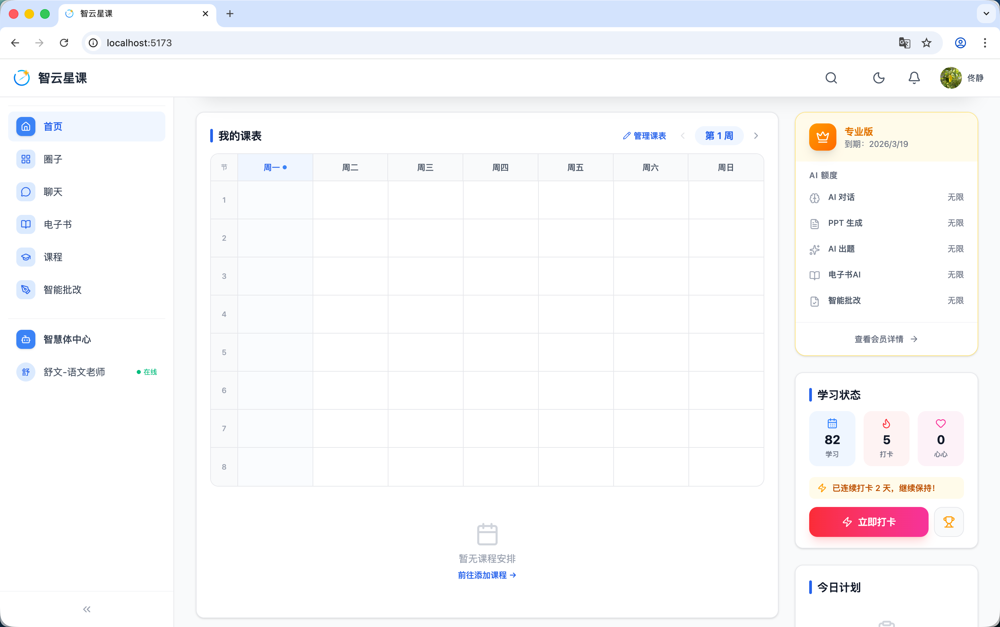
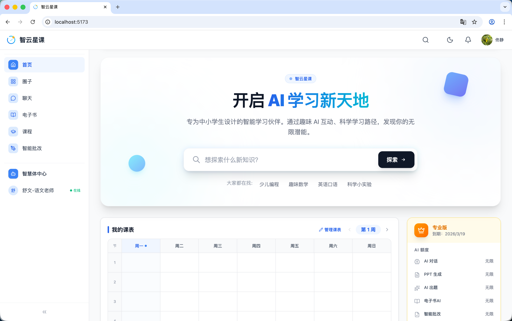

# 用户端 - 首页

> 对应源码：`web/src/App.tsx`（`HomePage` 组件）及 `web/src/components/home/` 下的子组件  
> 路由：`/`

## 页面概览

首页是智云星课平台的门户入口，采用响应式栅格布局，面向中小学生设计，风格清新现代。页面自上而下分为以下核心区域：

### 1. Banner 轮播区

页面顶部为全宽轮播 Banner，由 `BannerCarousel` 组件渲染，数据来自后端轮播图管理接口。支持自动轮播与手动切换。

### 2. Hero 搜索区

大尺寸品牌展示区域，包含：
- 平台品牌标语「开启 AI 学习新天地」
- 全站搜索框，回车或点击按钮跳转至 `/search` 聚合搜索页
- 热搜标签（少儿编程、趣味数学、英语口语、科学小实验）

### 3. 左栏 - 主内容区（8/12 栅格）

- **我的课表**（`CourseScheduleCard`）：展示用户已选课程的学习进度与上课安排
- **热门课程**：从后端拉取最新 6 门已发布课程，以卡片网格形式展示（封面图、课程类型标签、学员数、难度等），点击进入课程详情页
- **每日美文**（`DailyArticleSection`）：展示当日推荐的美文内容

### 4. 右栏 - 侧边小组件（4/12 栅格）

- **会员卡片**（`MembershipCard`）：当前会员等级与权益展示
- **学习统计**（`StudyStatsCard`）：累计学习时长、完成课程数等数据
- **学习计划**（`StudyPlanCard`）：每日学习目标与完成进度
- **公告**（`AnnouncementSection`）：最新平台公告摘要
- **每日单词**（`DailyWordSection`）：当日推荐英语单词预览

## 功能截图

### 首页主体预览

截图上半部分为全宽 Banner 轮播区，展示了一只橘猫老师站在黑板前的轮播图，标题「欢迎来到智云星课」，底部有圆点指示器和左右切换箭头。轮播图下方为「开启 AI 学习新天地」品牌标语区，副文案「专为中小学生设计的智能学习伙伴，通过趣味 AI 互动、科学学习路径，发现你的无限潜能。」左侧导航栏包含首页、圈子、聊天、电子书、课程、智能批改等入口，以及智慧体中心分区下的「舒文-语文老师」（带绿色在线状态点）。顶部 Header 右侧有搜索、暗色模式切换、通知铃铛和用户头像。

### 功能卡片展示（一）

左侧主内容区展示「我的课表」模块：一个周课表网格（周一至周日，8 节课时段），表头显示「管理课表」按钮和「第 1 周」周次切换。当前无课程安排时显示「暂无课程安排 - 前往添加课程」引导链接。右侧小组件栏上方为会员卡片，显示「专业版 - 到期：2026/3/19」，AI 额度列表包含 AI 对话（无限）、PPT 生成（无限）、AI 出题（无限）、电子书AI（无限）、智能批改（无限），底部有「查看会员详情」链接。下方为学习状态卡片，展示三个圆形指标：学习 82、打卡 5、点赞 0，附「已连续打卡 2 天，继续保持！」文案和橙色渐变「立即打卡」按钮。再下方为「今日计划」区块。

### 功能卡片展示（二）

左侧主内容区展示「热门课程」模块，以卡片形式呈现「示例一年级语文课程」（封面为橘猫老师黑板教学图，带「测试标签」「ceshi」蓝色标签和「付费课」紫色标签），下方显示 1 位学友和「开始学习」链接。课程区下方为「每日美文」模块，以横向卡片展示多篇文章（如「锤炼表里如一的政治品质--党建-中国共产党新闻网」），每篇附带「新闻」分类标签、「中等」难度标签、阅读时长和摘要预览。右侧小组件栏展示「今日计划」（今天还没有学习计划 - 添加学习计划）、「最新公告」（2 条红点标记的公告条目，带发布日期和浏览次数）、以及「每日单词」卡片（当前单词 whom，显示音标、释义和进度 1/10）。

### 全屏大图效果

宽屏模式下首页全貌：品牌区展示「开启 AI 学习新天地」大标题，下方为带搜索框的 Hero 区域（占位文案「想探索什么新知识？」，右侧蓝色「探索」按钮），搜索框下方有热搜标签：大家都在找 - 少儿编程、趣味数学、英语口语、科学小实验。搜索区下方紧接着「我的课表」周课表和右侧会员卡片（专业版，AI 额度全部无限）。

## 技术要点

- **框架**：React + React Router，使用 TailwindCSS 进行样式管理
- **暗色模式**：全面支持 `dark:` 前缀的暗色主题适配
- **数据加载**：通过 OpenAPI 生成的 `DefaultApi` 客户端调用后端接口
- **组件化**：首页各区域均拆分为独立组件，存放于 `components/home/` 目录下
