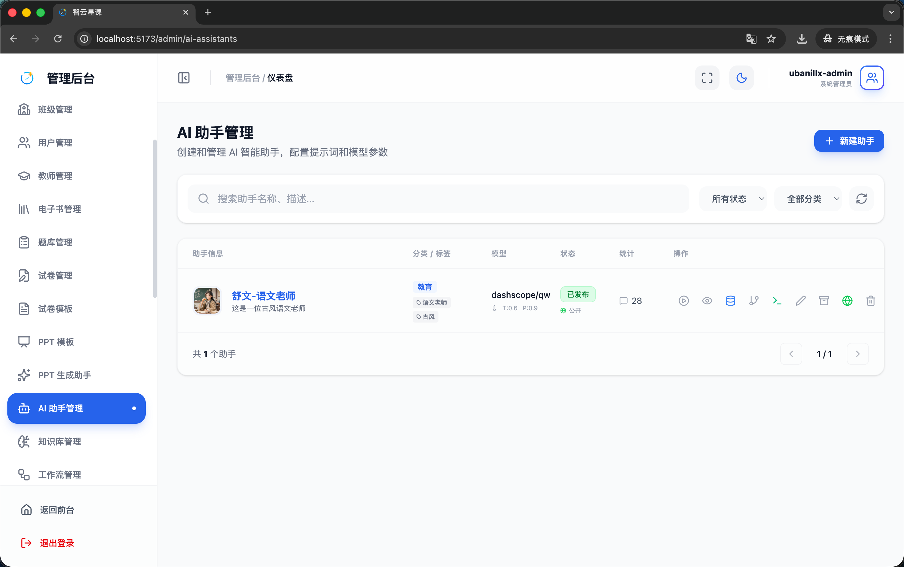
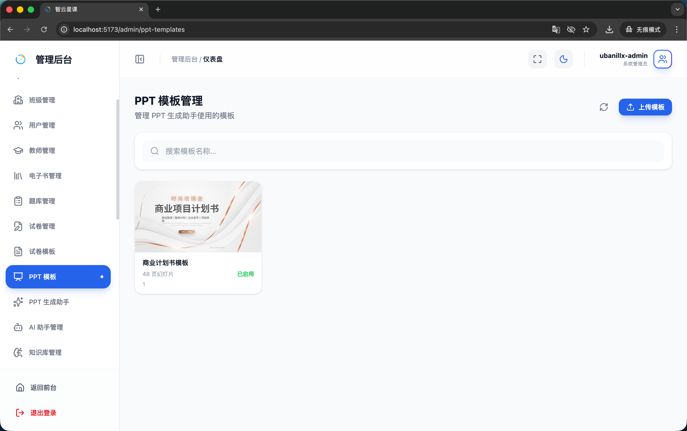
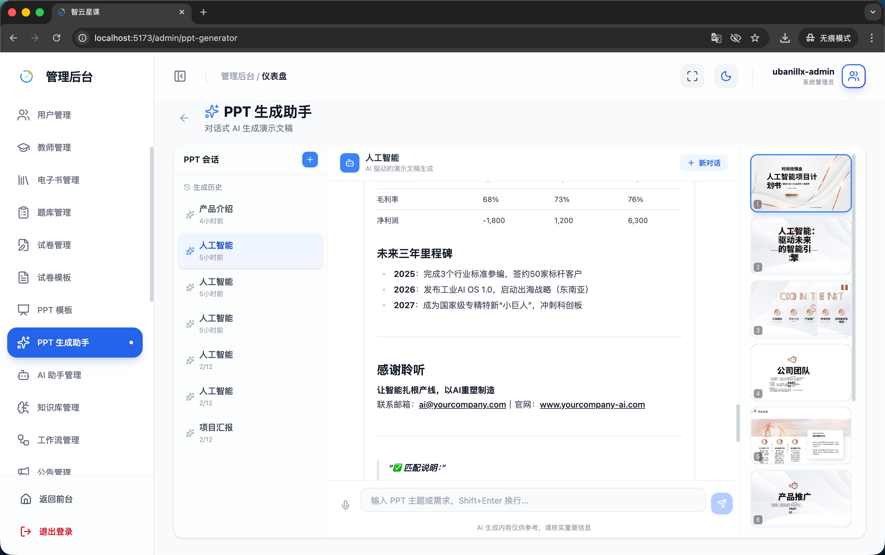
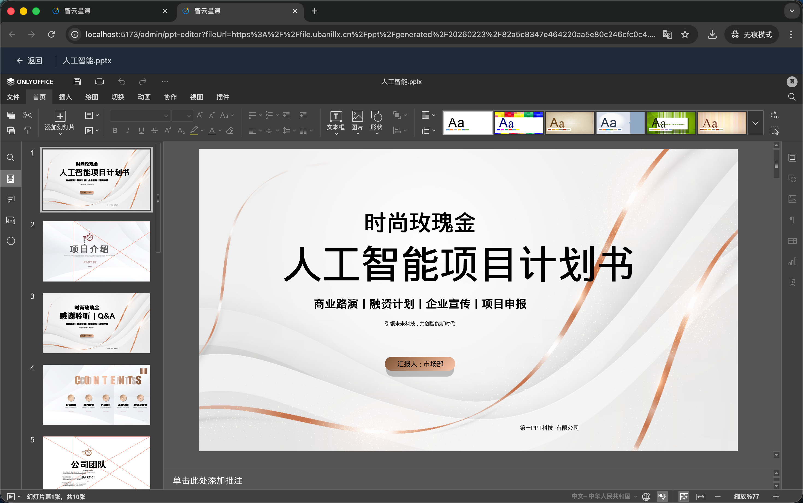
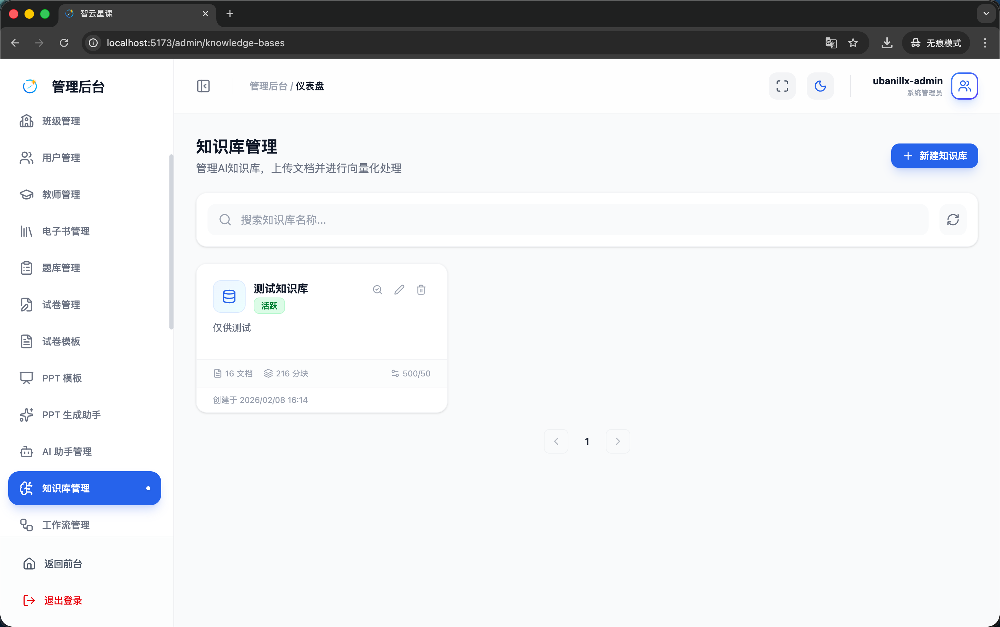
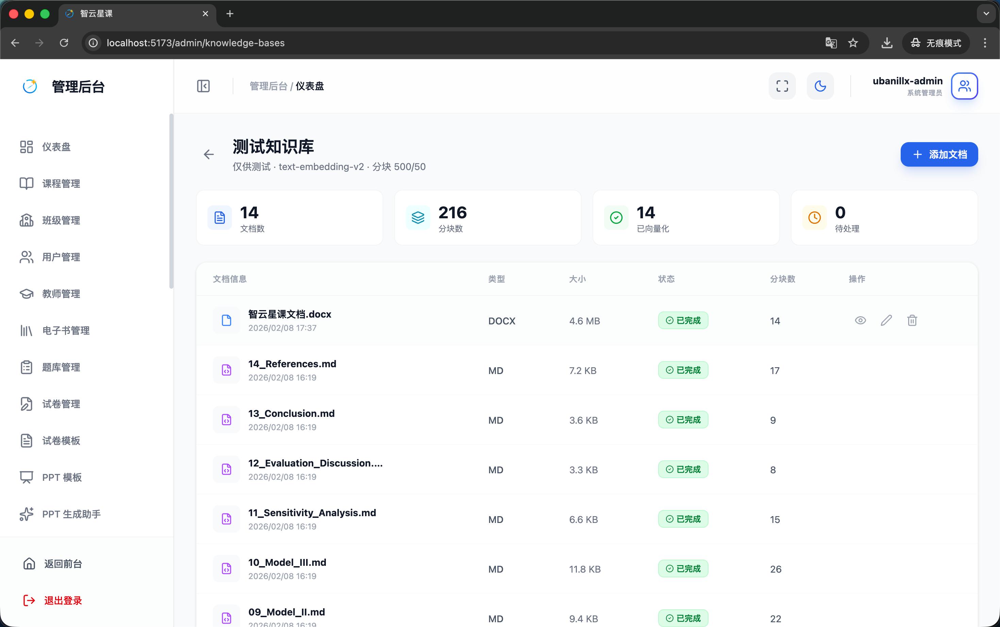

# 管理端 - AI 与 PPT 管理

> 对应源码：
>
> - `web/src/pages/admin/AiAssistantManagementPage.tsx`
> - `web/src/pages/admin/PptTemplateManagementPage.tsx`
> - `web/src/pages/admin/PptGeneratorPage.tsx`
> - `web/src/pages/admin/PptEditorPage.tsx`
> - `web/src/pages/admin/KnowledgeBaseManagementPage.tsx`

## 页面概览

AI 与 PPT 管理模块是平台智能化功能的管理中心，涵盖 AI 助手配置、PPT 生成系统和知识库管理。

---

### 1. AI 助手管理页面（AiAssistantManagementPage）

管理平台的 AI 智慧体/助手：

- **助手列表**：展示所有 AI 助手的名称、头像、描述、状态
- **助手配置**：
  - 基础信息：名称、头像、描述
  - System Prompt 设置：定义助手的角色和行为规则
  - 知识库关联：绑定特定知识库增强回答能力
  - 模型选择：配置底层 LLM 模型
  - 功能开关：启用/禁用特定能力
- **助手状态**：上架/下架管理

### 2. PPT 模板管理页面（PptTemplateManagementPage）

管理 AI PPT 生成使用的模板：

- **模板列表**：展示模板名称、缩略图、适用场景、创建时间
- **模板操作**：
  - 上传新模板
  - 编辑模板信息（名称、描述、标签）
  - 预览模板效果
  - 删除模板

### 3. PPT 生成助手页面（PptGeneratorPage）

AI 驱动的 PPT 自动生成工具：

- **会话管理**：左侧会话侧边栏（`SessionSidebar`），支持创建新会话、切换历史会话、删除会话
- **对话式交互**：通过自然语言描述 PPT 需求，AI 自动生成大纲与内容
- **模板选择**（`TemplateSelector`）：选择 PPT 模板风格
- **大纲编辑**（`OutlineEditor`）：AI 生成大纲后可手动调整
- **实时预览**（`PptPreviewPanel`）：右侧面板实时预览 PPT 效果
- **幻灯片列表**（`SlideListPanel`）：缩略图列表展示所有幻灯片
- **步骤指示器**（`StepIndicator`）：展示 PPT 生成的当前阶段
- **语音输入**：集成 `useTextToSpeech` 支持语音描述需求

### 4. 在线 PPT 编辑页面（PptEditorPage）

基于 OnlyOffice 的在线 PPT 编辑器：

- **在线编辑**：嵌入 OnlyOffice Presentation Editor，支持在浏览器中直接编辑 PPT
- **协同编辑**：支持多人同时编辑
- **保存与导出**：编辑完成后保存至服务器或导出下载

### 5. 知识库管理页面（KnowledgeBaseManagementPage）

管理 RAG（检索增强生成）知识库：

- **知识库列表**：展示所有知识库的名称、文档数量、创建时间
- **知识库操作**：
  - 创建新知识库
  - 编辑知识库信息
  - 删除知识库
- **文档管理**：
  - 上传文档（支持 PDF/DOCX/TXT 等多种格式）
  - 查看文档列表与处理状态（待处理/处理中/已完成/失败）
  - 文档分块信息查看（chunk 数量、嵌入状态）
  - 删除文档
- **向量检索测试**：输入查询文本测试知识库检索效果

## 功能截图

### AI 助手管理页面

页面标题「AI 助手管理」，副文案「创建和管理 AI 智能助手，配置提示词和模型参数」，右上角蓝色「新建助手」按钮。表格展示 1 个助手「舒文-语文老师」（教育分类，语文老师/古风标签，dashscope/qw 模型 T:0.6 P:0.9，已发布，28 条对话，9 个操作图标）。

### PPT 模板管理页面

页面标题「PPT 模板管理」，副文案「管理 PPT 生成助手使用的模板」，右上角刷新按钮和蓝色「上传模板」按钮。搜索栏占位文案「搜索模板名称...」。以卡片形式展示模板。

### PPT 生成助手页面

三栏布局：左侧「PPT 会话」列表（带「+」新建按钮，显示历史会话如「产品介绍」「人工智能」等）。中间对话区域顶部显示当前会话「人工智能 - AI 生成的演示文稿生成」，AI 回复以 Markdown 格式展示 PPT 大纲内容（包含「未来三年里程碑」年份列表、「感谢聆听」等模块）。底部输入框占位文案「输入 PPT 主题或需求，Shift+Enter 换行...」。右侧为 PPT 实时预览面板，以幻灯片缩略图列表展示生成的 PPT 页面：「人工智能项目计划书」封面（蓝色边框高亮选中）、「人工智能：驱动未来的智慧引擎」、「CONTENT」目录页、「公司团队」、「产品推广」等幻灯片。

### PPT 生成助手演示

动图展示 AI PPT 生成的完整流程：从输入主题描述、AI 生成大纲、选择模板风格、到最终生成完整 PPT 的全过程。

### 在线 PPT 编辑页面

基于 OnlyOffice 的在线 PPT 编辑器全屏界面。顶部显示文件名「人工智能.pptx」，下方为 OnlyOffice 完整工具栏（文件、首页、插入、绘图、切换、动画、协作、视图、插件菜单），工具栏包含添加幻灯片、文本框、图片、形状等工具，右侧有字体样式选择器。左侧为幻灯片缩略图导航面板，展示多张幻灯片预览。中间主编辑区域显示当前正在编辑的幻灯片。

### 知识库管理页面总览

页面标题「知识库管理」，副文案「管理 AI 助手使用的知识库和文档」，右上角蓝色「新建知识库」按钮。搜索栏占位文案「搜索知识库名称或描述...」，右侧刷新按钮。以卡片形式展示知识库，底部显示创建者信息和「管理文档」蓝色链接。

### 知识库文档管理

知识库详情页面，顶部面包屑「知识库管理 > 智云星课文档」，标题「智云星课文档」，描述「这是用于智云星课的知识库」，右上角蓝色「上传文档」按钮和刷新按钮。

## 技术要点

- **PPT 生成架构**：
  - 前端通过 `usePptChat` Hook 管理会话状态与 AI 交互
  - 后端 `ppt-service`（Python）负责 PPT 文件生成
  - 使用 SSE 实现流式生成进度推送
- **OnlyOffice 集成**：通过 `OnlyOfficeController` 提供文档编辑回调服务
- **知识库 RAG**：
  - 文档上传后进行分块（chunking）和向量嵌入（embedding）
  - AI 对话时检索相关知识增强回答质量
  - 使用 `KnowledgeBaseVO` 和 `KnowledgeDocumentVO` 数据模型
- **雪花 ID**：`getCurrentUserId` 函数使用字符串形式处理 ID，避免精度丢失
