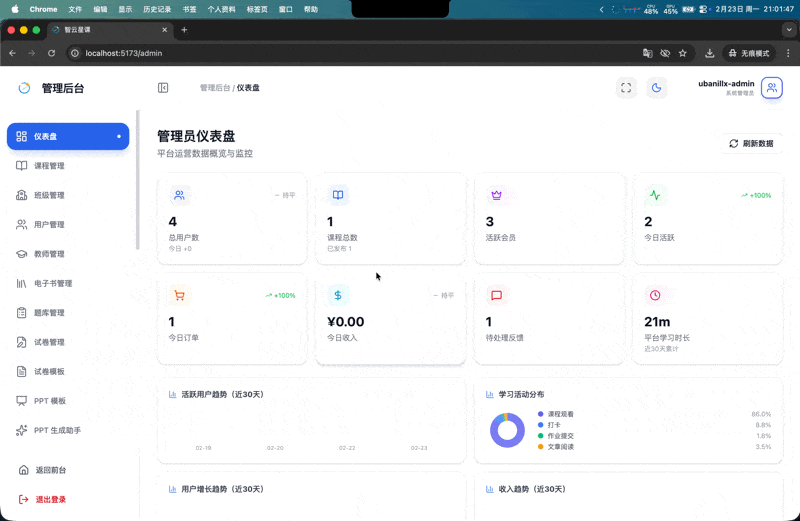
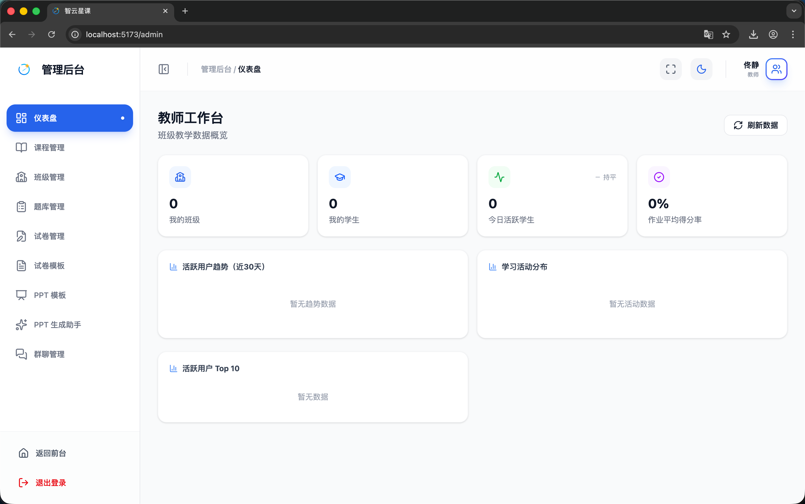

# 管理端 - 仪表盘

> 对应源码：`web/src/pages/admin/DashboardPage.tsx`  
> 路由：`/admin`（管理员）、`/admin`（教师视图）

## 页面概览

仪表盘是管理后台的首页，为管理员和教师提供平台运营的核心数据看板。根据角色不同展示不同维度的数据。

---

### 管理员仪表盘

管理员视角的全局运营数据概览，包含以下模块：

1. **核心指标卡片**：
   - 用户总数、课程总数、订单总数、收入金额
   - 每个指标附带环比趋势（上升/下降/持平），使用 `TrendBadge` 组件展示

2. **趋势分析**（`DashboardTrendsResponse`）：
   - 用户增长趋势
   - 订单与收入趋势
   - 活跃度变化

3. **学习数据**（`DashboardLearningResponse`）：
   - 学习时长统计
   - 课程完成率
   - 学科分布

4. **内容概览**（`DashboardContentResponse`）：
   - 课程/电子书/帖子等内容数量统计
   - 内容发布趋势

5. **AI 系统状态**（`DashboardAiSystemResponse`）：
   - AI 助手调用量
   - PPT 生成量
   - 工作流执行统计

6. **系统告警**（`DashboardAlertsResponse`）：
   - 待处理事项提醒
   - 异常状态告警

### 教师仪表盘

教师视角的班级教学数据概览，聚焦于：
- 所管班级的学生学习情况
- 班级课程进度统计
- 作业批改数据
- 学生活跃度排名

## 功能截图

### 管理员仪表盘

动图展示管理员仪表盘的完整界面：顶部四张指标卡片（用户总数、课程总数、总收入、AI 对话次数，每张带环比趋势箭头和百分比变化），下方为折线/柱状图的数据趋势区、内容概览统计（课程、电子书、帖子、公告数量）、AI 系统状态面板和系统告警列表。页面支持滚动浏览所有数据模块。

### 教师仪表盘

教师专属仪表盘，页面标题「教师工作台」，副文案「班级教学数据概览」，右上角蓝色「刷新数据」按钮。顶部四张指标卡片：「我的班级」0（蓝色图标）、「我的学生」0（绿色图标）、「今日活跃学生」0（绿色趋势箭头，持平）、「作业平均得分率」0%（紫色图标）。下方三个图表卡片：「活跃用户趋势（近30天）」（暂无趋势数据）、「学习活动分布」（暂无活动数据）、「活跃用户 Top 10」（暂无数据）。左侧导航栏显示教师可访问的菜单项：课程管理、班级管理、题库管理、试卷管理、试卷模板、PPT 模板、PPT 生成助手、群聊管理。

## 技术要点

- **独立 API**：使用 `AdminDashboardControllerApi` 调用后端仪表盘专用接口
- **环比计算**：`calcChange` 函数对比当期与上期数据，计算百分比变化并判断方向
- **数字格式化**：`fmt` 函数处理大数展示（1k、1w），`fmtMoney` 处理金额，`fmtDuration` 处理时长
- **多维数据**：后端返回 6 个响应对象分别覆盖概览、趋势、学习、内容、AI、告警六大维度
- **图标库**：使用 Lucide React 的丰富图标集合（Users、BookOpen、ShoppingCart、Brain、Workflow 等）
