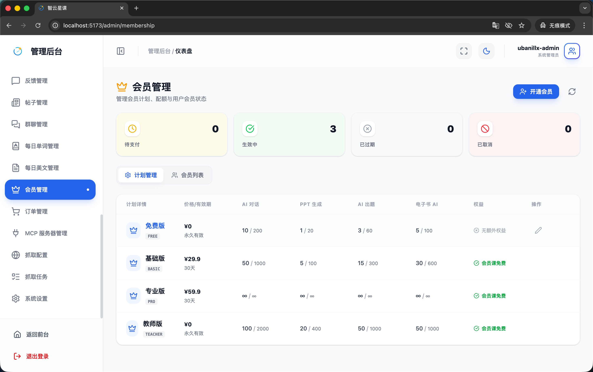
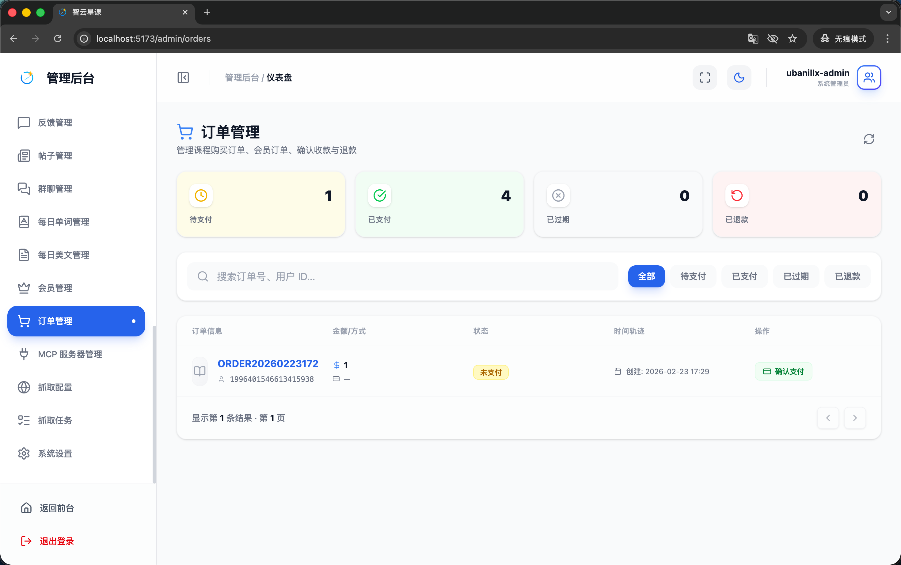
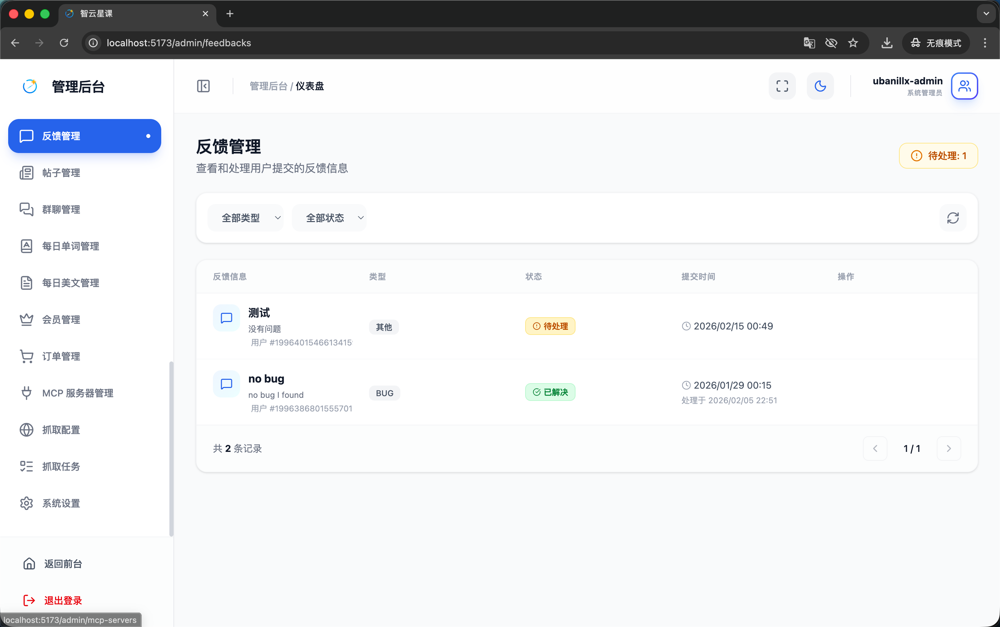
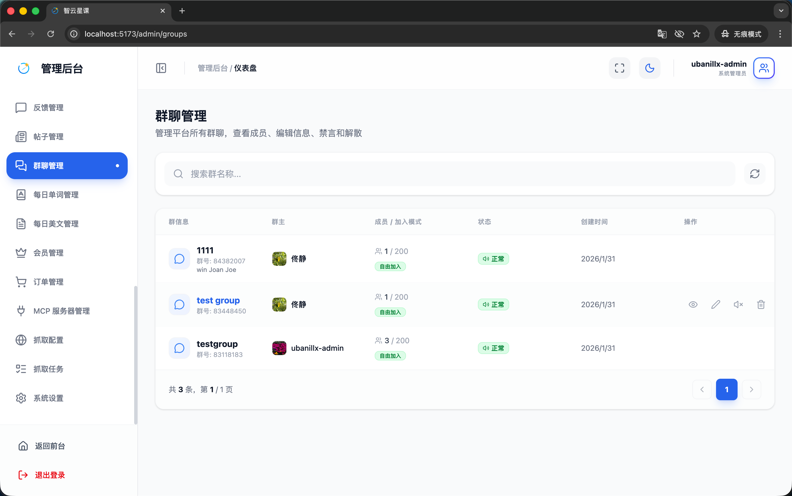

# 管理端 - 会员与订单管理

> 对应源码：
>
> - `web/src/pages/admin/MembershipManagementPage.tsx`
> - `web/src/pages/admin/OrderManagementPage.tsx`
> - `web/src/pages/admin/FeedbackManagementPage.tsx`
> - `web/src/pages/admin/GroupManagementPage.tsx`

## 页面概览

会员与订单管理模块负责平台的商业化运营与用户服务管理，包括会员套餐配置、订单跟踪、用户反馈处理和群聊管理。

---

### 1. 会员管理页面（MembershipManagementPage）

管理平台的会员套餐体系：

- **套餐列表**：展示所有会员套餐（FREE 免费版 / BASIC 基础版 / PRO 专业版 / TEACHER 教师版）
- **套餐配置**：
  - 套餐名称与描述
  - 价格设置
  - AI 配额管理（每日/每月调用限制）
  - 功能权限配置（AI 聊天、PPT 生成、AI 出题、智能批改等）
- **用户会员状态**：查看用户的当前会员状态与到期时间

### 2. 订单管理页面（OrderManagementPage）

管理平台的交易订单：

- **订单列表**：展示订单编号、用户、商品（课程/会员）、金额、状态、创建时间
- **订单状态**：待支付 / 已支付 / 已取消 / 已退款
- **订单搜索**：按订单号、用户、状态筛选
- **订单详情**：查看订单的完整交易信息

### 3. 反馈管理页面（FeedbackManagementPage）

处理用户提交的意见反馈：

- **反馈列表**：展示用户反馈的标题、类型、提交时间、处理状态
- **反馈处理**：
  - 查看反馈详情
  - 标记处理状态（待处理/处理中/已解决/已关闭）
  - 回复用户反馈

### 4. 群聊管理页面（GroupManagementPage）

管理平台的群聊组织：

- **群聊列表**：展示群组名称、创建者、成员数、创建时间
- **群组操作**：
  - 创建群组
  - 编辑群组信息
  - 管理群成员
  - 解散群组

## 功能截图

### 会员管理页面

页面标题「会员管理」，副文案「管理会员计划、配额与用户会员状态」，右上角蓝色「开通会员」按钮和刷新按钮。顶部四张状态统计卡片：「待支付」0（黄色图标）、「生效中」3（绿色图标）、「已过期」0（灰色图标）、「已取消」0（红色图标）。下方两个 Tab：「计划管理」（蓝色选中）和「会员列表」。表格列包含：计划详情（图标+名称+代码）、价格/有效期、AI 对话、PPT 生成、AI 出题、电子书 AI、权益、操作（编辑图标）。

### 订单管理页面

页面标题「订单管理」，副文案「管理课程购买订单、会员订单、确认收款与退款」，右上角刷新按钮。顶部四张状态统计卡片：「待支付」1（黄色图标）、「已支付」4（绿色图标）、「已过期」0（灰色图标）、「已退款」0（红色背景）。搜索栏占位文案「搜索订单号、用户 ID...」，右侧有状态筛选 Tab：「全部」（蓝色选中）、「待支付」、「已支付」、「已过期」、「已退款」。表格列包含：订单信息（订单号+用户ID+支付方式图标）、金额/方式（金额数值）、状态（黄色「未支付」标签）、时间轨迹（创建时间）、操作（「确认支付」蓝色链接）。

### 反馈管理页面

页面标题「反馈管理」，副文案「查看和处理用户提交的反馈信息」，右上角黄色「待处理: 1」提醒标签。筛选区域有「全部类型」和「全部状态」两个下拉选择器及刷新按钮。表格列包含：反馈信息（图标+标题+描述+用户ID）、类型（「其他」/「BUG」灰色标签）、状态（黄色「待处理」/绿色「已解决」标签）、提交时间（含处理时间）、操作。

### 群聊管理页面

页面标题「群聊管理」，副文案「管理平台所有群聊、查看成员、编辑信息、禁言和解散」。搜索栏占位文案「搜索群名称...」，右侧刷新按钮。表格列包含：群信息（头像+群名+群号+描述）、群主（头像+用户名）、成员/加入模式（如「1/200」+蓝色「自由加入」标签）、状态（绿色「正常」标签）、创建时间、操作（查看/禁言/编辑/删除图标）。

## 技术要点

- **会员体系**：四级套餐（FREE/BASIC/PRO/TEACHER），每级有不同的 AI 功能配额
- **AI 配额**：按天 + 按月双维度限制，由 `AiUsageLimitService` 领域服务控制
- **支付预留**：已预留支付宝和微信支付网关接口（`AlipayPaymentGateway`、`WechatPayPaymentGateway`）
- **会员课免费**：购买会员后自动解锁会员课程
