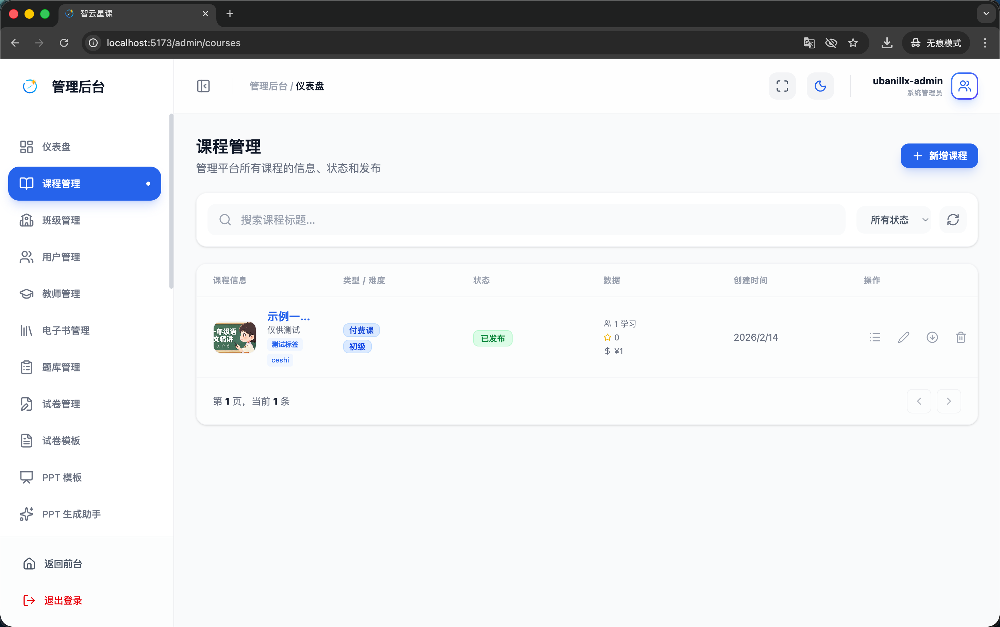
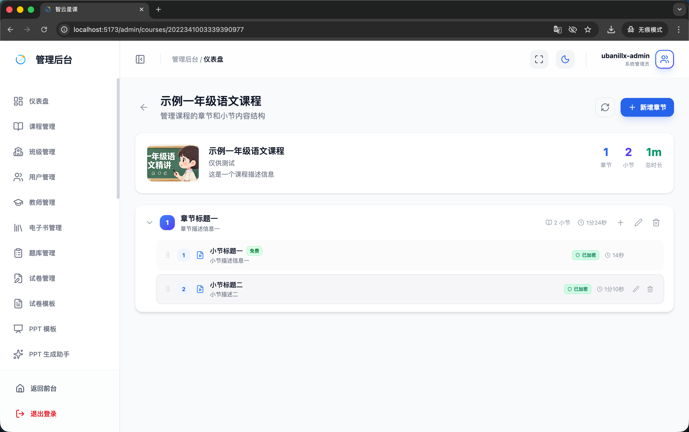
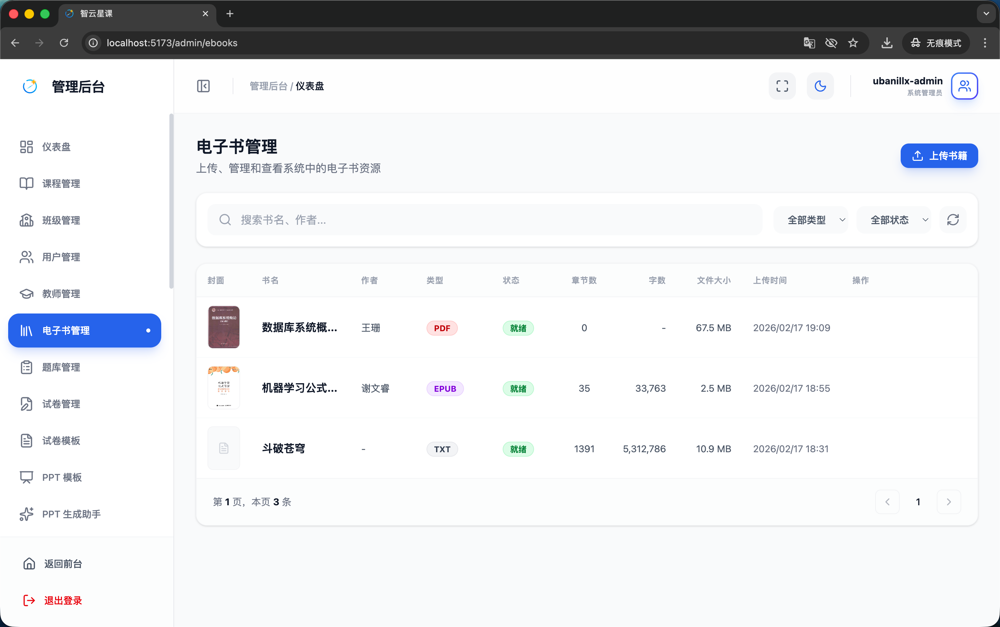
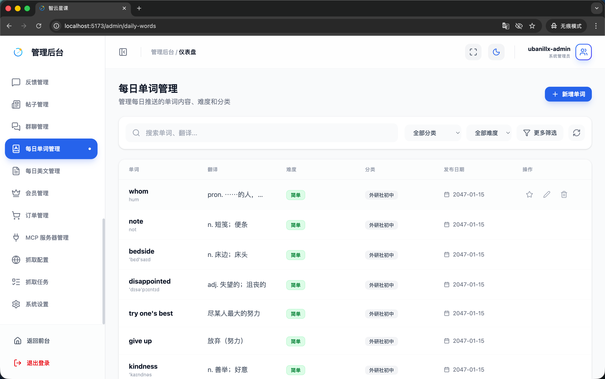
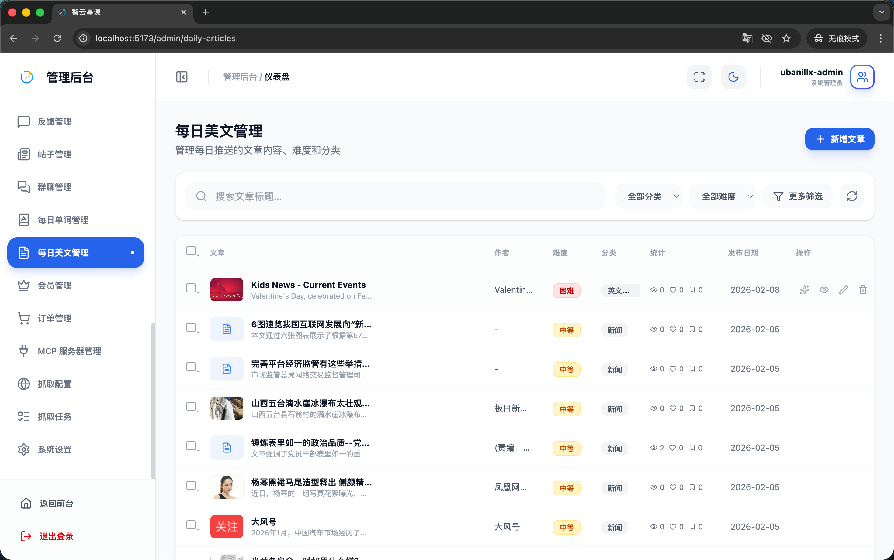
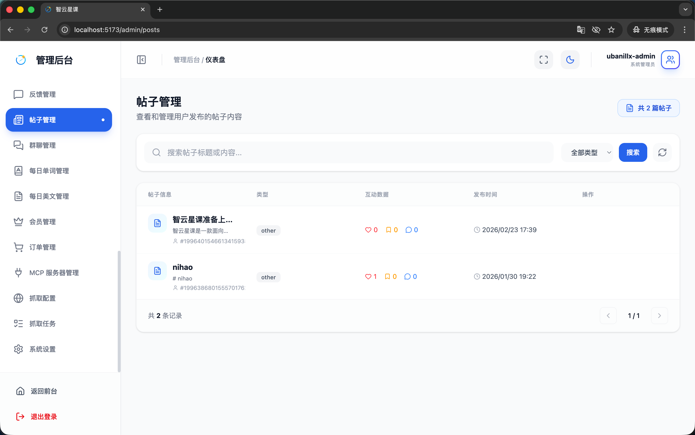
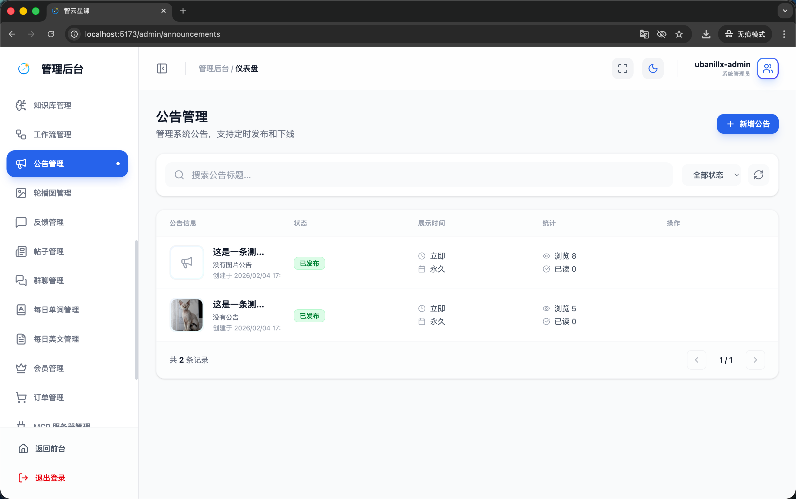

# 管理端 - 内容管理

> 对应源码：
>
> - `web/src/pages/admin/CourseManagementPage.tsx`、`web/src/pages/admin/CourseDetailPage.tsx`
> - `web/src/pages/admin/BookManagementPage.tsx`
> - `web/src/pages/admin/DailyWordManagementPage.tsx`
> - `web/src/pages/admin/DailyArticleManagementPage.tsx`
> - `web/src/pages/admin/PostManagementPage.tsx`
> - `web/src/pages/admin/AnnouncementManagementPage.tsx`
> - `web/src/pages/admin/BannerManagementPage.tsx`

## 页面概览

内容管理模块涵盖平台所有教学与运营内容的后台管理，包括课程、电子书、每日单词、每日美文、社区帖子、公告和轮播图七大功能。

---

### 1. 课程管理

#### 课程列表页（CourseManagementPage）

管理平台的全部课程：

- **课程列表**：表格展示课程标题、封面、类型（公开课/付费课/会员课）、状态（草稿/已发布）、学员数、创建时间
- **搜索筛选**：按课程名称搜索、按类型/状态筛选
- **课程操作**：创建新课程、编辑、上架/下架、删除
- **批量操作**：支持批量上架/下架

#### 课程详细设置页（CourseDetailPage）

单门课程的详细编辑界面：

- **基础信息编辑**：标题、副标题、描述、封面图上传
- **课程属性**：类型、难度（入门~专家五级）、标签管理
- **课程结构管理**：
  - 章节（Chapter）增删改排序
  - 小节（Section）增删改排序
  - 视频上传与管理
  - 课件附件上传
- **定价设置**：付费课程的价格配置

### 2. 电子书管理（BookManagementPage）

管理平台的电子书资源：

- **书籍列表**：展示书名、作者、文件类型（PDF/EPUB/TXT/DOCX）、上传时间
- **书籍操作**：上传新书、编辑信息、删除
- **文件上传**：支持多种电子书格式的文件上传
- **章节解析**：上传后自动解析书籍章节结构

### 3. 每日单词管理（DailyWordManagementPage）

管理每日推送的英语单词资源：

- **单词库管理**：按词库类型（初中/高中/四级/六级/考研/托福/雅思/GRE）分类管理
- **单词编辑**：编辑单词、音标、释义、例句
- **推送配置**：设置每日推送规则

### 4. 每日美文管理（DailyArticleManagementPage）

管理每日推荐的美文内容：

- **文章列表**：展示文章标题、作者、发布状态、发布时间
- **文章编辑**：富文本编辑器编写文章内容
- **发布管理**：文章的发布/下架控制

### 5. 帖子管理（PostManagementPage）

管理社区学习圈的帖子内容：

- **帖子列表**：展示帖子标题、作者、发布时间、点赞数、评论数
- **帖子审核**：审核用户发布的帖子
- **帖子操作**：编辑、置顶、删除

### 6. 公告管理（AnnouncementManagementPage）

管理平台公告：

- **公告列表**：展示公告标题、发布状态、发布时间
- **公告编辑**：富文本编辑器编写公告内容
- **发布管理**：公告的发布/撤回

### 7. 轮播图管理（BannerManagementPage）

管理首页 Banner 轮播图：

- **轮播图列表**：展示当前配置的轮播图顺序、图片、跳转链接
- **轮播图操作**：上传新图片、编辑跳转链接、调整排序、删除
- **预览功能**：实时预览轮播效果

## 功能截图

### 课程管理页面总览

页面标题「课程管理」，副文案「管理平台所有课程的信息、状态和发布」，右上角蓝色「新增课程」按钮。搜索栏占位文案「搜索课程标题...」，右侧「所有状态」下拉筛选和刷新按钮。表格列包含：课程信息（封面缩略图+标题+副标题+标签）、类型/难度（「付费课」紫色标签+「初级」蓝色标签）、状态（绿色「已发布」标签）、数据（学习人数、收藏数、销量）、创建时间、操作（目录/编辑/定时/删除图标）。

### 课程管理页面详细设置

课程详情编辑页面，顶部显示课程名称「示例一年级语文课程」，副文案「管理课程的章节和小节内容结构」，右上角蓝色「新增章节」按钮和刷新按钮。课程信息卡片展示封面图（橘猫老师黑板教学）、标题、副标题「仅供测试」、描述，右侧统计数据：1 章节、2 小节、总时长 1m。下方章节结构以可展开的树形列表呈现：「章节标题一」（2 小节，时长 1分24秒，带新增/编辑/删除按钮），展开后显示小节标题一（「免费」绿色标签，「已发布」绿色状态，时长 14秒）和小节标题二（「已发布」绿色状态，时长 1分10秒），每个小节左侧有拖拽排序手柄。

### 电子书管理页面

页面标题「电子书管理」，副文案「上传、管理和查看系统中的电子书资源」，右上角蓝色「上传书籍」按钮。搜索栏占位文案「搜索书名、作者...」，右侧「全部类型」和「全部状态」两个下拉筛选及刷新按钮。表格列包含：封面（书籍缩略图）、书名、作者、类型（PDF 红色/EPUB 紫色/TXT 蓝色标签）、状态（「就绪」橙色标签）、章节数、字数、文件大小、上传时间、操作。

### 每日单词管理页面

页面标题「每日单词管理」，副文案「管理每日推送的单词内容、难度和分类」，右上角蓝色「新增单词」按钮。搜索栏占位文案「搜索单词、翻译...」，右侧「全部分类」「全部难度」两个下拉筛选、「更多筛选」按钮和刷新按钮。表格列包含：单词（英文+音标）、翻译（中文释义）、难度（绿色「简单」标签）、分类（「外研社初中」标签）、发布日期、操作（收藏/编辑/删除图标）。

### 每日美文管理页面

页面标题「每日美文管理」，副文案「管理每日推送的文章内容、难度和分类」，右上角蓝色「新增文章」按钮。搜索栏占位文案「搜索文章标题...」，右侧「全部分类」「全部难度」两个下拉筛选、「更多筛选」按钮和刷新按钮。表格列包含：文章（封面缩略图+标题+摘要，带勾选框）、作者、难度（红色「困难」/橙色「中等」标签）、分类（「英文...」「新闻」标签）、统计（浏览/评论/点赞/收藏数据）、发布日期、操作（置顶/预览/编辑/删除图标）。

### 帖子管理页面

页面标题「帖子管理」，副文案「查看和管理用户发布的帖子内容」，右上角显示「共 2 篇帖子」。搜索栏占位文案「搜索帖子标题或内容...」，右侧「全部类型」下拉筛选和蓝色「搜索」按钮及刷新按钮。表格列包含：帖子信息（头像+标题+摘要+用户ID）、类型（other 灰色标签）、互动数据（点赞/收藏/评论计数）、发布时间、操作。

### 公告管理页面

页面标题「公告管理」，副文案「管理系统公告，支持定时发布和下线」，右上角蓝色「新增公告」按钮。搜索栏占位文案「搜索公告标题...」，右侧「全部状态」下拉筛选和刷新按钮。表格列包含：公告信息（缩略图+标题+描述+创建时间）、状态（绿色「已发布」标签）、展示时间（立即/永久）、统计（浏览数/已读数）、操作。

### 轮播图管理

页面标题「轮播图管理」，副文案「管理首页轮播图，支持定时展示和跳转设置」，右上角蓝色「新增轮播图」按钮。搜索栏占位文案「搜索轮播图标题...」，右侧「全部状态」下拉筛选和刷新按钮。以卡片形式展示轮播图。

## 技术要点

- **统一管理模式**：所有内容管理页面遵循统一的 CRUD 交互模式（列表 → 新建/编辑弹窗 → 确认提交）
- **富文本编辑**：公告与美文编辑使用富文本编辑器
- **文件上传**：课程视频、电子书文件、轮播图图片均通过 OSS 存储
- **课程结构**：采用章节（Chapter）→ 小节（Section）的二级嵌套结构
