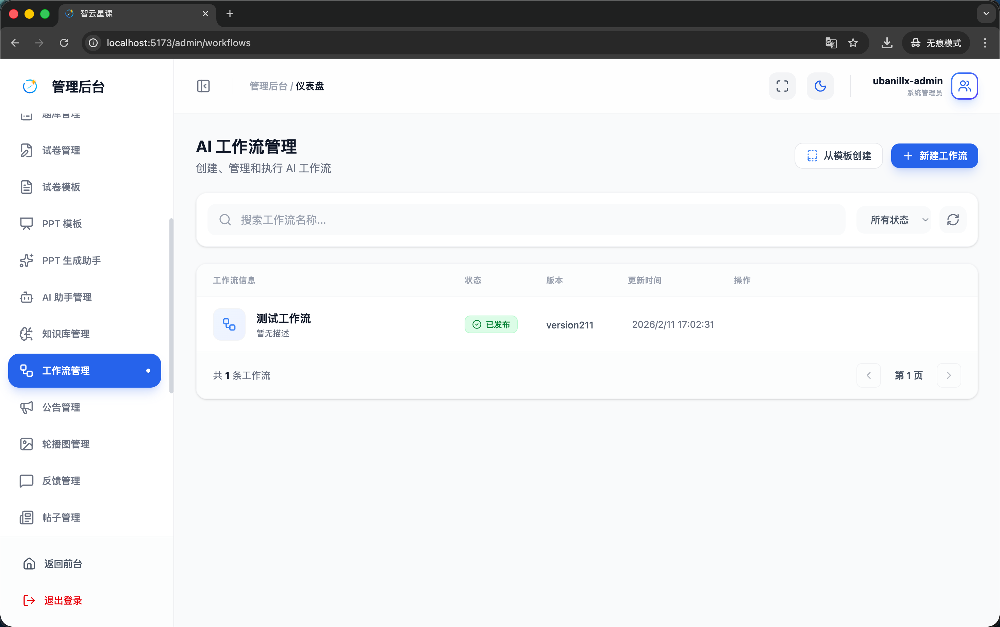
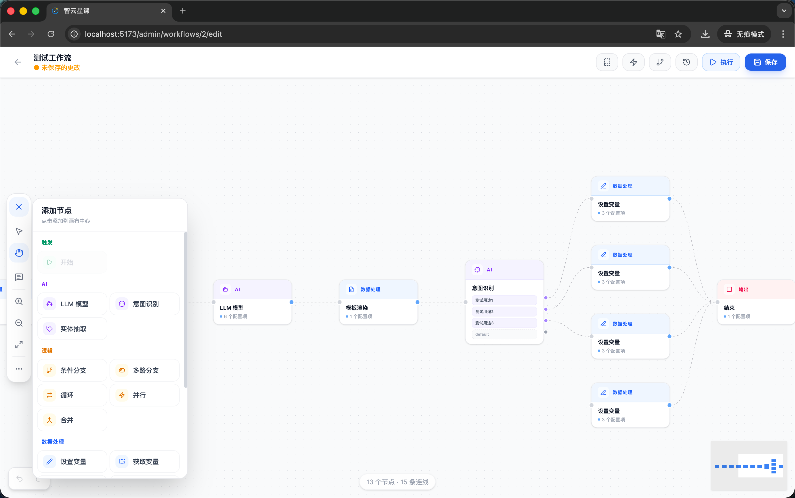
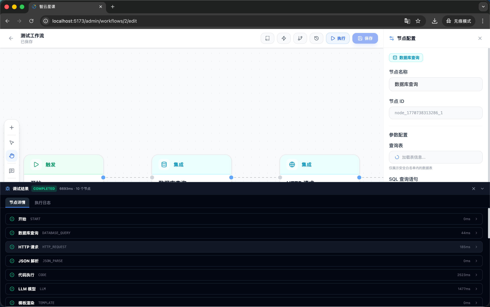
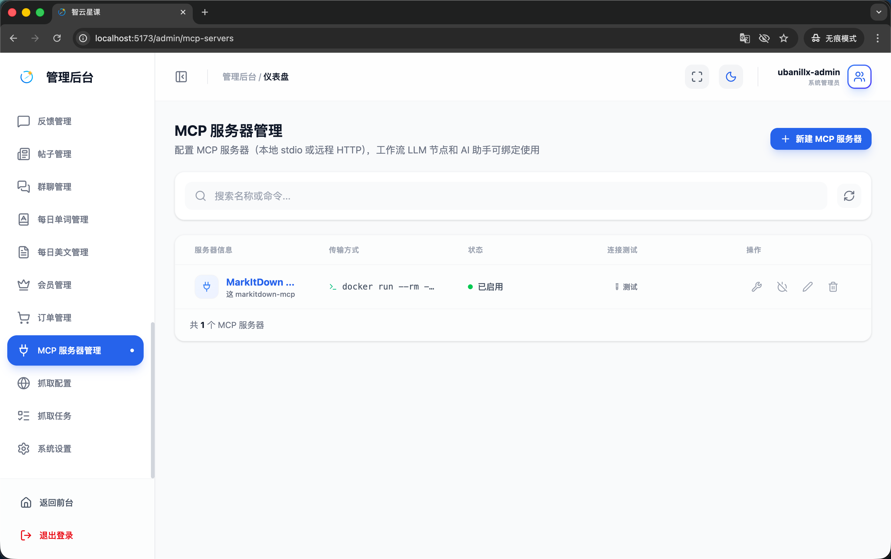
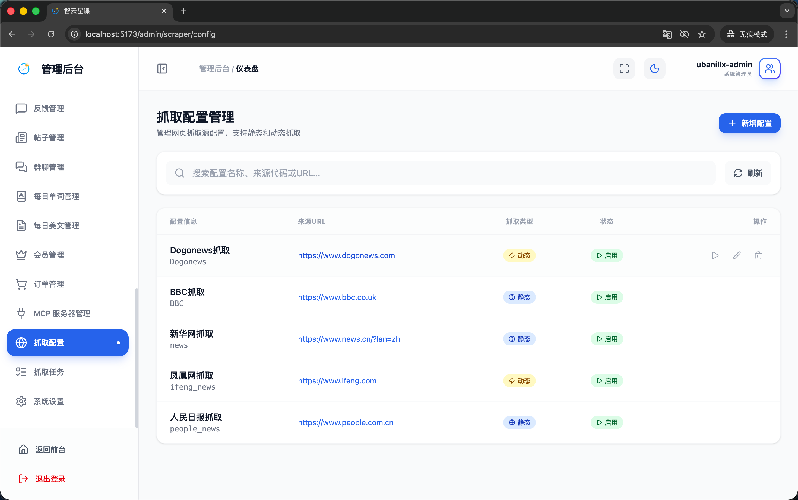
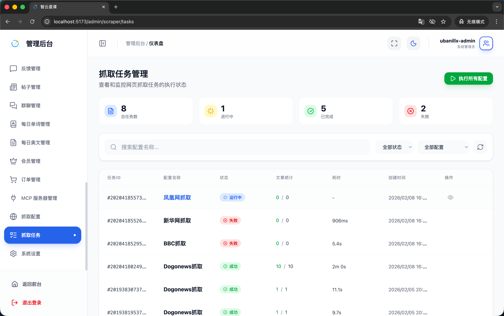

# 管理端 - 工作流与自动化

> 对应源码：
>
> - `web/src/pages/admin/WorkflowManagementPage.tsx`
> - `web/src/pages/admin/workflow/WorkflowEditorPage.tsx` 及 `workflow/` 子目录
> - `web/src/pages/admin/McpServerManagementPage.tsx`
> - `web/src/pages/admin/ScraperConfigPage.tsx`
> - `web/src/pages/admin/ScraperTaskPage.tsx`

## 页面概览

工作流与自动化模块提供可视化的 AI 工作流编排、MCP 服务器管理和网页抓取自动化功能，帮助管理员实现教学内容的智能化处理。

---

### 1. AI 工作流管理页面（WorkflowManagementPage）

管理所有 AI 工作流的列表视图：

- **工作流列表**：展示工作流名称、描述、状态（草稿/已发布）、最近执行时间
- **工作流操作**：创建新工作流、编辑、复制、删除
- **执行历史**：查看工作流的历次执行记录与结果

### 2. 工作流编辑页面（WorkflowEditorPage）

可视化的工作流编排器，基于 React Flow 构建：

- **画布工具栏**（`CanvasToolbar`）：缩放、布局、撤销/重做等画布操作
- **节点工具栏**（`NodeToolbar`）：拖拽添加各类节点到画布
- **节点配置面板**（`NodeConfigPanel`）：选中节点后编辑其参数配置
- **节点类型**：
  - 工作流节点（`WorkflowNodeComponent`）：通用处理节点
  - 循环容器节点（`LoopContainerNode`）：循环执行子流程
  - 注释节点（`CommentNode`）：画布上的文字注释
- **触发器管理**（`TriggerManagerPanel`）：配置工作流的触发条件（手动/定时/事件触发）
- **模板库**（`TemplateGalleryModal`）：从预设模板快速创建工作流
- **另存为模板**（`SaveAsTemplateModal`）：将当前工作流保存为可复用模板
- **版本历史**（`VersionHistoryPanel`）：查看和回滚工作流的历史版本
- **自动布局**（`autoLayout`）：一键自动整理节点排列
- **工作流状态管理**（`useWorkflowStore`）：使用 Zustand 管理工作流编辑状态

### 3. 工作流执行结果

工作流执行后的结果展示：

- 执行状态（成功/失败/超时）
- 各节点的执行详情与输出
- 执行耗时统计
- 错误日志查看

### 4. MCP 服务器管理页面（McpServerManagementPage）

管理 Model Context Protocol (MCP) 服务器：

- **服务器列表**：展示已配置的 MCP 服务器信息
- **服务器配置**：
  - 服务器地址与连接参数
  - 可用工具列表
  - 认证配置
- **连接测试**：测试 MCP 服务器的连通性
- **服务器状态**：在线/离线状态监控

### 5. 抓取配置管理页面（ScraperConfigPage）

管理网页内容抓取的配置：

- **配置列表**：展示所有抓取配置的名称、目标 URL、频率、状态
- **配置编辑**：
  - 目标网站 URL
  - 抓取规则（CSS 选择器/XPath）
  - 抓取频率（定时/手动）
  - 数据处理管道
- **启用/禁用**：控制抓取配置的激活状态

### 6. 抓取任务管理页面（ScraperTaskPage）

管理和监控抓取任务的执行：

- **任务列表**：展示任务 ID、关联配置、状态（等待中/执行中/已完成/失败）、开始时间、耗时
- **任务操作**：
  - 手动触发执行
  - 查看任务详情与抓取结果
  - 重试失败的任务
  - 取消进行中的任务

## 功能截图

### AI 工作流管理页面

页面标题「AI 工作流管理」，副文案「创建、管理和执行 AI 自动化工作流」，右上角蓝色「新建工作流」按钮。搜索栏占位文案「搜索工作流名称...」，右侧「所有状态」下拉筛选和刷新按钮。表格列包含：工作流信息（图标+名称+描述）、状态（绿色「已发布」标签）、版本、最后执行、执行次数、操作。

### 工作流编辑页面

全屏可视化工作流编辑器，顶部工具栏显示工作流名称「测试工作流」、「版本 2」标签，右侧有「测试运行」蓝色按钮和「发布」蓝色按钮。工具栏左侧有撤销/重做、自动布局、小地图、放大缩小等控件。画布上展示工作流节点连线图：「开始」节点（绿色圆形）→「网页抓取」节点（URL: http://paper.people.com.cn/rmrb/）→「AI 处理」节点（解析抓取内容）→「结束」节点（红色圆形）。右侧展开了「AI 处理」节点的配置面板，显示节点名称、处理类型「综合分析」、建议使用、自定义指令等配置项。节点之间有蓝色连接线串联。

### 工作流执行结果

工作流编辑器的执行结果视图。画布上各节点显示执行状态：「开始」节点绿色对勾标记，「网页抓取」节点绿色对勾（成功），「AI 处理」节点绿色对勾（成功），「结束」节点绿色对勾。右侧展开了「AI 处理」节点的输出结果面板，面板有「配置」「输入」「输出」三个 Tab。「输出」 Tab 显示 AI 处理结果。

### MCP 服务器管理页面

页面标题「MCP 服务器管理」，副文案「管理和监控 MCP (Model Context Protocol) 服务器」，右上角蓝色「新增服务器」按钮和刷新按钮。搜索栏占位文案「搜索服务器名称...」。表格列包含：服务器信息（图标+名称+描述+连接地址）、状态（绿色「已连接」/红色「未连接」标签）、工具数量、操作。

### 抓取配置管理页面

页面标题「抓取配置」，副文案「管理网站内容抓取规则，支持定时与手动执行」，右上角蓝色「新建配置」按钮。搜索栏占位文案「搜索配置名称...」，右侧「所有状态」下拉筛选和刷新按钮。表格列包含：配置信息（图标+名称+描述+目标 URL）、状态（绿色「已启用」标签）、执行计划、最近执行、操作。

### 抓取任务管理页面

页面标题「抓取任务」，副文案「查看和管理抓取任务的执行记录」。搜索栏占位文案「搜索任务 ID 或配置名称...」，右侧「所有状态」下拉筛选和刷新按钮。表格列包含：任务信息（图标+任务ID+配置名称）、状态（绿色「已完成」/红色「失败」标签）、结果统计（成功抓取数量）、执行时间（开始时间+耗时）、操作。

## 技术要点

- **工作流引擎**：基于 React Flow 构建可视化编排器，使用 Zustand（`useWorkflowStore`）管理状态
- **节点系统**：支持通用节点、循环容器、注释三种节点类型，通过 `NodeConfigPanel` 配置参数
- **版本管理**：工作流支持版本历史与回滚功能
- **自动布局**：`autoLayout` 工具函数实现一键节点排列优化
- **MCP 协议**：Model Context Protocol 标准，用于连接外部 AI 工具服务
