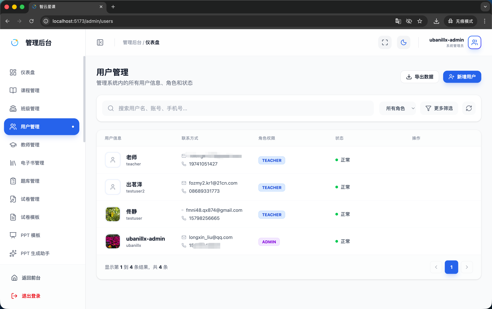
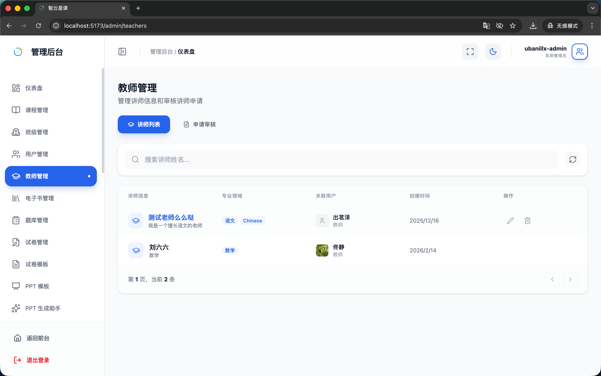
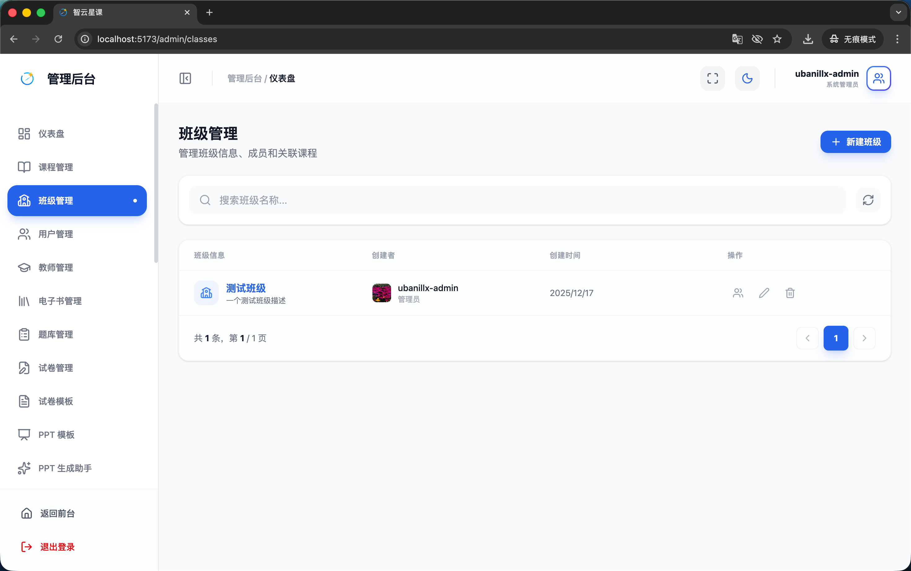

# 管理端 - 用户与班级管理

> 对应源码：`web/src/pages/admin/UserManagementPage.tsx`、`web/src/pages/admin/TeacherManagementPage.tsx`、`web/src/pages/admin/ClassManagementPage.tsx`
> 路由：`/admin/users`、`/admin/teachers`、`/admin/classes`

## 页面概览

用户与班级管理模块是管理后台的基础功能，负责平台用户账号、教师身份和班级组织的增删改查。

---

### 1. 用户管理页面（UserManagementPage）

管理平台所有注册用户：

- **用户列表**：表格展示用户 ID、头像、昵称、邮箱、注册时间、状态等信息
- **搜索筛选**：按用户名/邮箱搜索，按角色/状态筛选
- **用户操作**：
  - 查看用户详情
  - 编辑用户信息
  - 禁用/启用用户账号
  - 角色分配（普通用户/教师/管理员）
- **分页浏览**：支持分页查看大量用户数据

### 2. 教师管理页面（TeacherManagementPage）

专门管理教师角色的用户：

- **教师列表**：展示所有具有教师权限的用户
- **教师审核**：审核教师身份申请
- **权限管理**：配置教师的管理范围与权限
- **关联班级**：查看教师所管理的班级列表

### 3. 班级管理页面（ClassManagementPage）

管理平台的班级组织：

- **班级列表**：展示所有班级的名称、创建者、学生人数、创建时间
- **班级操作**：
  - 创建新班级
  - 编辑班级信息
  - 管理班级成员（添加/移除学生）
  - 删除班级
- **班级详情**：查看班级的完整信息与成员列表

## 功能截图

### 用户管理页面

页面标题「用户管理」，副文案「管理系统内的所有用户信息、角色和状态」，右上角有「导出数据」和蓝色「新增用户」按钮。搜索栏占位文案「搜索用户名、账号、手机号...」，右侧有「所有角色」下拉筛选和「更多筛选」按钮。表格列包含：用户信息（头像+昵称+账号）、联系方式（邮箱+手机号）、角色权限（TEACHER/ADMIN 彩色标签）、状态（绿色「正常」）、操作。

### 教师管理页面

页面标题「教师管理」，副文案「管理讲师信息和审核讲师申请」。顶部两个 Tab：「讲师列表」（蓝色选中）和「申请审核」。搜索栏占位文案「搜索讲师姓名...」，右侧刷新按钮。表格列包含：讲师信息（头像+姓名+描述）、专业领域（如「语文 Chinese」「数学」彩色标签）、关联用户（头像+用户名+角色）、创建时间、操作（编辑/删除图标）。

### 班级管理页面

页面标题「班级管理」，副文案「管理班级信息、成员和关联课程」，右上角蓝色「新建班级」按钮。搜索栏占位文案「搜索班级名称...」，右侧刷新按钮。表格列包含：班级信息（图标+名称+描述）、创建者（头像+用户名+角色）、创建时间、操作（成员管理/编辑/删除三个图标按钮）。

## 技术要点

- **角色体系**：平台有 user（普通用户）、teacher（教师）、admin（管理员）三种角色
- **权限控制**：教师只能管理自己创建的班级（`classInfo.creatorId == currentUserId`），管理员不受限
- **班级成员**：通过 `classMemberRepository` 管理班级与学生的关联关系
