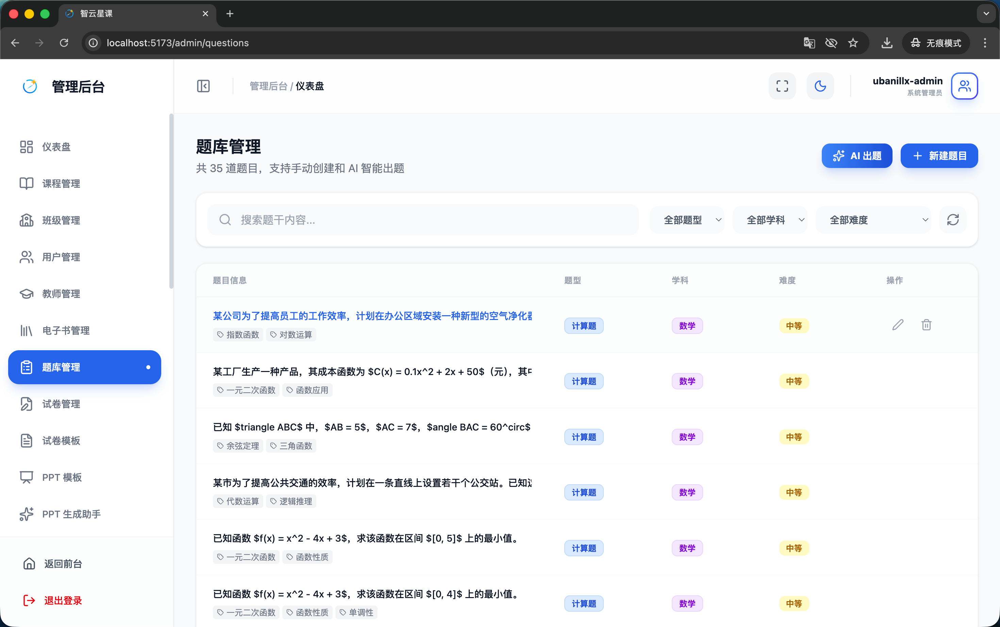
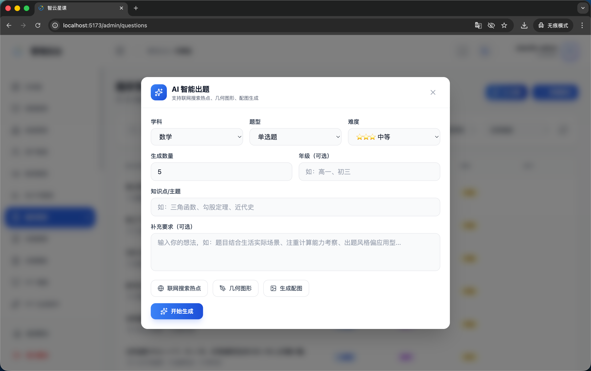
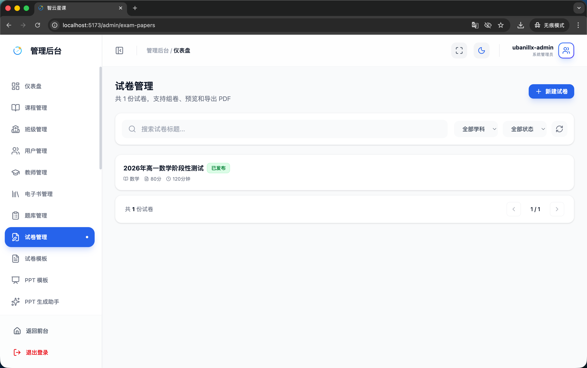
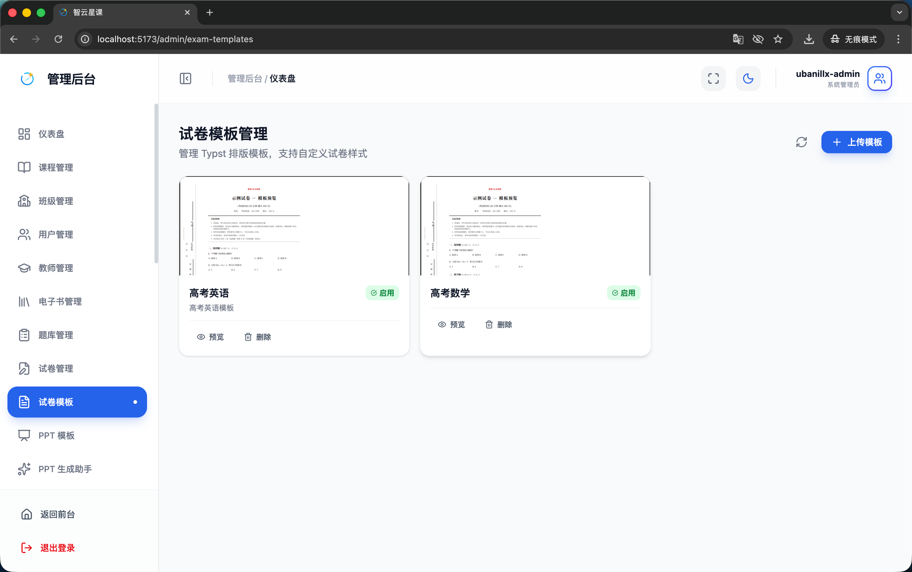
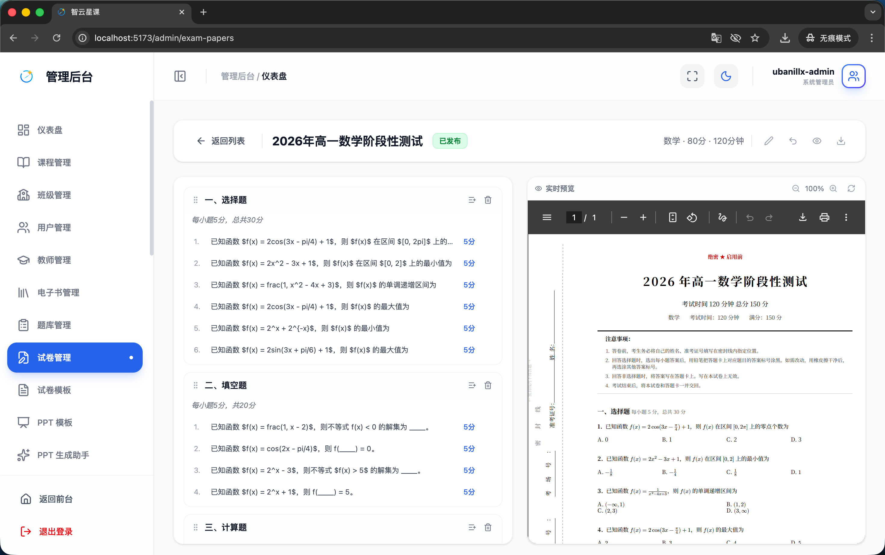

# 管理端 - 题库与试卷管理

> 对应源码：
>
> - `web/src/pages/admin/QuestionManagementPage.tsx`
> - `web/src/pages/admin/ExamPaperManagementPage.tsx`
> - `web/src/pages/admin/ExamTemplateManagementPage.tsx`

## 页面概览

题库与试卷管理模块为教师和管理员提供完整的题目管理与试卷编排能力，集成 AI 自动出题功能，支持试卷排版预览与导出。

---

### 1. 题库管理页面（QuestionManagementPage）

管理平台的题目资源库：

- **题目列表**：展示题目内容、题型（单选/多选/判断/填空/简答/计算）、学科、难度、知识点标签
- **题目筛选**：按学科、题型、难度、知识点等多维筛选
- **题目操作**：
  - 手动创建新题目
  - 编辑已有题目
  - 删除题目
  - 批量导入
- **题目详情**：题干、选项、正确答案、解析、知识点标签、难度等级

### 2. AI 出题功能

集成在题库管理中的智能出题工具：

- **AI 自动生成**：输入知识点或主题，AI 自动生成相关题目
- **参数配置**：
  - 指定学科与年级
  - 选择题型分布
  - 设置难度范围
  - 指定题目数量
- **结果审核**：AI 生成的题目可逐题审核、编辑后入库
- **批量生成**：支持一次生成多道题目

### 3. 试卷管理页面（ExamPaperManagementPage）

管理和编排试卷：

- **试卷列表**：展示试卷标题、学科、总分、题目数量、创建时间、状态
- **试卷编排**：
  - 从题库选题组卷
  - 调整题目顺序
  - 设置各题分值
  - 配置试卷基本信息（标题、学科、年级、考试时长）
- **试卷操作**：创建、编辑、复制、删除

### 4. 试卷模板管理页面（ExamTemplateManagementPage）

管理试卷的排版模板：

- **模板列表**：展示可用的试卷排版模板
- **模板配置**：
  - 页面布局（A4/B5、纵向/横向）
  - 页眉页脚设置
  - 字体与字号
  - 分栏设置
- **模板预览**：实时预览模板效果

### 5. 试卷排版预览与生成

试卷的最终排版与导出功能：

- **排版预览**：将试卷内容按模板样式进行排版渲染
- **Typst 排版**：后端使用 `typst-service`（Python）进行专业级排版
- **导出格式**：支持 PDF 格式导出
- **打印支持**：排版结果适配 A4 打印

## 功能截图

### 题库管理页面总览

页面标题「题库管理」，副文案「管理题目库，支持手动录入和 AI 自动生成」，右上角蓝色「新增题目」按钮和「AI 出题」按钮。搜索栏占位文案「搜索题目内容、知识点...」，右侧有「全部学科」「全部题型」「全部难度」三个下拉筛选和「更多筛选」按钮。表格列包含：题目信息（序号+题目内容摘要+知识点标签）、学科/题型（「数学」蓝色标签+「单选题」绿色标签）、难度（绿色「简单」/橙色「中等」/红色「困难」标签）、分值、来源（「AI 生成」紫色标签）、创建时间、操作（查看/编辑/删除图标）。

### 题库管理 - AI 出题

题库管理页面上方弹出「AI 智能出题」模态对话框。对话框内包含多个配置项：「学科」下拉选择器（当前选中「数学」）、「题型」下拉选择器（当前选中「单选题」）、「难度」下拉选择器（当前选中「中等」）、「生成数量」输入框（当前填入 10，提示「建议 1-20 题」）、「知识点（可选）」输入框（占位文案「如：二次函数、概率统计」）、「附加要求（可选）」多行文本域（占位文案「如：适合初三学生，贴近生活场景」）。底部有「取消」和蓝色「开始生成」按钮。

### 试卷管理页面

页面标题「试卷管理」，副文案「管理试卷的创建、编辑和发布」，右上角蓝色「新建试卷」按钮。搜索栏占位文案「搜索试卷标题...」，右侧「全部学科」「全部状态」两个下拉筛选和刷新按钮。表格列包含：试卷信息（图标+标题+描述+学科标签）、状态（绿色「已发布」/灰色「草稿」标签）、题目/总分（如「30 题 / 100 分」）、时长（如 90 分钟）、创建时间、操作（查看/编辑/排版/删除图标）。

### 试卷模板管理页面

页面标题「试卷模板管理」，副文案「管理试卷排版模板，配置字体、边距、密封线等样式」，右上角蓝色「新建模板」按钮。搜索栏占位文案「搜索模板名称...」。以卡片形式展示模板。

### 试卷排版预览与生成

试卷排版预览页面，左侧为配置面板（「排版配置」区域，包含「选择模板」下拉选择器「默认试卷模板」、「生成选项」多选框（生成试卷、生成答题卡、生成答案卷，前两个已勾选），以及蓝色「生成试卷」按钮和「下载 PDF」按钮）。右侧为试卷实时预览区域，显示专业排版的试卷效果：顶部密封线区域（「密封线内不得答题」）、考生信息填写区（姓名、班级、学号）、试卷标题「三年级上册数学期中测试」（副标题「数学」，总分 100 分，时间 90 分钟），然后是正式题目内容：「一、单选题」模块（第 1 题「下列哪个分数最大？」A. 1/3 B. 2/5 C. 3/7 D. 4/9，每题带分值标注「(3分)」）。排版模拟 A4 纸张效果，带页码和侧边标识。

## 技术要点

- **AI 出题**：后端 `AiQuestionGenerationService` 调用 LLM 自动生成题目，受会员 AI 配额限制
- **Typst 排版**：独立的 `typst-service` 微服务（Python）负责试卷排版
  - 模板文件：`templates/exam_paper.typ`（试卷正卷）、`templates/answer_key.typ`（答案卷）
  - 支持数学公式、表格、图片等复杂排版
- **题型体系**：单选题、多选题、判断题、填空题、简答题、计算题等多种题型
- **知识点标签**：题目可关联多个知识点标签，用于 AI 批改时的错因分析与知识画像建模
