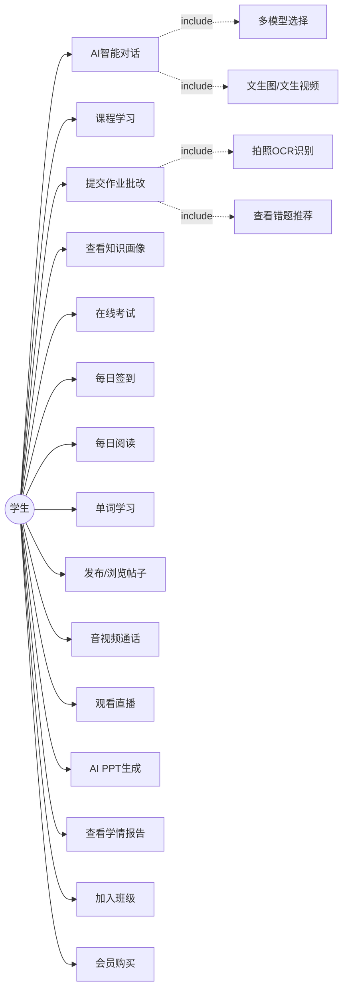
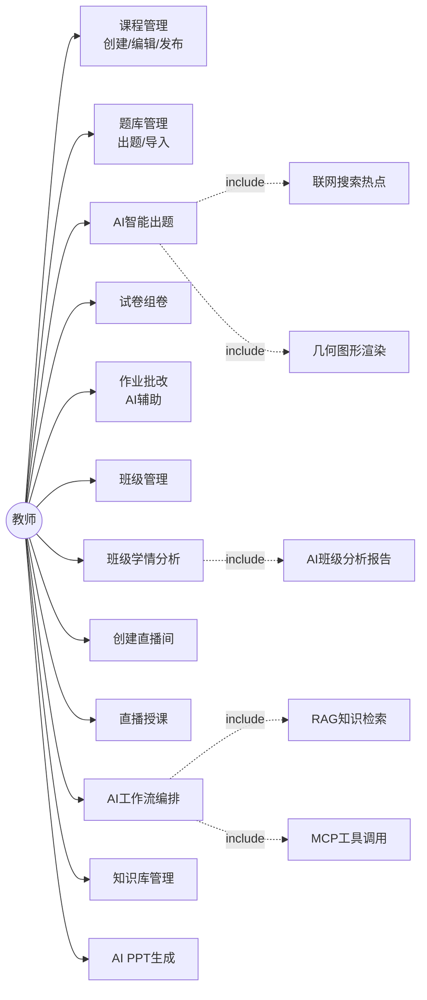
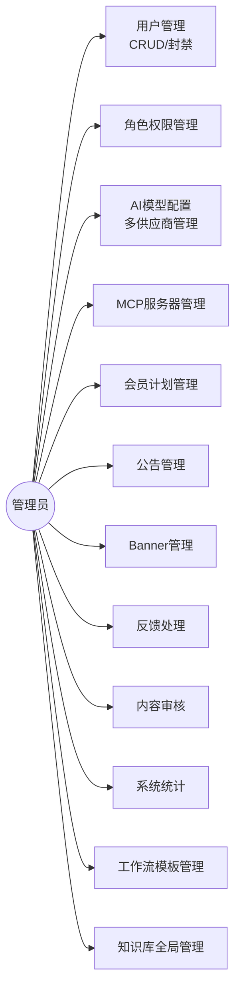

# 第三章 系统需求分析

## 3.1 系统概述

### 3.1.1 系统定位

智云星课平台定位为面向K12及高等教育场景的AI驱动智慧教育云平台。平台以大语言模型为技术核心，覆盖教师教学、学生学习、考试评测、智能批改、社交互动等教育全流程，旨在通过AI技术降低教育资源获取门槛、提升教学效率和学习体验。系统采用Web管理端（React + TypeScript）与Flutter移动端双端架构，Web端面向教师和管理员提供课程管理、出题组卷、学情分析等管理功能，Flutter移动端面向学生提供课程学习、AI对话、智能批改、每日学习等移动化学习体验，实现随时随地的泛在学习。

### 3.1.2 用户角色分析

系统面向三类核心用户角色。学生角色是平台的主要使用者，其核心需求包括在线课程学习、AI智能对话（多模型选择、文生图/文生视频）、智能批改（拍照OCR识别、错题推荐）、每日学习（签到打卡、阅读、单词记忆）、社交互动（帖子发布、评论点赞）、音视频通话、观看直播以及会员购买等。教师角色负责教学内容的创建与管理，其核心需求包括课程管理（创建/编辑/发布）、题库管理与AI智能出题（含联网搜索和几何图形渲染）、试卷组卷、AI辅助作业批改、班级管理、班级学情分析（含AI分析报告）、直播授课、AI工作流编排（含RAG知识检索和MCP工具调用）以及知识库管理等。管理员角色负责平台运营与系统管理，其核心需求包括用户管理（CRUD/封禁）、角色权限管理、AI模型配置（多供应商管理）、MCP服务器管理、会员计划管理、公告/Banner管理、反馈处理、内容审核、系统统计以及工作流模板和知识库的全局管理等。

图3-1展示了学生角色的用例图。学生可使用AI智能对话（含多模型选择和文生图/文生视频）、课程学习、提交作业批改（含拍照OCR识别和错题推荐）、查看知识画像、在线考试、每日签到/阅读/单词学习、社交互动、音视频通话、观看直播、AI PPT生成、查看学情报告、加入班级和会员购买等功能。

图3-1 学生用例图

图3-2展示了教师角色的用例图。教师在学生功能基础上，还可进行课程管理（创建/编辑/发布）、题库管理、AI智能出题（含联网搜索热点和几何图形渲染）、试卷组卷、AI辅助作业批改、班级管理、班级学情分析（含AI班级分析报告）、创建直播间和直播授课、AI工作流编排（含RAG知识检索和MCP工具调用）以及知识库管理等功能。

图3-2 教师用例图

图3-3展示了管理员角色的用例图。管理员负责系统层面的管理工作，包括用户管理（CRUD/封禁）、角色权限管理、AI模型配置（多供应商管理）、MCP服务器管理、会员计划管理、公告管理、Banner管理、反馈处理、内容审核、系统统计、工作流模板管理和知识库全局管理。

图3-3 管理员用例图

## 3.2 功能性需求分析

### 3.2.1 AI智能对话模块

AI智能对话模块是平台的核心交互入口，要求支持多模型选择能力，用户可在通义千问、DeepSeek、GPT-4o、智谱GLM等20余个模型之间自由切换。对话采用SSE（Server-Sent Events）流式响应机制，实现逐Token实时输出，提升交互体验。会话管理方面，要求支持会话的创建、列表展示、删除和历史记录查询。长对话场景下，要求采用滑动窗口与摘要压缩相结合的记忆策略，在控制Token消耗的同时保持上下文连贯性。多模态交互方面，要求支持文本、图片和文档的混合输入，视觉模型能够理解图片内容。此外，对话系统还需集成文生图、图生图和文生视频等生成能力，以及AI助手绑定知识库实现领域增强回答的功能。

### 3.2.2 AI工作流引擎模块

AI工作流引擎模块要求提供类似Dify/Coze的可视化拖拽式工作流编排界面，使教师无需编程即可编排复杂的AI处理流程。引擎需支持16种节点类型，包括LLM大模型调用、代码执行、HTTP请求、数据库查询、条件分支、多分支选择、循环、并行等节点。其中LLM节点作为核心节点，要求支持多模型切换、Prompt模板变量替换、RAG知识库检索增强、MCP工具调用以及JSON结构化输出解析；CODE节点要求支持JavaScript（通过GraalJS沙箱执行）和Python（通过Docker隔离容器执行）两种语言，确保代码执行的安全隔离。此外，模块还需支持工作流版本管理、模板市场（预置常用工作流供一键克隆）、触发器配置（手动/定时）、执行日志与调试功能，以及AI助手绑定工作流作为技能的能力。

### 3.2.3 RAG知识库模块

RAG（检索增强生成）知识库模块是提升AI回答领域准确性的核心功能[3][4]。模块要求支持知识库的完整生命周期管理（创建、配置、归档），以及文档的上传与管理，支持PDF、DOCX、TXT、MD、HTML、CSV、JSON等多种格式。文档入库流程要求实现智能分块（可配置chunkSize和chunkOverlap参数）、基于DashScope text-embedding-v2模型的文档向量化[16]，以及向量存储到PostgreSQL pgvector扩展中。检索方面，要求实现"向量相似度召回+Rerank语义精排"的两阶段检索架构[8]，并提供召回测试接口供开发者调试检索质量。为提升处理效率，批量文档处理需采用异步线程池并行执行。

### 3.2.4 智能批改模块

智能批改模块要求支持"试卷批改"和"通用作业助手"两种模式。试卷批改模式下用户指定学科和试卷，系统匹配标准答案进行评判；通用模式下学科可空，系统由AI自动推断。用户上传作业图片（1–10张）后，系统需调用视觉语言模型进行OCR结构化文字识别，提取题号、题目文本和学生答案。LLM逐题批改过程通过SSE实时推送进度，批改结果包含得分、答案对比、错误分类（六维错因体系）、知识点标注和AI详细解析。模块还需构建学生知识画像，按学科统计知识点掌握度、识别薄弱知识点、分析错因分布；基于错因和知识点实现错题同类题推荐（自适应难度调整）；以及批改历史查询和多维度统计功能。

### 3.2.5 AI智能出题模块

AI智能出题模块要求接受多维度输入参数（学科、题型、难度、年级、数量、知识点），通过LLM逐题生成高质量题目。模块需支持联网搜索热点出题功能，使生成的题目紧跟时事；支持几何图形自动渲染功能，LLM生成Typst cetz绘图代码后调用Typst微服务编译为PNG图片；支持文生图自动配图功能，为英语、语文等需要场景描述的题型生成配图。出题过程通过SSE逐题流式推送，用户可边生成边预览，生成完毕后自动入库题库。

### 3.2.6 AI PPT生成模块

演示文稿自动生成是当前研究的热点方向[17][18][19]。本模块要求实现多步骤生成流程：首先对用户输入进行意图识别，提取主题、风格和页数；然后由LLM生成Markdown格式大纲，支持用户确认或修改后重新生成；接着匹配合适的PPT模板（支持自定义主题、配色、版式的模板市场）；通过视觉模型理解模板布局后逐页填充内容；最终由Python微服务组装PPTX文件并上传OSS返回下载链接。整个生成过程通过SSE实现多阶段进度推送，前端可实时展示当前阶段和进度百分比。

### 3.2.7 课程学习模块

课程学习模块要求支持课程的完整生命周期管理，包括创建、编辑、发布和下架，课程属性涵盖分类、标签、封面、价格和难度等。课程内容采用三层层次结构（课程→章节→视频），支持章节排序和视频资源管理。学习进度追踪方面，要求记录视频观看进度（精确到秒）、章节完成状态和课程整体完成百分比。此外，模块还需支持课程评价与评论功能，以及基于用户偏好和热门排行的课程推荐功能。

### 3.2.8 考试管理模块

考试管理模块要求实现完整的题库管理功能，支持选择题、填空题、判断题、简答题、编程题等多种题型，每道题目包含学科、难度（1–5级）、年级、知识点标注和详细解析。试卷组卷支持手动选题和AI智能组卷两种方式。在线考试要求支持计时控制、防切屏检测和超时自动交卷机制。批改方面，客观题支持系统自动批改，主观题支持人工批改与AI辅助批改相结合。

### 3.2.9 每日学习模块

每日学习模块旨在培养学生的学习习惯，包含三个子功能。每日签到功能要求支持连续签到奖励机制，激励学生保持学习频率。每日阅读功能要求提供文章推荐和阅读时长统计，记录学生的阅读行为。单词学习功能要求支持多词库选择，涵盖初中、高中、CET4、CET6、考研、雅思和托福等7个级别的词库，支持顺序学习和乱序学习模式。所有学习行为均需通过事件机制采集到学情分析系统。

### 3.2.10 社交互动模块

社交互动模块要求构建平台内的学习社区。用户关注/粉丝系统支持双向关注关系管理。帖子发布功能支持图文和视频等多种内容形式，以及点赞、评论和收藏等互动操作。实时聊天功能基于WebSocket/STOMP协议实现消息的实时推送与接收，支持一对一私聊和群组聊天。

### 3.2.11 班级管理模块

班级管理模块面向教师提供班级运营工具。要求支持班级的创建与学生加入（邀请码机制）、班级成员管理（查看/移除）、班级作业布置与批改流程，以及教师视角的班级学情分析功能（含AI生成的班级分析报告）。

### 3.2.12 音视频通话与直播模块

实时音视频通信是远程教育的关键支撑技术[20][21]。一对一音视频通话要求基于WebRTC P2P实现低延迟直连，在NAT穿透失败时通过TURN服务器中继，在P2P和TURN均失败时降级到LiveKit SFU转发模式，形成三级降级保障。直播功能要求支持RTMP推流至SRS媒体服务器，通过HTTP-FLV和HLS协议分发给观众，实现低延迟直播。直播间需支持STOMP WebSocket弹幕互动，以及公开和班级专属两种权限模式。

### 3.2.13 学情分析模块

学情分析模块要求从多维度采集学习行为数据（课程观看、阅读、单词学习、签到、作业提交等），通过事件驱动机制实时记录学习活动。个人学情方面，要求提供学习概览、趋势分析（支持日/周/月粒度切换）和学科分布统计。班级学情方面，要求提供班级排名、趋势对比和学科分析功能，仅班级创建教师和管理员可查看。此外，模块还需支持AI学情报告功能，通过SSE流式调用LLM生成个性化的学情分析和学习建议。

### 3.2.14 会员与配额模块

会员与配额模块要求实现四级会员计划体系（FREE免费版、BASIC基础版、PRO专业版、TEACHER教师版），不同等级对应不同的AI功能使用配额。配额管理采用按天和按月双重限制机制，涵盖AI对话、PPT生成、智能出题和智能批改等功能。配额耗尽时需通过邮件通知用户。管理员角色不受配额限制。

### 3.2.15 系统管理模块

系统管理模块面向管理员提供平台运营工具，包括用户管理（CRUD操作、角色分配和账号封禁）、公告管理（创建/编辑/发布/置顶）、Banner轮播图管理、用户反馈处理以及文件上传管理（基于OSS对象存储）等功能。

## 3.3 非功能性需求

### 3.3.1 性能需求

系统在性能方面提出以下要求：SSE流式响应的首Token延迟应控制在500ms以内，确保AI对话的实时交互体验；向量检索响应时间应控制在200ms以内（Top-10召回），满足RAG知识库的实时检索需求；常规API接口响应时间应控制在200ms以内；页面加载时间应控制在2秒以内；系统需支持500以上并发用户同时在线。

### 3.3.2 安全性需求

系统在安全性方面提出以下要求：身份认证采用JWT Token机制，支持Token刷新和过期自动失效；权限控制采用RBAC模型，划分student、teacher和admin三种角色，通过@AuthCheck注解实现接口级细粒度鉴权；工作流CODE节点的代码执行需通过Docker容器隔离，防止恶意代码逃逸和资源耗尽攻击；电子书等敏感内容需采用AES加密存储，防止内容被非法获取。

### 3.3.3 可用性需求

系统在可用性方面提出以下要求：移动端通过Flutter框架实现iOS和Android双平台适配；Web端采用响应式设计，适配不同屏幕尺寸；SSE流式连接需实现断线自动重连机制，确保AI对话的连续性；各服务需配置健康检查探针，支持故障自动检测与容器重启。

### 3.3.4 可扩展性需求

系统在可扩展性方面提出以下要求：多模型供应商采用热插拔设计，新增供应商仅需在配置文件中添加对应配置项和工厂分支；工作流节点类型采用策略模式设计，新增节点仅需实现NodeExecutor接口并注册为Spring Bean；MCP工具服务器支持动态注册和发现；各微服务可独立部署并支持水平扩展。

### 3.3.5 可维护性需求

系统在可维护性方面提出以下要求：后端采用DDD四层分层架构（接口层、应用层、领域层、基础设施层），各层职责清晰、依赖方向单一；API文档通过OpenAPI规范自动生成，降低前后端联调成本；统一异常处理机制通过全局异常拦截器实现标准化错误响应；日志规范采用结构化日志格式；部署方面通过Docker Compose实现一键启动全部服务。

## 3.4 用例分析

三类用户角色与系统的交互关系已通过图3-1至图3-3的用例图进行了详细描述。学生核心用例涵盖AI智能对话、课程学习、作业批改、每日学习、社交互动、音视频通话和直播观看等15项功能；教师核心用例涵盖课程管理、题库管理、AI出题、试卷组卷、作业批改、班级管理、学情分析、直播授课和AI工作流编排等12项功能；管理员核心用例涵盖用户管理、AI模型配置、MCP服务器管理、会员计划管理、公告管理和系统统计等12项功能。各角色的用例之间存在包含关系，如AI智能对话包含多模型选择和文生图/文生视频子用例，AI智能出题包含联网搜索热点和几何图形渲染子用例，班级学情分析包含AI班级分析报告子用例。

## 3.5 本章小结

本章从功能性和非功能性两个维度对智云星课平台进行了全面的需求分析。功能性需求方面，系统梳理了15个功能模块，其中AI智能对话、AI工作流引擎、RAG知识库、智能批改、AI出题和AI PPT生成6个模块构成AI核心能力，课程学习、考试管理、每日学习和班级管理4个模块覆盖教学全流程，音视频通话与直播模块支撑远程教育场景，学情分析模块提供数据驱动的教学决策支持，会员配额和系统管理模块保障平台的商业化运营。非功能性需求从性能、安全性、可用性、可扩展性和可维护性5个维度提出了明确的量化指标和设计约束，为后续的系统架构设计和技术选型提供了需求基线。
