# 第四章 系统总体设计

## 4.1 系统架构设计

### 4.1.1 总体架构

系统采用基于DDD四层架构的单体后端与微服务辅助相结合的混合架构。Java后端作为核心单体服务承载主要业务逻辑，按照DDD规范划分为四个层次：接口层（interfaces）负责对外暴露REST Controller、WebSocket Handler和SSE Emitter三种通信接口；应用层（application）编排业务流程，包含应用服务、命令/查询对象和DTO转换；领域层（domain）封装核心业务规则，包含聚合根、实体、值对象、领域服务和仓储接口；基础设施层（infrastructure）提供技术实现，包括持久化实现、AI服务适配和外部API调用。各层依赖方向严格自上而下，领域层不依赖任何外层，通过依赖倒置原则实现核心业务逻辑与技术实现的解耦。

图4-1展示了系统的DDD四层架构。最上层为客户端层，包含React Web管理端和Flutter移动端；接口层通过REST Controller、SSE Emitter和WebSocket/STOMP三种协议对外暴露服务；应用层编排AI Chat、Workflow、KnowledgeBase、Grading、PPT/Question等核心业务流程；领域层按AI、Grading、Teaching、User、General五大领域划分聚合；基础设施层集成Langchain4j、Workflow Engine、MyBatis-Plus和OSS/Email等技术组件。

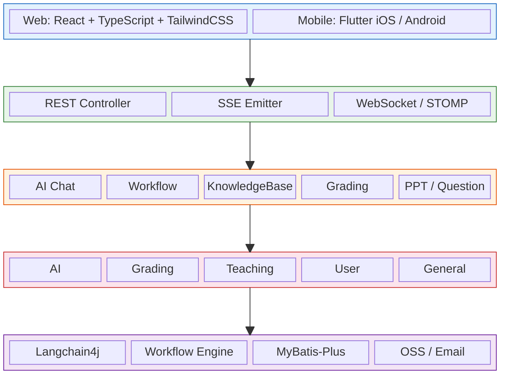
<center>图4-1 系统DDD四层架构图</center>

图4-2展示了技术架构全景图。客户端通过Spring Security + JWT认证网关接入后端，后端核心集成Langchain4j、RAG+Rerank、Workflow Engine和MCP Client四大AI组件；辅助微服务包括Go RTC信令服务、Python PPT服务和Python Typst服务；数据层使用PostgreSQL+pgvector、Redis 7、Elasticsearch+IK和Neo4j 5四种数据库；基础设施层包括OSS对象存储、SRS流媒体、LiveKit音视频、OnlyOffice文档编辑和Gotenberg文档转换五个服务。

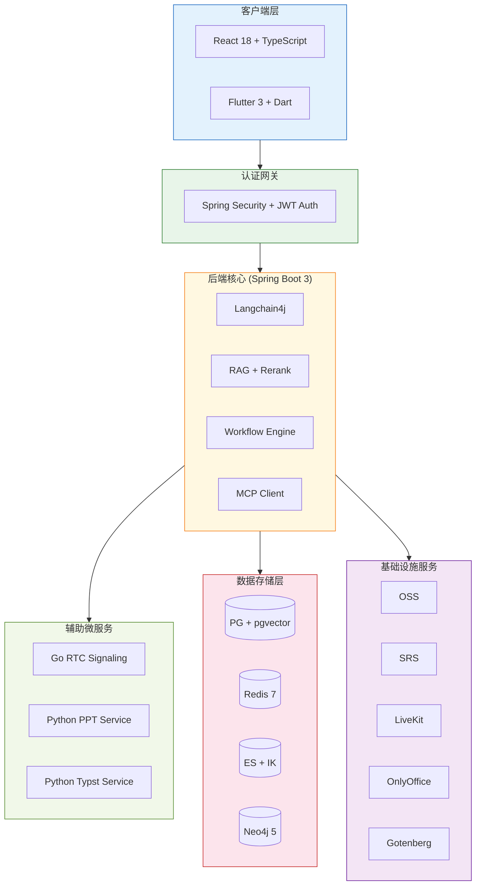
<center>图4-2 技术架构全景图</center>

### 4.1.2 微服务拆分策略

系统按照"语言适配性"原则将部分功能拆分为独立微服务。Java后端主服务（Spring Boot 3）承载核心业务逻辑、AI编排和数据管理，是系统的中枢。Python PPT生成服务（FastAPI）专注于PPTX文件生成和Gotenberg PDF转换，选用Python是因为python-pptx库在PPT操作方面的生态优势。Python Typst排版服务（FastAPI）负责试卷和几何图形的Typst编译为PDF/PNG，利用Typst的增量编译能力实现快速排版。Go RTC信令服务负责WebSocket信令转发、WebRTC协商和LiveKit Token签发，选用Go是因为其goroutine并发模型天然适合大量长连接管理。服务间通信采用REST HTTP调用为主，辅以SRS回调（直播鉴权）和WebSocket（RTC信令）。

### 4.1.3 技术选型依据

| 技术组件 | 选型 | 选型理由 |
|---------|------|---------|
| 后端框架 | Spring Boot 3 | 生态完善、社区活跃、与Langchain4j深度集成 |
| ORM | MyBatis-Plus | 灵活SQL + 通用CRUD，适合复杂查询场景 |
| 主数据库 | PostgreSQL + pgvector | 原生向量搜索支持（HNSW索引[22]），避免引入独立向量数据库 |
| 缓存 | Redis 7 | 高性能缓存 + 会话管理 + 分布式锁 + AI配额计数 |
| 搜索引擎 | Elasticsearch + IK | 中文全文搜索的事实标准 |
| 图数据库 | Neo4j 5 | 知识图谱[2]、推荐关系建模 |
| AI框架 | Langchain4j | Java生态最成熟的LLM集成框架 |
| 前端 | React + TypeScript | 组件化开发 + 类型安全 |
| 移动端 | Flutter | 跨平台一套代码覆盖iOS/Android |
| 容器化 | Docker Compose | 本地开发与生产环境一致性 |

## 4.2 领域模型设计

### 4.2.1 领域划分（28个子域）

系统按照DDD战略设计方法，将业务领域划分为核心域、支撑域和通用域三个层次，共计28个子域。

核心域承载平台的核心竞争力，包含4个子域：ai域涵盖AI助手、聊天会话、聊天消息、知识库、知识文档、MCP服务器和工作流（含执行记录、版本管理、触发器和模板）等聚合；grading域涵盖作业提交、逐题批改结果和知识画像等聚合；exam域涵盖题库、试卷和考试记录等聚合；course域涵盖课程、章节和视频等聚合。

支撑域为核心域提供必要的基础能力支撑，包含4个子域：user域负责用户注册、登录和信息管理；membership域管理会员计划、用户会员订阅和AI使用记录；clazz域管理班级和班级成员关系；teacher域负责教师认证。

通用域提供跨领域的通用功能，包含20个子域：file域负责文件上传和OSS存储；event域封装领域事件机制；analytics域负责学情分析数据采集与聚合；social域管理关注/粉丝关系；post域管理帖子和评论；book域管理电子书和向量嵌入；ppt域管理PPT生成会话；livestream域管理直播间和直播消息；order和payment域分别负责订单管理和支付网关；dailylearning域管理每日阅读和单词学习；checkin域管理签到打卡；schedule域管理课程表和日程；announcement、banner和feedback域分别管理公告、轮播图和意见反馈；progress域追踪学习进度；recommendation域提供课程推荐；scraper域负责内容抓取；knowledge域管理知识点。

图4-3展示了DDD领域模块全景图。核心域包含AI（助手/聊天/工作流/MCP）、Grading（智能批改/知识画像）、Exam（题库/试卷/考试）和Course（课程/章节/视频）四个子域；支撑域包含User、Membership、Clazz、Teacher、Order和Payment六个子域；通用域涵盖File、Analytics、Social、Post、Book、Livestream、PPT、DailyLearning等十余个子域，以及Announcement、Banner、Feedback等系统管理子域。各域之间通过领域事件和应用服务协作。

```mermaid
graph TB
    subgraph 核心域
        A1[ai<br/>AI助手/聊天/工作流/MCP]
        A2[grading<br/>智能批改/知识画像]
        A3[exam<br/>题库/试卷/考试]
        A4[course<br/>课程/章节/视频]
    end

    subgraph 支撑域
        B1[user<br/>注册/登录/信息]
        B2[membership<br/>会员/配额]
        B3[clazz<br/>班级/成员]
        B4[teacher<br/>教师认证]
        B5[order<br/>订单管理]
        B6[payment<br/>支付网关]
    end

    subgraph 通用域
        C1[file<br/>OSS文件上传]
        C2[analytics<br/>学情分析]
        C3[social<br/>关注/粉丝]
        C4[post<br/>帖子/评论]
        C5[book<br/>电子书/向量]
        C6[livestream<br/>直播间/弹幕]
        C7[ppt<br/>PPT生成]
        C8[dailylearning<br/>阅读/单词]
        C9[checkin<br/>签到打卡]
        C10[knowledge<br/>知识点]
        C11[schedule<br/>课程表]
        C12[recommendation<br/>推荐]
    end

    subgraph 通用域-系统
        D1[announcement<br/>公告]
        D2[banner<br/>轮播图]
        D3[feedback<br/>意见反馈]
        D4[event<br/>领域事件]
        D5[scraper<br/>内容抓取]
        D6[progress<br/>学习进度]
    end

    A1 --> B2
    A2 --> A3
    A2 --> B2
    A4 --> D6
    C2 --> B3
    C6 --> B3
```
<center>图4-3 DDD领域模块全景图</center>

### 4.2.2 核心聚合根设计

#### AI聚合
```
AiAssistant（AI助手聚合根）
  ├── AiAssistantId（值对象）
  ├── AiAssistantStatus（值对象：ACTIVE/DISABLED）
  └── 关联：KnowledgeBase[], Workflow[]

AiChatSession（聊天会话聚合根）
  ├── AiChatSessionId（值对象）
  └── AiChatMessage[]（实体）

KnowledgeBase（知识库聚合根）
  ├── KnowledgeBaseId（值对象）
  ├── KnowledgeDocument[]（实体）
  │   ├── KnowledgeDocumentId（值对象）
  │   ├── DocumentStatus（值对象：PENDING/PROCESSING/COMPLETED/FAILED）
  │   └── DocumentType（值对象：PDF/DOCX/TXT/MD/HTML）
  └── KnowledgeChunk[]（实体，分块后的向量数据）

Workflow（工作流聚合根）
  ├── WorkflowDefinition（值对象：节点 + 边的JSON定义）
  ├── WorkflowVersion[]（实体，版本管理）
  ├── WorkflowTrigger[]（实体，触发器）
  └── WorkflowExecution[]（实体，执行记录）
      ├── ExecutionStatus（值对象：PENDING/RUNNING/COMPLETED/FAILED）
      └── WorkflowExecutionLog[]（实体，节点执行日志）

McpServer（MCP服务器聚合根）
  └── McpServerId + 连接URL + 配置JSON
```

#### 批改聚合
```
HomeworkSubmission（作业提交聚合根）
  ├── GradingMode（值对象：EXAM_PAPER/GENERAL）
  ├── 图片URLs + OCR识别结果
  ├── 批改结果（得分、逐题详情）
  └── 知识点标注 + 错因分类
```

图4-4展示了AI域核心聚合根与值对象的类图。AiAssistant聚合根可绑定多个KnowledgeBase和Workflow作为技能；AiChatSession管理用户与AI助手的会话历史和摘要；Workflow聚合根包含WorkflowDefinition值对象定义节点与边，支持发布和版本管理；McpServer聚合根封装MCP工具服务器的连接信息。

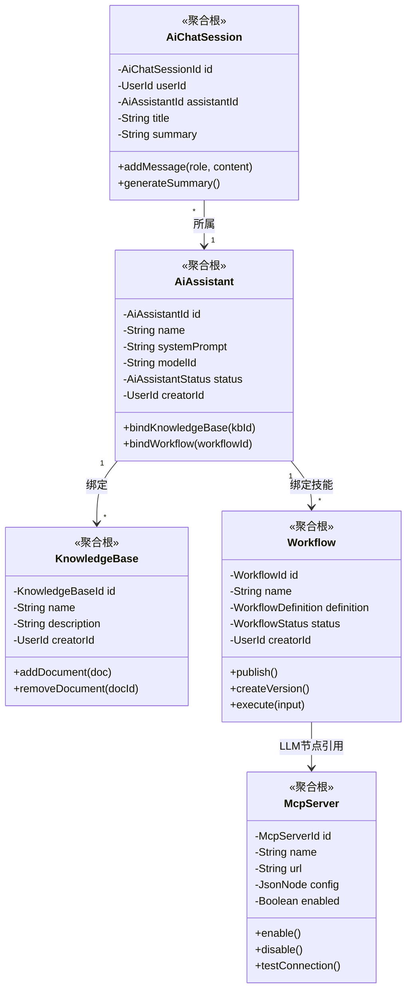
<center>图4-4 AI域聚合根与值对象类图</center>

图4-5展示了批改域的聚合设计。HomeworkSubmission作为聚合根包含GradingMode值对象（区分试卷批改和通用模式）、多个QuestionGrading实体（逐题批改结果），每个QuestionGrading关联ErrorCategory值对象（六维错因分类：计算错误、概念混淆、审题不清、记忆模糊、方法不当、粗心大意）。

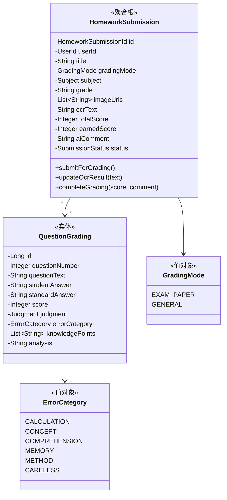
<center>图4-5 批改域聚合设计类图</center>

### 4.2.3 领域服务设计

领域服务封装跨聚合或不适合放在单个聚合根中的业务逻辑。AiUsageLimitService负责AI使用配额的检查与扣减，根据用户会员等级判断每日和每月的剩余配额，在对话、出题、批改和PPT生成等AI操作前进行拦截。WorkflowEngine（DefaultWorkflowEngine）是工作流执行引擎，负责解析工作流定义中的节点与边，按照拓扑顺序调度各节点的执行。KnowledgeSearchService是RAG检索服务接口，定义了向量相似度召回和Rerank精排的两阶段检索流程。NodeExecutor是工作流节点执行器接口，采用策略模式设计，每种节点类型（LLM、CODE、HTTP、DATABASE等）对应一个实现类，新增节点类型仅需实现该接口并注册为Spring Bean。

## 4.3 数据库设计

### 4.3.1 数据库选型与分工

| 数据库 | 用途 | 核心表/索引 |
|--------|------|------------|
| PostgreSQL | 业务数据 + 向量存储 | 29个SQL脚本、pgvector向量列 |
| Redis | 缓存/会话/配额 | JWT Token、在线状态、AI配额计数 |
| Elasticsearch | 全文搜索 | 课程/书籍/帖子索引（IK分词） |
| Neo4j | 图关系 | 知识图谱节点与关系 |

### 4.3.2 核心表设计（E-R图）

系统共包含29个SQL脚本，按功能模块划分为以下几组。用户相关表（10_user至12_user_preference）包括user_info（用户基础信息）、user_follow（关注关系）和user_preference（用户偏好）三张表，是系统的基础数据。

AI相关表（50_ai_chat至53_ppt_template）是系统最复杂的表群，包括ai_chat_session（聊天会话）、ai_chat_message（聊天消息，含向量字段）、ai_assistant（AI助手配置）三张对话核心表；knowledge_base、knowledge_document和knowledge_chunk三张知识库表；workflow、workflow_version、workflow_execution和workflow_execution_log四张工作流表；mcp_server（MCP服务器配置）以及ppt_generation_session和ppt_template（PPT生成）两张表。

教学相关表（30_course至42_ai_book）包括course、course_section和course_video三张课程表（三层层次结构）；class_info和class_member两张班级表；question_bank、exam_paper和exam_record三张考试表；以及book、chapter和chapter_vector三张电子书表（含向量嵌入）。

批改相关表（94_grading）包括homework_submission（作业提交）和question_grading（逐题批改结果）两张表，通过submission_id外键关联。

其他功能表（60至96）涵盖daily_learning和schedule（每日学习/日程）、announcement、banner、feedback和checkin（系统管理）、membership_plan、user_membership和ai_usage_record（会员三表）、learning_activity（学情埋点）以及live_room、live_room_message和call_record（直播/通话）等。

图4-6展示了AI聊天与助手模块的E-R图。AI_ASSISTANT可创建多个AI_CHAT_SESSION，每个会话包含多条AI_CHAT_MESSAGE；AI_ASSISTANT可绑定多个KNOWLEDGE_BASE和WORKFLOW，实现领域知识增强和技能编排。

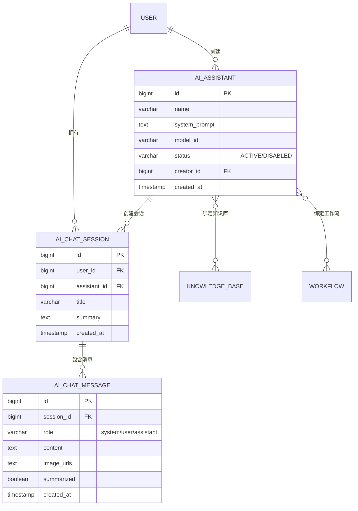
<center>图4-6 AI聊天与助手E-R图</center>

图4-7展示了知识库模块的E-R图。KNOWLEDGE_BASE包含多个KNOWLEDGE_DOCUMENT，每个文档分块后生成多个KNOWLEDGE_CHUNK，chunk中存储1536维向量用于相似度检索。

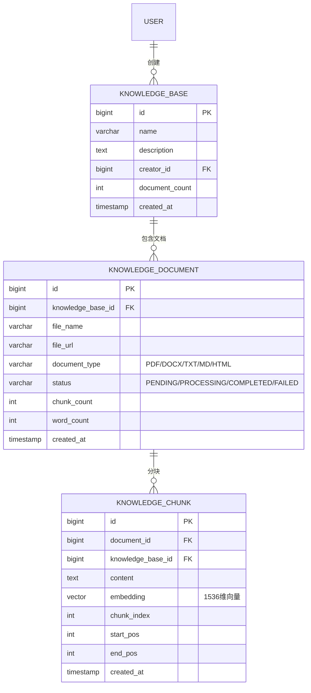
<center>图4-7 知识库E-R图</center>

图4-8展示了工作流模块的E-R图。WORKFLOW支持版本管理（WORKFLOW_VERSION）、触发器配置（WORKFLOW_TRIGGER）和执行记录（WORKFLOW_EXECUTION），每次执行生成多条节点级别的WORKFLOW_EXECUTION_LOG。MCP_SERVER独立管理外部工具服务器配置。

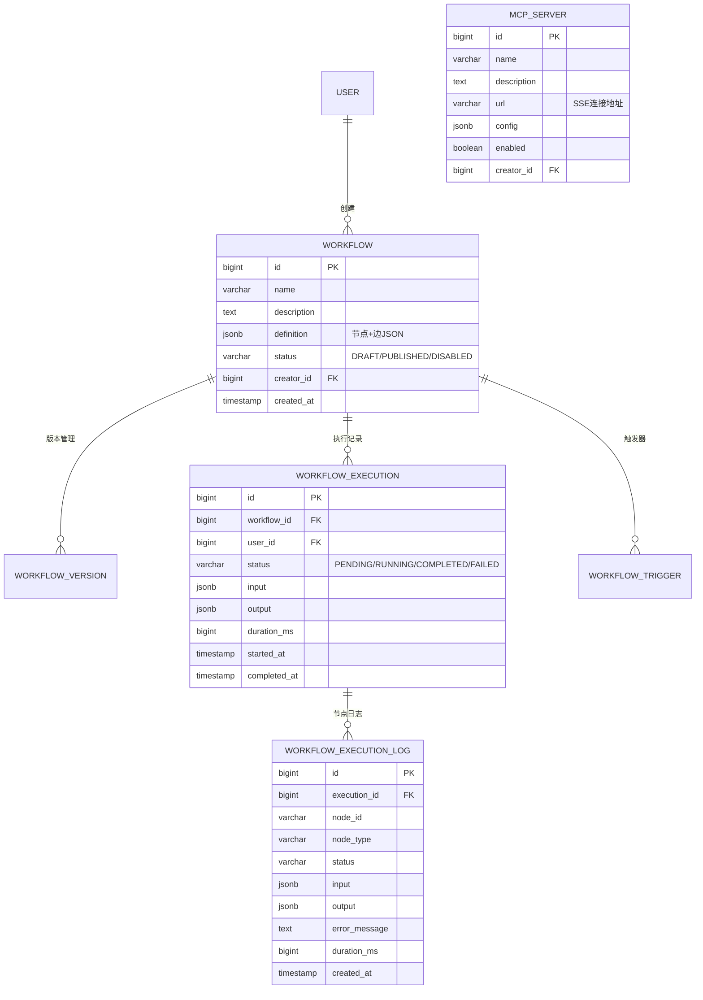
<center>图4-8 工作流与MCP服务器E-R图</center>

图4-9展示了课程与考试模块的E-R图。COURSE包含多个COURSE_SECTION（章节），每个章节包含多个COURSE_VIDEO；用户通过LEARNING_PROGRESS追踪学习进度。QUESTION_BANK通过EXAM_PAPER_QUESTION关联到EXAM_PAPER，用户参加考试记录在EXAM_RECORD中。

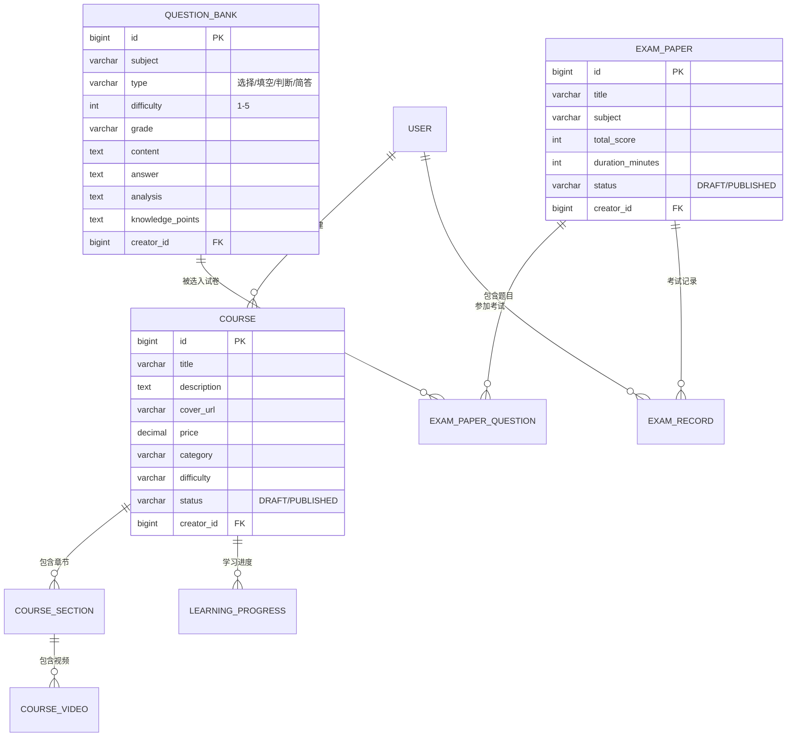
<center>图4-9 课程与考试E-R图</center>

图4-10展示了智能批改模块的E-R图。HOMEWORK_SUBMISSION记录作业提交信息（含双模式、图片URLs、OCR文本、总分、AI总评等），每次提交包含多条QUESTION_GRADING逐题批改结果（含得分、判定、错因分类、知识点和AI解析）。

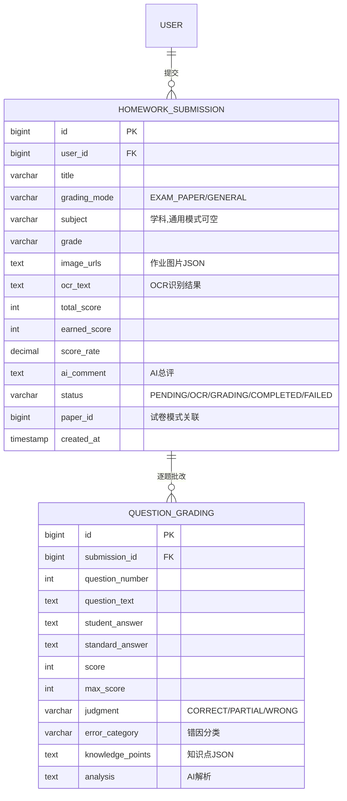
<center>图4-10 智能批改E-R图</center>

图4-11展示了用户、会员与班级模块的E-R图。USER关联USER_FOLLOW（关注关系）和POST（帖子）；MEMBERSHIP_PLAN定义四种会员等级（FREE/BASIC/PRO/TEACHER）及其AI配额，USER_MEMBERSHIP记录用户订阅状态，AI_USAGE_RECORD追踪每日/每月AI使用量；CLASS_INFO管理班级，LEARNING_ACTIVITY记录学情埋点数据。

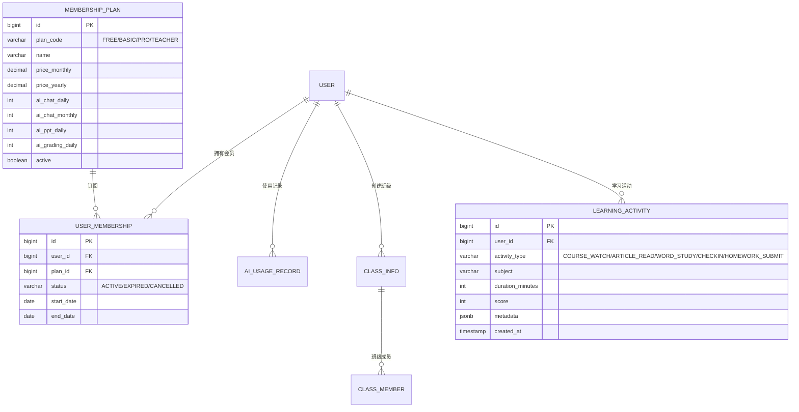
<center>图4-11 用户、会员与班级E-R图</center>

### 4.3.3 向量存储设计

系统利用PostgreSQL pgvector扩展实现向量与关系数据的统一存储，避免引入独立向量数据库带来的运维复杂度。knowledge_chunk表的embedding列定义为vector(1536)类型，存储由DashScope text-embedding-v2模型[16]生成的文档分块向量；chapter_vector表的embedding列同样为vector(1536)类型，存储电子书章节的向量嵌入。索引策略方面，两个向量列均建立HNSW（Hierarchical Navigable Small World）索引[22]，采用余弦距离算子（cosine distance）进行相似度计算，在百万级向量规模下仍能保证毫秒级检索延迟。

## 4.4 接口设计

### 4.4.1 RESTful API设计规范

所有RESTful API遵循统一的设计规范。响应格式统一封装为BaseResponse&lt;T&gt;结构，包含code（业务状态码）、data（响应数据）和message（描述信息）三个字段。错误码规范划分为三个区间：20000表示成功，40xxx系列表示客户端错误（如参数校验失败、权限不足），50xxx系列表示服务端错误。认证方面，所有需鉴权的接口均通过Authorization请求头携带Bearer JWT Token。分页查询统一采用page和size参数，响应中包含total（总记录数）和records（当前页数据列表）。

### 4.4.2 SSE流式接口设计

SSE（Server-Sent Events）流式接口用于AI生成内容的实时推送，Content-Type设置为text/event-stream。事件类型划分为三类：data事件携带生成内容片段，error事件携带错误信息，done事件标记生成完成。超时机制设置为默认5分钟，期间通过心跳事件保持连接活跃。SSE接口广泛应用于AI对话流式输出、智能批改进度推送、AI出题逐题推送、PPT生成多阶段进度推送以及AI学情报告生成等场景。

### 4.4.3 WebSocket接口设计

系统使用两种WebSocket协议满足不同的实时通信需求。STOMP协议WebSocket（端点/ws/chat）用于平台内的实时聊天和直播弹幕互动，聊天消息通过/topic/chat/{sessionId}频道推送，直播弹幕通过/topic/live/{roomId}频道推送。原生WebSocket（Go RTC服务端点/ws）用于音视频通话的信令转发，承载invite、answer、ice、bye等信令消息的实时交换。

### 4.4.4 核心API列表

| 模块 | 端点数 | 关键端点 |
|------|--------|---------|
| AI对话 | 8 | /api/ai/chat/sessions/{id}/stream (SSE) |
| 工作流 | 20+ | /api/ai/workflows/{id}/execute |
| 知识库 | 15+ | /api/ai/knowledge-bases/{id}/documents/{docId}/embed |
| 批改 | 8 | /api/grading/submit (SSE) |
| 出题 | 5 | /api/exam/questions/ai-generate (SSE) |
| PPT | 6 | /api/ppt/generate (SSE) |
| 课程 | 15+ | /api/courses |
| 考试 | 10+ | /api/exam |
| 直播 | 9 | /api/livestream |
| 会员 | 8 | /api/membership |

## 4.5 安全设计

### 4.5.1 认证与授权

系统采用JWT Token实现无状态认证，签名算法为HS256，access_token有效期2小时，refresh_token有效期7天，支持Token自动刷新。Spring Security FilterChain拦截所有请求，验证Token有效性并提取用户身份。细粒度权限控制通过自定义@AuthCheck注解实现，支持mustRole参数指定所需角色（如admin、teacher），在方法级别进行鉴权。接口白名单机制放行无需认证的端点，包括登录注册接口、公开资源接口、支付回调接口和内部服务间调用接口。

### 4.5.2 数据安全

数据安全方面采用多层防护策略。用户密码使用BCrypt算法加密存储，确保即使数据库泄露也无法逆向还原明文。电子书等敏感内容采用AES-256加密存储，阅读时动态解密。主键采用雪花算法生成64位分布式唯一ID，避免自增ID带来的ID枚举攻击风险。SQL注入防护通过MyBatis的参数绑定机制（#{param}语法）实现，所有用户输入均经过参数化处理。

### 4.5.3 代码沙箱安全

工作流CODE节点的代码执行采用多层安全隔离。Python代码在独立的Docker容器中执行，容器配置独立网络（禁止外部访问）、资源限制（CPU/内存上限）和只读文件系统，防止恶意代码逃逸和资源耗尽攻击。执行超时控制默认30秒，超时后强制终止容器。JavaScript代码在GraalJS沙箱中执行，禁用Java互操作能力，限制文件系统和网络资源访问，确保脚本执行的安全隔离。

## 4.6 本章小结

本章从系统架构、领域模型、数据库、接口和安全五个维度对智云星课平台进行了总体设计。架构方面，采用DDD四层架构的单体后端与微服务辅助的混合架构，Java主服务承载核心业务，Python和Go微服务分别负责PPT生成、Typst排版和RTC信令等语言适配性强的功能。领域模型方面，按照DDD战略设计将系统划分为28个子域（4个核心域、4个支撑域、20个通用域），设计了AI域和批改域的核心聚合根与值对象，以及4个关键领域服务。数据库方面，采用PostgreSQL+pgvector作为主数据库实现业务数据与向量数据的统一存储，辅以Redis缓存、Elasticsearch全文搜索和Neo4j图数据库，共设计29个SQL脚本、6组E-R图。接口方面，设计了REST+SSE+WebSocket三种通信模式的API体系，涵盖100余个端点。安全方面，建立了JWT认证授权、数据加密和代码沙箱隔离的多层次安全防护机制。
