# 第五章 AI核心模块设计与实现

## 5.1 多模型统一适配层

### 5.1.1 设计目标

多模型统一适配层的设计目标是将不同LLM供应商的接口差异封装在基础设施层，使业务层通过统一的modelId（格式为“provider/model”，如“dashscope/qwen-max”）即可透明切换不同模型。具体包括：统一封装6大LLM供应商（阿里云DashScope、OpenAI兼容协议、DeepSeek、Moonshot、智谱GLM、Ollama本地模型）；支持流式（StreamingChatLanguageModel）和非流式（ChatLanguageModel）两种调用模式，其中非流式模式专用于Tool Calling场景；支持文本和视觉（多模态）两种输入模式；通过ConcurrentHashMap实现模型实例缓存，同时支持根据自定义参数动态创建新实例，避免重复初始化开销。

### 5.1.2 核心类设计

多模型适配层由三个核心类组成，分别负责配置管理、模型实例创建和统一对话服务。

**ChatModelProperties**（多模型配置类）采用Spring Boot的@ConfigurationProperties机制，通过`ai.chat-models.providers.{providerName}`前缀映射YAML配置。每个供应商配置包含api-key、base-url（仅OpenAI兼容协议需要）、enabled开关以及其下属的多个模型配置，每个模型支持独立的type（text/vision）、temperature、topP、maxTokens参数。parseModelId()方法将modelId字符串解析为ProviderAndModel记录类型，实现供应商与模型名的分离。

**ChatModelFactory**（模型工厂类）是适配层的核心组件，内部维护modelCache和chatModelCache两个ConcurrentHashMap缓存，分别缓存流式和非流式模型实例。getStreamingModel(modelId)方法通过computeIfAbsent实现懒加载缓存；createStreamingModelWithParams()方法则每次根据自定义参数新建实例，用于AI助手等需要动态调整模型参数的场景。内部通过Java 17的switch表达式根据供应商名称分发到对应的Langchain4j Builder：DashScope使用QwenStreamingChatModel，OpenAI/DeepSeek/Moonshot/SiliconFlow统一使用OpenAiStreamingChatModel（通过baseUrl区分），智谱使用ZhipuAiStreamingChatModel，Ollama使用OllamaStreamingChatModel。值得注意的是，DashScope供应商额外支持enableSearch参数，用于启用通义千问的联网搜索能力。

**LangchainChatService**（统一对话服务）是面向业务层的统一接口，提供流式文本对话（streamChat）、流式多模态对话（streamChatWithImages）、带自定义参数的流式对话（streamChatWithParams）等多个方法。内部通过convertMessages()方法将Map<String,String>格式的消息列表转换为Langchain4j的ChatMessage类型体系（SystemMessage、UserMessage、AiMessage），多模态场景下将图片URL封装为ImageContent附加到最后一条用户消息中。各业务模块（AI对话、智能批改、工作流引擎、学情分析等）均通过此服务与LLM交互。

图5-1展示了多模型适配层的核心类图。ChatModelProperties读取YAML配置，ChatModelFactory维护流式/非流式两个ConcurrentHashMap缓存并通过switch表达式分发到6大供应商的Builder，LangchainChatService作为业务层统一入口通过StreamCallback回调实现流式Token推送。

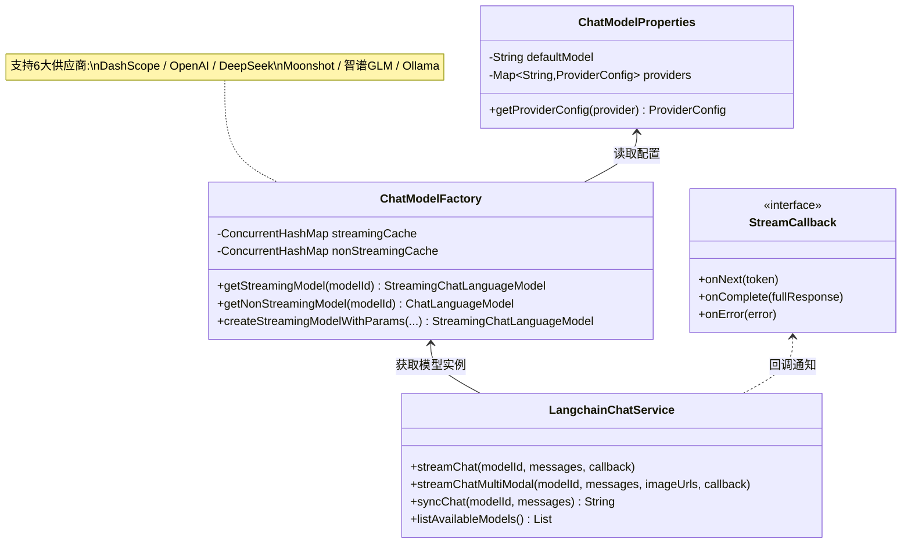
<center>图5-1 多模型适配层类图</center>

### 5.1.3 流式响应机制（SSE）

平台采用SSE（Server-Sent Events）机制实现AI生成内容的实时推送。Controller层创建Spring SseEmitter对象（超时5分钟）作为响应载体，通过异步线程池提交LLM调用任务，避免阻塞Servlet线程。StreamingChatLanguageModel.generate()方法配合StreamingResponseHandler回调接口实现流式Token推送：onNext(token)回调触发SSE data事件向前端推送单个Token；onComplete()回调触发SSE done事件表示生成完成；onError()回调触发SSE error事件并携带错误信息。该机制被广泛应用于AI对话、智能批改、出题进度、PPT生成进度、学情报告等多个场景。

图5-2展示了AI对话的SSE流式时序图。用户发起对话请求后，Controller创建SseEmitter并异步提交任务；应用服务加载会话历史、执行滑动窗口+摘要压缩、检查配额后调用LangchainChatService；LLM逐Token流式返回，经回调链最终通过SSE推送到前端；生成完成后持久化消息并扣减配额。

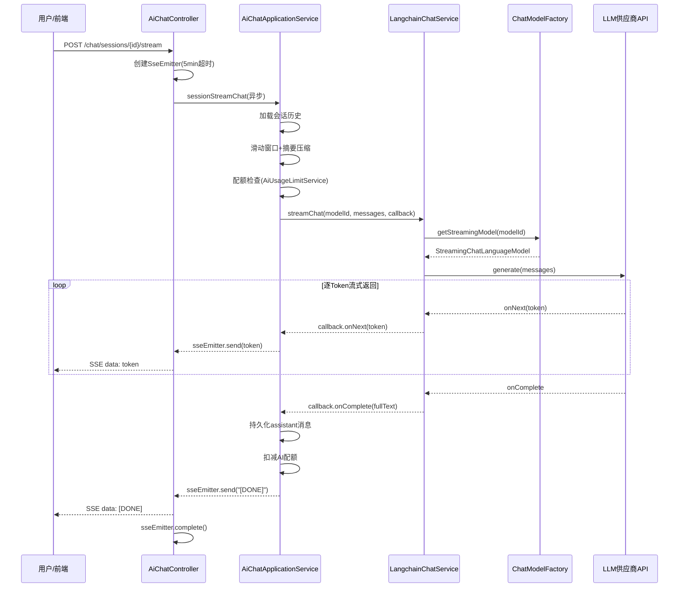
<center>图5-2 AI对话SSE流式时序图</center>

### 5.1.4 实现效果

该适配层设计实现了良好的可扩展性。新增一个模型供应商仅需两步操作：在application.yml配置文件中添加对应的provider配置（API Key、Base URL、模型列表），然后在ChatModelFactory的switch表达式中增加对应的构建分支。业务层代码无需任何修改，完全感知不到底层模型的差异，统一通过modelId字符串切换不同模型。目前平台已配置超过20个可用模型，涵盖文本对话、视觉理解、代码生成等多种能力。图5-3展示了AI智能对话的用户端界面，用户可选择不同的AI助手和模型进行对话交互。


<center>图5-3 AI智能对话用户端界面</center>

---

## 5.2 AI工作流引擎

### 5.2.1 设计目标

AI工作流引擎的设计目标是实现类Dify/Coze的可视化工作流编排能力[9][10]，使用户通过拖拽式界面即可编排复杂的AI处理流程。核心设计目标包括：支持DAG（有向无环图）执行拓扑，包含顺序、条件分支、循环、并行等多种控制流；节点类型采用策略模式设计，新增节点类型仅需实现NodeExecutor接口并注册为Spring Bean，引擎自动发现并注册；支持工作流版本管理、模板市场和触发器机制。

图5-4展示了工作流引擎的总体执行流程。引擎加载WorkflowDefinition并进行DAG拓扑排序后初始化执行上下文，从START节点开始迭代执行，根据节点类型分发到对应的NodeExecutor（LLM/CODE/CONDITION/PARALLEL等），每个节点执行完毕后将输出写入上下文并记录执行日志，直到到达END节点输出最终结果。

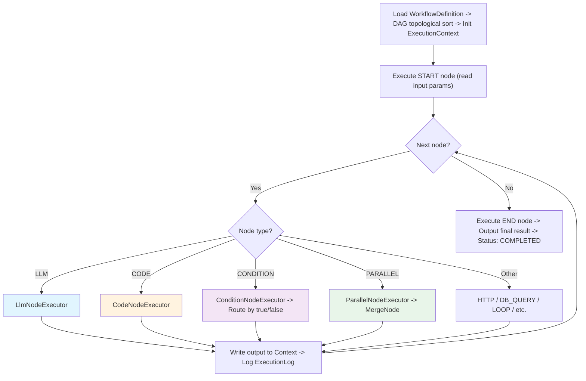
<center>图5-4 工作流引擎执行流程图</center>

图5-5展示了LLM节点的详细执行流程。首先读取模型配置并替换Prompt变量；若启用RAG则调用KnowledgeSearchService进行向量召回+Rerank精排；构建消息列表后判断是否启用MCP Tool Calling——若启用则进入"LLM推理→工具执行→结果反馈"的循环（最多10轮）；最终根据outputFormat决定是否解析JSON输出。

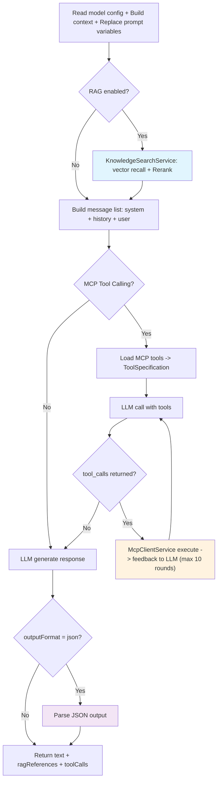
<center>图5-5 LLM节点详细执行流程图</center>

### 5.2.2 工作流数据模型

#### WorkflowDefinition（值对象）
```json
{
  "nodes": [
    {
      "id": "node_1",
      "type": "START",
      "config": {...},
      "position": {"x": 100, "y": 200}
    },
    {
      "id": "node_2", 
      "type": "LLM",
      "config": {
        "modelId": "dashscope/qwen-max",
        "systemPrompt": "...",
        "userPrompt": "...",
        "knowledgeBaseIds": [1, 2],
        "enableSearch": true,
        "outputFormat": "json"
      }
    }
  ],
  "edges": [
    {"source": "node_1", "target": "node_2", "condition": null}
  ]
}
```

### 5.2.3 节点类型详解（16种）

| 节点类型 | 执行器类 | 功能描述 |
|---------|---------|---------|
| START | StartNodeExecutor | 工作流入口，接收输入参数 |
| END | EndNodeExecutor | 工作流出口，输出最终结果 |
| LLM | LlmNodeExecutor | 大模型调用（核心节点） |
| CODE | CodeNodeExecutor | 代码执行（JS/Python） |
| CONDITION | ConditionNodeExecutor | 条件判断（if-else） |
| SWITCH | SwitchNodeExecutor | 多分支选择（switch-case） |
| LOOP | LoopNodeExecutor | 循环执行 |
| PARALLEL | ParallelNodeExecutor | 并行执行多个分支 |
| MERGE | MergeNodeExecutor | 合并并行分支结果 |
| HTTP_REQUEST | HttpRequestNodeExecutor | HTTP请求外部API |
| DATABASE_QUERY | DatabaseQueryNodeExecutor | 数据库查询 |
| JSON_PARSE | JsonParseNodeExecutor | JSON解析与提取 |
| TEMPLATE | TemplateNodeExecutor | 文本模板渲染 |
| FILE_READ/WRITE | FileReadNodeExecutor / FileWriteNodeExecutor | 文件读写 |
| ENTITY_EXTRACTION | EntityExtractionNodeExecutor | 实体抽取 |
| INTENT_RECOGNITION | IntentRecognitionNodeExecutor | 意图识别 |
| TEXT_EMBEDDING | TextEmbeddingNodeExecutor | 文本向量化 |
| RESPONSE | ResponseNodeExecutor | 响应输出 |

### 5.2.4 LLM节点详细设计（核心）

LlmNodeExecutor是工作流引擎中最复杂的节点，集成了多项AI能力，其执行流程分为8个阶段。

第一阶段是模型配置读取，从node.getConfig()中提取modelId、temperature、topP、maxTokens等参数。第二阶段是输入变量映射，通过inputMappings配置将工作流变量名映射为模板占位符名，合并上游节点输出和全局变量构建变量上下文。第三阶段是Prompt模板解析，系统提示词和用户提示词均支持`{{变量名}}`占位符，通过正则表达式匹配并从varContext中查找对应值进行替换。

第四阶段是RAG知识库检索。当配置了knowledgeBaseIds时，自动调用KnowledgeSearchService执行向量召回和Rerank精排，检索参数包括ragTopK（默认5）和ragThreshold（默认0.5）。检索结果格式化为“【知识库参考资料】”并拼接到系统提示词末尾，同时记录每条参考的文档ID、文档名、相关度分数和内容摘要，供前端展示引用来源。

第五阶段是消息列表构建，将系统提示词、历史消息和用户消息组装为Langchain4j的ChatMessage列表。多轮对话通过historyVariable配置从执行上下文中读取历史消息，通过historyLimit（默认10）控制保留的历史消息数量。

第六阶段是AI能力开关解析。enabledCapabilities列表支持webSearch（联网搜索）、vision（视觉理解）、text2image（文生图）等能力开关，由节点配置动态控制。

第七阶段是LLM调用，根据配置分三条路径执行。当配置了mcpServerIds时，进入MCP Tool Calling模式：从DB加载McpServer配置，通过McpClientService.listTools()发现工具并转换为Langchain4j的ToolSpecification，使用非流式ChatLanguageModel发送消息，当LLM输出tool_calls时调用McpClientService.callTool()执行工具，将结果作为ToolExecutionResultMessage反馈给LLM继续推理，最多迭代10轮。当未配置MCP但有自定义参数或启用联网搜索时，通过streamChatWithParams()流式调用同步收集结果。否则使用默认参数调用。

第八阶段是输出构建。LLM响应存储到配置的outputVariable（默认llmOutput）中，同时记录模型信息和Token估算。当启用parseJsonOutput时，自动从LLM响应中提取JSON片段（支持```json围栏和裸JSON两种格式），解析后存储到parsedOutput变量供下游节点使用。RAG引用列表和MCP工具调用日志也一并写入输出结果。

### 5.2.5 CODE节点安全沙箱

CODE节点支持JavaScript和Python两种语言，分别采用不同的沙箱隔离策略。

JavaScript沙箱基于GraalVM Polyglot Context实现进程内隔离执行。通过设置allowAllAccess=false禁用Java互操作，限制CPU执行时间和内存上限，输入和输出通过JSON序列化传递。该方案启动开销低，适合轻量级数据转换任务。

Python沙箱采用Docker-in-Docker（DinD）模式，每次执行基于python:3.11-slim镜像创建独立容器。安全措施包括：网络隔离（禁止容器访问外部网络）、只读文件系统（仅/tmp可写）、执行超时控制（默认30秒）、容器执行完毕自动清理。同时支持pip install安装第三方库，已安装的包缓存到Docker命名卷以避免重复下载。该方案提供了最强的安全隔离，适合执行用户提交的任意代码。

### 5.2.6 工作流执行引擎（DefaultWorkflowEngine）

DefaultWorkflowEngine是工作流执行引擎的核心实现，采用迭代式while循环（而非递归）驱动节点执行，避免长链路工作流的栈溢出问题。其整体执行流程如下：首先校验工作流是否已发布，创建WorkflowExecution实体；然后深拷贝工作流定义并调用flattenChildren()将嵌套在LOOP/PARALLEL容器内的子节点和边提升到顶层；接着初始化变量（定义默认值+输入覆盖），找到START节点后进入executeFromNode()核心循环。

executeFromNode()方法是引擎的核心逻辑，每次迭代处理一个节点：检查执行状态、超时和节点执行次数上限；检查断点（命中则暂停）；根据节点类型分派执行——LOOP容器调用executeLoopContainer()进行循环体迭代，PARALLEL容器调用executeParallelContainer()并发执行多个分支，CONDITION/SWITCH节点根据输出的branch字段匹配出边的sourceHandle进行动态路由，普通节点则走第一条满足条件的出边。

并行容器的实现尤为复杂。引擎为每个分支创建独立的WorkflowExecution副本（forkForBranch）避免共享变量竞态，通过CompletableFuture+线程池并发执行。支持三种等待策略（ALL/ANY/N_OF_M）和四种合并策略（OBJECT/ARRAY/FIRST/LAST）。引擎还实现了汇合节点自动检测（computeParallelConvergenceNodes）和差量合并（Delta Merge）机制，确保并行分支的变量修改正确累加写回全局上下文。

错误处理方面，每个节点可配置STOP（终止工作流）、CONTINUE（跳过当前节点继续执行）、FALLBACK（跳转到指定节点）三种策略。执行上下文贯穿全流程，变量存储于ConcurrentHashMap中保证线程安全，每个节点的执行结果通过WorkflowLogService记录到WorkflowExecutionLog中，便于调试和审计。

### 5.2.7 工作流版本与模板

工作流支持多版本管理（WorkflowVersion），用户可在草稿状态下反复编辑节点和连线，确认无误后发布为正式版本。每次发布会保存当前工作流定义的快照，可随时回滚到历史版本。工作流模板市场（WorkflowTemplate）预置了多个常用工作流，如“知识库问答”“内容摘要”“批量翻译”等，用户可一键克隆后自定义修改。触发器（WorkflowTrigger）支持手动触发和定时触发两种模式，定时触发通过WorkflowSchedulerService基于Cron表达式配置执行计划。图5-6展示了工作流可视化编辑界面，用户通过拖拽节点和连线即可编排复杂的AI处理流程。


<center>图5-6 工作流可视化编辑界面</center>

---

## 5.3 RAG知识库系统

### 5.3.1 系统架构

RAG系统的核心思想是通过检索外部知识来增强大语言模型的生成质量[3][4]。本系统采用“向量召回 + 语义精排”的两阶段检索架构，借鉴了稠密检索[5]和重排序[8]的研究成果：

```
文档上传 → DocumentParseService（内容提取）
         → 智能分块（chunkSize/chunkOverlap）
         → DashScopeEmbeddingService（文本→1536维向量）
         → PostgreSQL pgvector 存储（knowledge_chunk表）
         
查询检索 → 查询文本向量化（embedQuery，text_type=query）
         → pgvector 向量相似度召回（cosine distance，Top-50）
         → DashScopeRerankService 精排（gte-rerank模型）
         → 返回 Top-K 结果
```

图5-7展示了文档入库流程。用户上传文档后，DocumentParseService根据文件类型（PDF/DOCX/TXT/MD/HTML）调用对应解析器提取文本和元信息；超长文档自动截断；然后进行段落感知智能分块（默认chunkSize=500，overlap=50）；分块后批量调用DashScope text-embedding-v2模型生成1536维向量（每200条一批）；最终向量和分块内容存入pgvector的knowledge_chunk表。

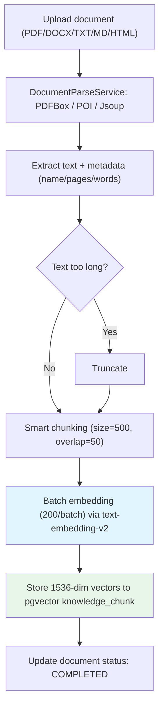
<center>图5-7 文档入库流程图</center>

图5-8展示了RAG检索流程。查询文本首先通过EmbeddingService（text_type=query）向量化为1536维向量，然后通过pgvector cosine搜索召回Top-50候选分块；经相似度阈值过滤后，若启用Rerank则调用DashScope gte-rerank模型进行语义重排序；最终返回Top-K（默认K=5）结果注入AI上下文。

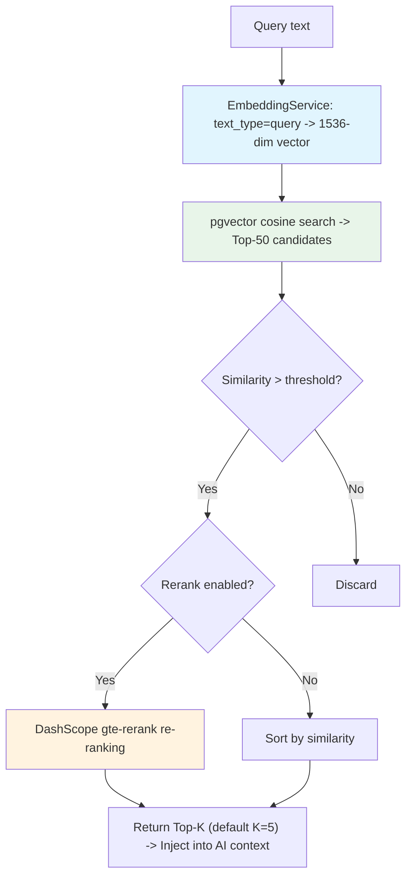
<center>图5-8 RAG检索流程图</center>

### 5.3.2 文档解析（DocumentParseService）

DocumentParseService负责从 URL 下载文档并提取文字内容与元信息。支持的格式包括PDF（基于Apache PDFBox的PDFTextStripper提取文字，同时解析标题、作者和页数元信息）、DOCX（基于Apache POI的XWPFDocument遍历段落和表格，表格转换为Markdown格式）、TXT/MD/CSV/JSON/XML/YAML等纯文本格式（直接UTF-8解码）、HTML（基于Jsoup提取纯文本）。解析结果封装为ParsedDocument对象，包含文件名、文档类型、标题、作者、页数、文件大小和文本内容。为防止超长文档导致上下文溢出，系统设置了180000字符的最大内容限制，超出部分自动截断并标记truncated状态。此外，系统还提供了DocumentContentExtractor作为统一的内容提取接口，额外支持EPUB格式（通过epublib解析章节并去除HTML标签）。

### 5.3.3 文档分块策略

文档分块采用段落感知的智能分块策略，在KnowledgeBaseApplicationService的splitContent()方法中实现。默认参数为chunkSize=500字符、chunkOverlap=50字符，可通过知识库配置自定义。分块策略如下：从start位置取chunkSize个字符作为基准切割点，然后向后搜索最近的换行符延伸到段落结尾（最多额外延伸chunkSize的20%）；若向后找不到则向前搜索最近的换行符，在段落边界处切割。overlap起始位置同样对齐到最近的换行符边界，保证重叠部分从段落开头开始，维持上下文的语义连贯性。每个分块附带元数据（所属文档ID和文档名），便于检索时追溯来源。

### 5.3.4 向量嵌入（DashScopeEmbeddingService）

DashScopeEmbeddingService实现了VectorEmbeddingService接口，基于阿里云DashScope平台的text-embedding-v2模型生成 1536维向量，参考了C-Pack等中文嵌入方案的设计思路[16]。该服务区分text_type参数：文档入库时使用DOCUMENT类型，RAG检索时使用QUERY类型，这是DashScope等非对称嵌入模型的要求。单条嵌入通过embedText()/embedQuery()方法实现，批量嵌入通过embedTexts()方法每25条一批调用API，防止触发限流。在知识库文档处理流程中，KnowledgeBaseApplicationService进一步将分块按每200条一轮进行向量化，生成的向量连同分块内容和元数据批量写入knowledge_chunk表。

### 5.3.5 向量检索与Rerank

检索流程采用两阶段架构。一阶检索基于pgvector的HNSW索引[22]，使用cosine距离`<=>`算子从knowledge_chunk表中召回Top-50候选分块，同时通过相似度阈值过滤低质量结果。二阶精排使用DashScope的gte-rerank模型对候选文档进行语义重排序[8]，综合考虑查询与文档的语义匹配度，最终返回Top-K（默认K=5）结果。KnowledgeSearchService定义了统一的搜索接口，接受SearchRequest（包含知识库ID列表、查询文本、topK、相似度阈值和检索模式），返回SearchResult（包含DocumentChunk列表、总数和检索耗时）。每个DocumentChunk包含分块ID、文档ID、文档名、内容、相关度分数和元数据，便于前端展示引用来源。

### 5.3.6 知识库管理

知识库管理通过KnowledgeBaseApplicationService提供完整的CRUD操作。KnowledgeBase聚合根封装了知识库的基本信息和向量化配置（embeddingModel、embeddingDimension、chunkSize、chunkOverlap），支持状态管理（ACTIVE/ARCHIVED）。文档管理支持上传、删除和重新嵌入操作，文档处理流程为：内容提取→分块→批量向量化→写入knowledge_chunk表→更新文档状态和知识库分块计数。批量处理通过batchProcessDocuments()方法实现一键嵌入知识库下所有文档，单个文档失败不影响其他文档的处理。召回测试接口允许用户输入查询文本查看检索结果和相似度分数，用于调试和优化检索效果。图5-9展示了知识库管理的Web端界面，管理员可创建知识库、上传文档、查看分块状态和执行召回测试。


<center>图5-9 知识库管理界面</center>

---

## 5.4 MCP工具调用系统

### 5.4.1 MCP协议概述

Model Context Protocol（MCP）是AI模型与外部工具交互的开放标准，采用SSE（Server-Sent Events）作为传输层。其核心交互流程为：Client通过initialize请求与Server建立连接并协商能力；通过tools/list获取Server提供的工具列表及其参数JSON Schema；通过tools/call执行具体工具并获取返回结果。本文实现了完整的MCP Client，支持与任意符合MCP规范的工具服务器集成。

### 5.4.2 McpClientService实现

McpClientService负责与MCP Server的全部通信逻辑。SSE连接管理方面，服务启动时与配置的MCP Server建立SSE长连接，按Server URL缓存连接实例。工具发现方面，调用tools/list获取可用工具列表，解析每个工具的名称、描述和参数Schema，并缓存以避免重复请求。工具调用方面，根据LLM输出的tool_calls指令，调用tools/call执行具体工具并将结果返回给调用方。

### 5.4.3 MCP服务器管理

McpServerApplicationService提供完整的MCP服务器管理能力，包括CRUD操作（注册、更新、删除）、启用/禁用控制、连接测试（验证Server连通性）以及工具列表查询。管理员可在Web端注册MCP Server的URL和配置信息，AI助手和工作流节点可关联使用这些工具服务器。

### 5.4.4 Tool Calling在工作流中的集成

在LLM节点中，Tool Calling的集成流程如下：执行时根据节点配置的MCP Server ID加载工具列表，将MCP工具转换为Langchain4j的ToolSpecification格式；LLM推理后输出tool_calls指令，LlmNodeExecutor调用McpClientService执行工具，将结果作为ToolExecutionResultMessage反馈给LLM继续推理，形成“LLM思考→工具执行→结果反馈→继续思考”的循环。为防止无限循环，设置了最多10轮迭代限制。每轮工具调用的工具名、参数和结果均记录到执行日志中。

---

## 5.5 智能批改系统

### 5.5.1 系统流程

智能批改系统支持“试卷批改”和“通用作业助手”两种模式（GradingMode）。完整流程如下：用户上传作业图片（1–10张），系统调用通义千问VL视觉语言模型进行OCR识别，输出结构化JSON（含题号、题目文本、学生答案）；然后LLM逐题批改，通过SSE实时推送每题结果（得分、判定、标准答案、错误分类、知识点、详细解析）；最后生成批改报告（总分、得分率、总评），持久化结果并更新学生知识画像。试卷模式下用户需指定学科和试卷；通用模式下学科可空，系统由AI自动推断。

图5-10展示了智能批改的总体流程。用户上传作业图片后，系统根据批改模式（试卷/通用）选择是否加载标准答案，然后调用Qwen-VL视觉模型进行OCR结构化识别；通用模式下AI自动推断学科；LLM逐题批改通过SSE实时推送进度，最终生成报告并更新学生知识画像。

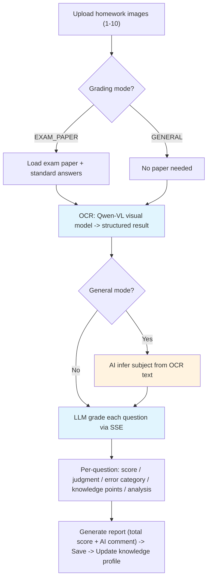
<center>图5-10 智能批改总体流程图</center>

图5-11展示了智能批改的SSE时序图。Controller创建SseEmitter后异步提交批改任务；应用服务依次推送OCR开始/完成、批改开始等阶段事件，逐题调用LLM批改并实时推送每题结果；最后计算总分、生成AI总评、持久化结果并更新知识画像。

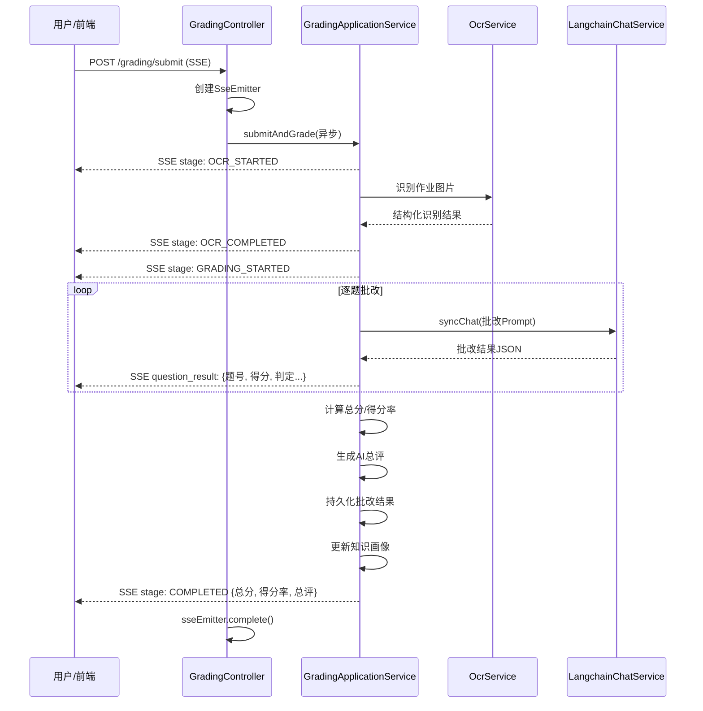
<center>图5-11 智能批改SSE时序图</center>

### 5.5.2 OCR识别服务

OCR识别服务基于通义千问VL（视觉语言模型）实现结构化文字识别。输入为用户上传的作业图片URL列表（最多10张），通过精心设计的Prompt引导视觉模型输出结构化JSON，包含题号、题目文本和学生书写答案。该方案相比传统OCR引擎的优势在于：视觉语言模型能够理解手写体、版面布局和题目结构，直接输出结构化数据而非纯文本。在移动端，还集成了Google ML Kit的端侧OCR作为拍照时的实时文字检测反馈。

### 5.5.3 AI批改Prompt设计

AI批改的Prompt设计是影响批改质量的关键因素。系统提示词明确定义了批改标准、评分规则和输出格式；用户提示词包含题目文本、学生答案以及标准答案（试卷模式）或学科信息（通用模式）。LLM输出JSON结构化结果，包含得分（score）、判定（judgment）、错误分类（errorCategory）、知识点标注（knowledgePoints）和详细解析（analysis）。错因采用六维分类体系：计算错误、概念混淆、审题不清、记忆模糊、方法不当、粗心大意。通用模式下，系统先通过inferSubjectFromOcrText()方法让LLM推断学科，然后使用增强版Prompt支持作文、日记等非标准化题目的批改。

### 5.5.4 学生知识画像

学生知识画像由KnowledgeProfileApplicationService实现，基于累积的所有批改记录构建多维度学习分析。数据按学科分组，统计每个知识点的掌握度（基于历史得分率）；识别得分率低于阈值的薄弱知识点；分析六类错因的占比分布。GradingStatsApplicationService提供批改历史统计，包括得分趋势、学科得分率和错因分布等多维度数据。

### 5.5.5 错题同类题推荐

SimilarQuestionService实现基于“相同错因+相同知识点+自适应难度”的三维推荐策略。首先根据当前错题的错因分类和知识点在题库中检索同类题目，然后根据学生对该知识点的掌握度动态调整推荐题目的难度——掌握度低则推荐同等或略低难度的题目以巩固基础，掌握度高则推荐更高难度的题目以拓展能力。图5-12展示了智能批改的Web端界面，包括批改结果总览、逐题详细分析和AI总评。


<center>图5-12 智能批改结果总览界面</center>

---

## 5.6 AI智能出题系统

### 5.6.1 系统流程

AI智能出题系统接受多维度输入参数（学科、题型、难度、年级、数量、知识点、开关选项），通过多阶段流水线生成高质量题目。整体流程为：根据参数构建Prompt逐题调用LLM生成，通过SSE实时推送每题进度；若启用联网搜索（enableWebSearch），LLM会根据热点时事素材出题；若启用图形（withDiagram），LLM生成Typst cetz绘图代码，调用Typst微服务编译为PNG并上传OSS；若启用配图（withImage），LLM生成图片描述后调用图像生成服务创建配图。最终JSON解析题目结构并入库。系统支持多种题型，包括单选题、多选题、填空题、简答题和论述题等。

图5-13展示了AI智能出题的完整流程。系统接收学科/题型/难度等参数后检查配额，构建Prompt逐题调用LLM生成；若启用联网搜索则调用DashScope enableSearch获取时事素材；若需几何图形则通过Typst服务编译PNG；若需配图则调用图像生成服务。每题生成后通过SSE实时推送，最终保存到题库。

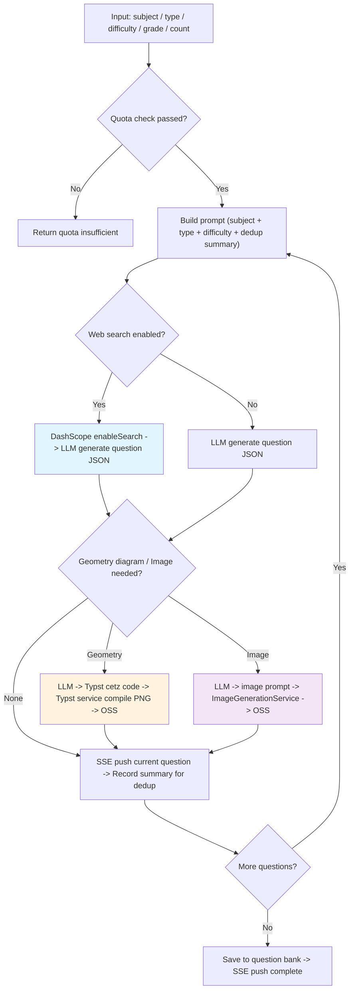
<center>图5-13 AI智能出题流程图</center>

### 5.6.2 逐题生成策略

出题系统采用逐题生成策略而非批量生成，每次LLM调用只生成1题，确保单题输出不超过Token限制且质量可控。已生成题目的摘要传入后续Prompt，实现逐题去重，避免生成重复题目。每题生成完成后通过SSE实时推送到前端，用户可边生成边预览。

### 5.6.3 几何图形渲染

几何图形渲染是数学出题的特色功能。LLM根据题目内容生成Typst cetz绘图代码，Typst是一种新型可编程标记语言[23]，具备增量编译能力[24]，其cetz库专门用于绘制几何图形。生成的Typst代码发送到独立部署的Typst微服务（typst-service）编译为PNG图片，上传OSS后将图片URL嵌入题目结构中。

### 5.6.4 文生图配图

AI配图功能用于英语、语文等需要场景描述的题型。LLM根据题目内容生成英文图片描述，调用ImageGenerationService（通义万相或FLUX模型）生成图片，上传OSS后返回图片URL嵌入题目。图5-14展示了AI智能出题的管理端界面，教师可配置学科、题型、难度等参数后一键生成题目。


<center>图5-14 AI智能出题管理界面</center>

---

## 5.7 AI PPT生成助手

### 5.7.1 多步骤生成流程

演示文稿自动生成是当前研究的热点方向，现有工作包括LLM多阶段端到端方法[18]、基于视觉理解的模板适配方法[17]以及基于学位论文的系统性研究[19]。本系统综合了上述研究成果，采用以下多步骤流程：

1. **意图识别**：分析用户输入，提取PPT主题、风格、页数等
2. **大纲生成**：使用超长上下文模型（qwen-long）生成Markdown格式大纲
3. **用户确认/修改**：支持用户修改大纲后重新生成
4. **模板选择**：匹配合适的PPT模板（主题/配色/版式）
5. **页面结构解析**：视觉模型（qwen-vl-max）理解模板布局
6. **逐页内容填充**：AI根据大纲和模板结构生成每页内容
7. **PPT组装**：Python ppt-service 使用 python-pptx 生成PPTX文件
8. **OSS上传**：返回下载链接

图5-15展示了AI PPT生成的多步骤流程。用户输入主题后，系统依次执行意图识别、大纲生成（支持用户确认/修改）、模板选择、视觉模型解析模板结构、逐页AI内容填充（通过SSE推送进度），最终由Python ppt-service通过python-pptx生成PPTX文件并上传OSS返回下载链接。

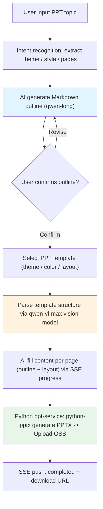
<center>图5-15 AI PPT生成多步骤流程图</center>

### 5.7.2 SSE多阶段进度推送

PPT生成过程通过SSE实现多阶段进度推送，前端可实时展示当前所处阶段和进度百分比。五个核心阶段依次为：intent_recognized（意图识别完成）、outline_generated（大纲生成完成）、template_selected（模板匹配完成）、page_filling（逐页内容填充中，推送当前页码和总页数）、completed（PPT组装完成，返回下载链接）。每个阶段的SSE事件均携带进度百分比和状态描述。图5-16展示了AI PPT生成助手的Web端界面，用户可通过对话交互描述PPT需求，系统实时展示生成进度。


<center>图5-16 AI PPT生成助手界面</center>

---

## 5.8 AI对话与记忆系统

### 5.8.1 记忆策略：滑动窗口 + 摘要压缩

长对话场景下，Token消耗和上下文连贯性是一对矛盾。本文采用“滑动窗口+摘要压缩”的混合记忆策略：保留最近N轮消息原文（默认N=10）作为滑动窗口；当未摘要消息累积超过阈值时，将窗口外的旧消息通过独立的LLM调用压缩为摘要；摘要作为system消息注入到下一次对话中，保持长对话的上下文连贯性同时有效控制Token消耗。

图5-17展示了AI对话记忆策略的工作流程。用户发送新消息后，系统加载会话历史并判断未摘要消息是否超过阈值：若超过则调用LLM对旧消息进行摘要压缩并标记已摘要；最终构建消息列表（系统人设 + 历史摘要 + 最近N轮滑动窗口 + 当前用户消息）发送给LLM。

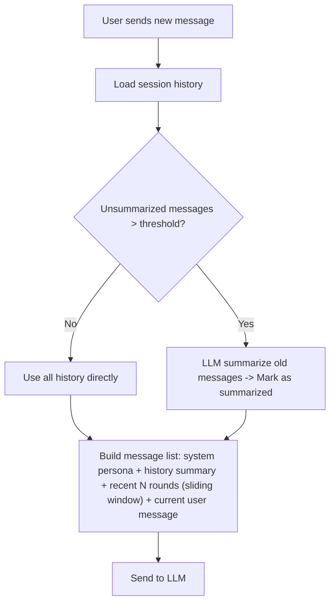
<center>图5-17 AI对话记忆策略示意图</center>

### 5.8.2 多模态对话

对话系统支持文本、图片和文档的混合输入。图片通过URL或Base64编码封装为Langchain4j的ImageContent，附加到用户消息中，自动切换为视觉模型（如qwen-vl-max）处理。文档通过DocumentParseService提取文本内容后作为上下文注入到对话中，实现“上传文档+提问”的交互模式。

### 5.8.3 生成能力

对话系统集成了多种生成能力。文生图能力基于扩散模型技术[12]，调用通义万相或FLUX模型，在教育场景中广泛应用于辅助教学内容创作[11]。图生图能力支持上传参考图配合文字描述生成变体图。文生视频能力调用通义万相视频模型，视频扩散模型的发展为教育视频内容生产提供了新可能[13][14]。所有生成的媒体文件均上传至OSS存储，返回URL嵌入对话消息中。

---

## 5.9 学情分析与AI报告

### 5.9.1 数据采集埋点

学情分析的基础是多维度的学习行为数据采集。本文通过Spring事件机制（LearningActivityEvent）实现去耦合的埋点采集，各业务模块在关键操作完成后发布事件，LearningActivityEventListener通过@Async异步监听器写入learning_activity表。目前已埋点的活动类型包括：课程观看（COURSE_WATCH，由ProgressApplicationService发布）、文章阅读（ARTICLE_READ）、单词学习（WORD_STUDY）、签到打卡（CHECKIN）、作业提交（HOMEWORK_SUBMIT，含得分数据）。

### 5.9.2 AI学情分析报告

AiLearningAnalysisService提供基于LLM的智能学情分析。个人学情报告汇总学生的学习概览、趋势、学科分布等数据，通过精心设计的Prompt模板调用LLM分析学习习惯、薄弱点和改进建议。班级学情报告汇总全班数据，分析整体学习趋势、两极分化情况和教学建议。班级学情仅允许教师访问（@AuthCheck(mustRole="teacher")），且教师只能查看自己创建的班级。两种报告均通过SSE流式输出，实现LLM生成内容的实时推送。

---

## 5.10 本章小结

本章详细阐述了智云星课平台9大AI核心模块的设计与实现。多模型统一适配层通过ChatModelFactory封装6大LLM供应商的接口差异，业务层通过统一的modelId透明切换模型。AI工作流引擎支持16种节点类型，采用迭代式执行引擎驱动DAG拓扑，支持条件分支、循环容器和并行执行。RAG知识库系统采用“向量召回+语义精排”的两阶段检索架构，基于pgvector和HNSW索引实现高效向量检索。MCP工具调用系统实现了完整的MCP Client，支持AI模型与外部工具的动态集成。智能批改系统实现了“OCR识别→LLM逐题批改→知识画像”的完整链路，并提供错题同类题推荐。AI智能出题采用逐题生成策略，支持几何图形渲染和AI配图。PPT生成助手采用8步多阶段流水线。AI对话系统采用“滑动窗口+摘要压缩”的混合记忆策略，支持多模态输入和多种生成能力。学情分析系统通过Spring事件机制采集多维度学习数据，结合LLM生成个性化学情报告。各模块通过统一的LangchainChatService和SSE流式机制进行集成，形成完整的AI能力矩阵。
