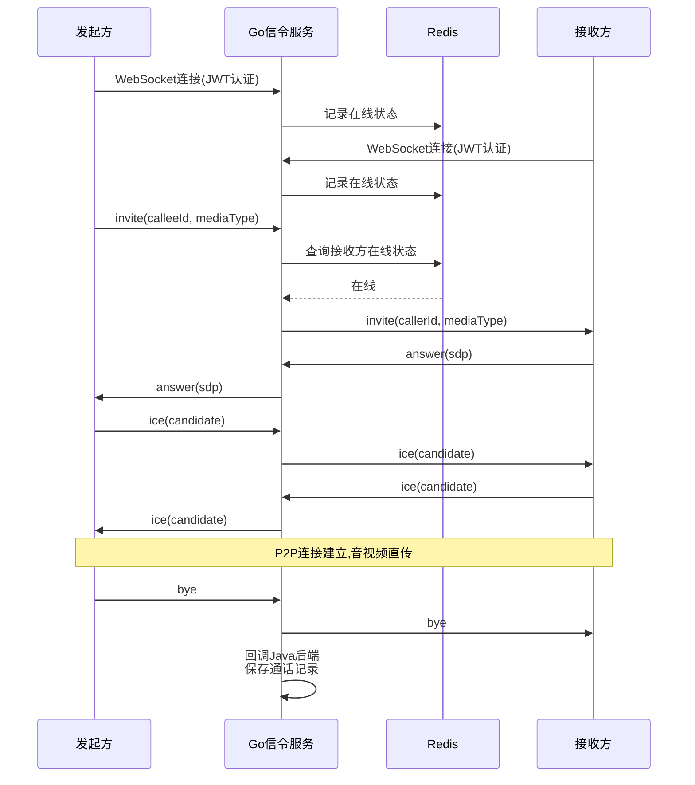
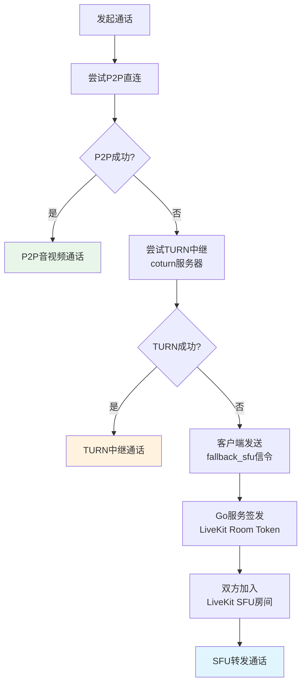
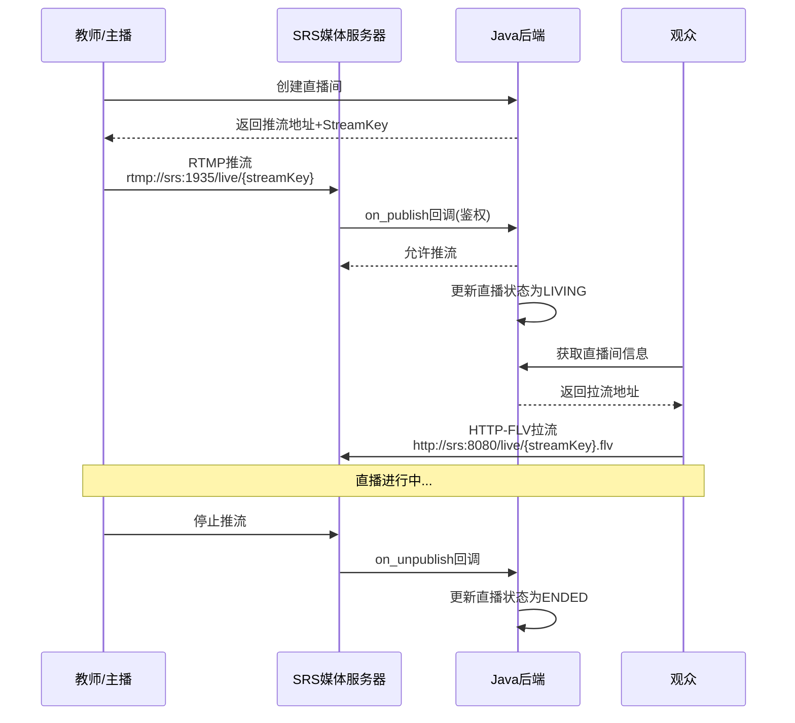
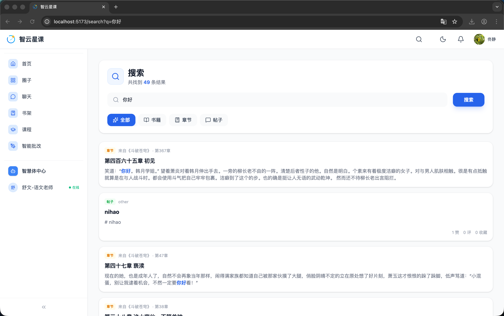

# 第六章 系统关键功能实现

## 6.1 实时音视频通话系统

### 6.1.1 系统架构

实时音视频通话系统采用三级降级架构：Go语言开发的RTC信令服务通过WebSocket长连接负责呼叫信令转发；WebRTC P2P实现浏览器和移动端之间的直接音视频传输；coturn TURN服务器在NAT穿透失败时提供中继转发，借鉴了P2P中继网络与可编程交换机的NAT穿透方案[20]；LiveKit SFU作为P2P和TURN均失败时的最终降级方案，参考了动态冗余自稳定实时视频分发的研究[21]。该三级架构确保在各种网络环境下均能建立音视频连接。

### 6.1.2 通话流程

通话建立流程为：发起方通过WebSocket发送invite信令，Go信令服务转发至接收方；接收方回复answer信令，双方交换ICE候选后建立P2P连接。若P2P连接失败，自动尝试通过coturn TURN服务器中继；若TURN仍然失败，客户端在ICE超时后发送fallback_sfu信令，Go服务端签发LiveKit房间Token，双方通过LiveKit SFU建立连接。

图6-1展示了P2P通话的信令流程。发起方和接收方分别通过JWT认证建立WebSocket连接，Go信令服务通过Redis管理在线状态；发起方发送invite信令，经信令服务转发至接收方；接收方回复answer（含SDP），双方交换ICE候选后建立P2P直连；通话结束后信令服务回调Java后端保存通话记录。

图6-1 P2P通话信令流程图

图6-2展示了三级降级策略。系统首先尝试P2P直连；若失败则尝试通过coturn TURN服务器中继；若TURN仍失败，客户端发送fallback_sfu信令，Go服务端签发LiveKit房间Token，双方通过LiveKit SFU建立连接。

图6-2 三级降级策略流程图

### 6.1.3 Go信令服务关键实现

Go信令服务的关键实现包括：JWT认证采用与Java后端相同的共享密钥HMAC验签，确保跨服务身份验证一致性；Redis在线状态管理追踪用户上线和下线状态；连接管理器（ConnManager）维护用户ID到WebSocket连接的映射；呼叫超时机制确保30秒无应答自动取消；通话结束后回调Java后端保存通话记录。当SFU降级时，Go服务端负责签发LiveKit房间Token，包含房间ID、用户身份和权限（publish/subscribe）。图6-3展示了音视频通话的用户端界面。

图6-3 音视频通话用户端界面

## 6.2 在线直播系统

### 6.2.1 直播架构

在线直播系统采用SRS v5作为媒体服务器。推流端（OBS或移动端）通过RTMP协议将音视频流推送至SRS，SRS负责转码并通过HTTP-FLV和HLS协议分发给观众。Web端使用flv.js拉取HTTP-FLV流实现低延迟播放，移动端使用video_player插件播放。

图6-4展示了直播推拉流的完整架构。教师创建直播间后获得推流地址和StreamKey，通过RTMP协议推流至SRS；SRS触发on_publish回调至Java后端进行鉴权并更新直播状态；观众通过HTTP-FLV拉流观看；停止推流时SRS触发on_unpublish回调更新状态。

图6-4 直播推拉流架构时序图

### 6.2.2 直播间管理

直播间由LiveRoom聚合根管理，支持完整的CRUD操作。直播状态遵循CREATED→LIVING→ENDED的生命周期。权限控制支持两种模式：PUBLIC（公开直播，所有登录用户可观看）和CLASS_ONLY（班级专属，通过classMemberRepository验证班级成员关系）。每个直播间分配唯一的流密钥（StreamKey），用于推流鉴权、防止未授权推流。

### 6.2.3 SRS回调鉴权

SRS通过HTTP回调与Java后端联动。on_publish回调在推流时验证StreamKey有效性，拒绝非法推流；on_unpublish回调在停止推流时更新直播间状态；on_play和on_stop回调用于观看人数统计。SRS回调接口已加入Spring Security白名单（/api/internal/srs/**）。

### 6.2.4 弹幕互动

直播弹幕采用STOMP WebSocket协议实现实时互动。观众订阅/topic/live/{roomId}频道接收弹幕消息，消息类型包括TEXT（普通弹幕）、SYSTEM（系统通知）和GIFT（礼物）。所有弹幕消息通过LivestreamChatWebSocketController持久化到LiveRoomMessage表，支持历史弹幕回看。

## 6.3 课程学习系统

### 6.3.1 课程管理

课程系统采用三层层次结构：课程（Course）包含多个章节（Section），每个章节包含多个视频（Video）。课程实体包含标题、描述、封面、价格、分类、标签、难度等属性，状态遵循草稿→已发布→已下架的生命周期。教师通过课程管理界面创建课程后，可逐步添加章节和视频资源，章节支持拖拽排序调整学习顺序。视频上传至OSS后，系统自动提取视频时长和缩略图信息。课程发布时同步索引至Elasticsearch，支持全文搜索发现。付费课程通过订单系统购买后解锁，会员专属课程则在开通会员时自动免费解锁。

### 6.3.2 学习进度追踪

学习进度追踪由ProgressApplicationService实现，采用多粒度的进度记录策略。视频观看进度精确到秒，前端每隅30秒上报一次播放位置，服务端取最大值更新，确保断点续播体验。章节完成状态在该章节所有视频观看进度超过90%时自动标记为已完成。课程整体完成百分比根据已完成章节数与总章节数的比值计算。学习时长统计汇总每日、每周、每月的累计学习时间。进度数据同时通过Spring事件机制发布COURSE_WATCH类型的LearningActivityEvent，由异步监听器持久化到learning_activity表，供学情分析系统采集。

### 6.3.3 课程推荐

课程推荐系统提供多种推荐策略以满足不同场景需求。基于用户偏好的个性化推荐根据用户的学习历史、收藏记录和偏好标签匹配相关课程；协同过滤推荐基于相似用户的学习行为发现潜在兴趣课程；热门课程排行综合课程的学习人数、评价分数和近期活跃度进行动态排序。推荐结果通过RecommendationApplicationService统一聚合，支持分页查询和分类筛选。图6-5展示了课程播放页面，支持视频播放、章节导航和学习进度显示。

图6-5 课程播放页面

## 6.4 考试管理系统

### 6.4.1 题库管理

题库支持多种题型，包括选择题、填空题、判断题、简答题和编程题。每道题目包含学科、难度、年级、知识点和解析等属性。题目来源包括手动录入、批量导入和AI智能出题（详见5.6节）。

### 6.4.2 试卷组卷

组卷支持手动选题和AI智能组卷两种模式。AI智能组卷根据知识点覆盖度和难度分布自动从题库中选取题目。试卷支持在线预览，同时可通过Typst排版引擎导出为专业排版的PDF文件。

### 6.4.3 在线考试

在线考试功能实现了完整的考试生命周期管理。考试计时机制在学生开始答题时启动倒计时，到达设定时长后自动提交答卷。防切屏检测通过监听页面可见性变化事件（visibilitychange），记录学生离开考试页面的次数和时长，超过阈值时触发警告或自动交卷。批改方面，客观题（选择题、判断题、填空题）由系统自动比对标准答案评分，支持LaTeX公式渲染[15]；主观题支持教师手动批改与AI辅助批改相结合，AI辅助批改通过LLM对学生答案进行语义理解和评判，提供评分建议和参考评语供教师确认。

## 6.5 每日学习系统

### 6.5.1 签到打卡

签到打卡由CheckinApplicationService实现，采用“每日一次+连续签到奖励”的激励机制。服务端根据用户ID和日期判重，防止重复签到。连续签到天数通过查询前一天的签到记录计算：若昨日已签到则连续天数加1，否则重置为1。达到特定连续天数（7天、30天等）时触发奖励事件。签到操作同时发布CHECKIN类型的LearningActivityEvent，由异步监听器纳入学情分析数据。

### 6.5.2 每日阅读

每日阅读模块由DailyLearningApplicationService管理，综合用户兴趣标签和文章热度推荐每日阅读内容。阅读进度通过前端定时上报浮动窗口位置计算，服务端记录阅读时长和完成状态。用户可为文章添加阅读笔记，笔记与文章段落关联存储，方便后续回顾。阅读完成后发布ARTICLE_READ类型的LearningActivityEvent，记录阅读时长和文章元数据，供学情分析采集。

### 6.5.3 单词学习

单词学习模块支持7套词库（初中、高中、CET4、CET6、考研、雅思、托福），学习模式包括认识/不认识判断和拼写测试。复习策略基于艾宾浩斯遗忘曲线，根据学习记录自动安排复习计划。学习进度和统计数据实时更新，同时发布WORD_STUDY事件。图6-6展示了单词学习的用户端界面，包括单词释义、例句和发音功能。

图6-6 单词学习详情页

## 6.6 社交互动系统

### 6.6.1 用户关注

用户关注系统支持关注、取消关注、粉丝列表查询、关注列表查询以及双向关注（互关）检测。关注关系存储在user_follow表中，通过follower_id和followed_id的联合唯一索引防止重复关注，并分别建立两个单列索引优化粉丝列表和关注列表的查询性能。互关检测通过反向查询实现，在用户主页展示“已互关”标识。关注数和粉丝数通过计数查询实时获取，展示在用户个人资料页。

### 6.6.2 帖子系统

帖子系统支持图文和视频等多种内容形式的发布，用户可添加标签分类。互动功能包括点赞、评论（支持多级嵌套回复）和收藏。帖子列表支持按热度和时间两种排序方式，热度算法综合考虑点赞数、评论数和时间衰减因子，确保高质量且近期活跃的内容获得更高展示优先级。帖子内容支持Elasticsearch全文检索，方便用户搜索感兴趣的讨论话题。

### 6.6.3 实时聊天

实时聊天基于STOMP WebSocket协议实现，客户端通过/ws/chat端点建立连接，支持私聊和群聊两种模式。私聊消息通过/user/queue/messages通道点对点推送，群聊消息通过/topic/group/{groupId}通道广播。所有消息经服务端处理后持久化到数据库，支持分页查询历史消息。用户在线状态通过WebSocket连接事件（CONNECT/DISCONNECT）实时追踪，前端显示在线/离线标识。消息内容支持文本、图片和表情等多种类型。

## 6.7 会员与支付系统

### 6.7.1 会员体系

会员体系设计4个等级，各等级配额递增。FREE免费版提供每日10次AI对话、不支持PPT生成和智能出题；BASIC基础版提升至每日50次对话、每日5次PPT生成；PRO专业版提供每日200次对话和20次PPT生成；TEACHER教师版专为教师角色设计，配额与PRO版相当但增加班级管理和学情分析等教学专属功能。每个等级同时设置月配额上限，防止单日大量使用后累计超标。会员订阅支持按月和按年两种计费方式，年付享受价格优惠。会员专属课程通过CreateOrderCommand自动免费开通。

### 6.7.2 AI配额管理

AiUsageLimitService作为统一的配额校验领域服务，接入AI对话、PPT生成、智能出题和智能批改4个服务。配额采用日配额加月配额的双重限制机制，Redis原子计数保证并发安全。管理员免受配额限制。配额耗尽和配额低时通过邮件通知用户。

### 6.7.3 订单与支付

订单系统支持课程和会员的购买流程。支付网关采用预留设计，已定义AlipayPaymentGateway和WechatPayPaymentGateway接口（未注册为Bean），待对接实际支付渠道。支付回调接口已加入Spring Security白名单（/api/payment/callback/**）。

## 6.8 文件与文档管理

### 6.8.1 OSS文件上传

文件上传服务基于阿里云OSS对象存储，通过FileBusinessType枚举实现分业务类型的目录管理（如avatar/、course/、grading/、ppt/等子目录）。上传前进行文件类型白名单校验（如图片仅允许jpg/png/gif/webp）和文件大小限制（图片最大10MB、视频最大500MB）。上传成功后返回OSS公开访问的URL，前端直接引用该URL展示资源。文件命名采用UUID随机生成，避免文件名冲突和中文编码问题。

### 6.8.2 OnlyOffice文档协作

系统集成OnlyOffice Document Server实现在线文档协作，支持PPT、DOCX和XLSX三种格式的在线编辑。前端通过OnlyOffice JS API嵌入编辑器组件，通过JWT签名鉴权确保只有授权用户才能访问特定文档。文档编辑完成后，OnlyOffice通过回调URL将修改后的文件推送至Java后端，后端下载并重新上传至OSS替换原文件。该功能主要用于PPT模板的在线编辑和课程材料的协作修改。

### 6.8.3 Gotenberg PDF转换

Gotenberg服务基于Chromium和LibreOffice提供文档格式转换能力。系统通过HTTP API调用Gotenberg，支持HTML转PDF（用于PPT幻灯片缩略图生成）和DOCX转PDF（用于试卷专业排版导出）。Gotenberg以Docker容器方式部署，通过队列机制控制并发转换任务数，避免资源竞争。转换结果以二进制流返回，由Java后端上传至OSS并返回下载链接。

## 6.9 全文搜索系统

### 6.9.1 Elasticsearch集成

全文搜索基于Elasticsearch实现，采用IK中文分词器（ik_max_word用于索引、ik_smart用于搜索）并配置自定义词典（custom.dic）。系统建立了课程、书籍和帖子三类实体索引，基于高效内存倒排索引技术[25]和实用可视化搜索引擎方案[26]。

### 6.9.2 搜索功能

搜索功能在基础检索之上提供了多种增强特性。关键词高亮通过Elasticsearch的highlight API在搜索结果中标记匹配词汇，提升用户识别效率。分面搜索支持按分类、标签、难度和价格区间等多维度进行过滤和聚合统计。搜索建议基于completion suggester实现输入自动补全，用户输入前几个字符即可获得推荐搜索词。搜索结果默认按BM25相关度排序，同时支持切换为按时间或热度排序。图6-7展示了聚合搜索功能页面，支持跨课程、书籍和帖子的统一检索。

图6-7 聚合搜索功能页面

## 6.10 前端与移动端实现

### 6.10.1 Web管理端（React + TypeScript）

Web管理端采用React + TypeScript技术栈，路由架构基于React Router v6，状态管理使用React Context结合Hooks。UI框架采用TailwindCSS配合shadcn/ui组件库。API层通过OpenAPI Generator自动生成类型安全的客户端代码，配合json-bigint处理后端雪花ID的大数精度问题。核心页面包括课程管理、题库管理、AI工作流可视化编辑器、知识库管理和学情仪表盘等。图6-8展示了用户端首页，包含Banner轮播、功能导航和课程推荐等模块。

图6-8 用户端首页

### 6.10.2 Flutter移动端

Flutter移动端采用features分模块架构，包含auth、chat、circle、course、grading、membership、ppt、profile等模块。AI对话通过Dio的ResponseType.stream实现SSE流式解析。智能批改集成了Google ML Kit端侧OCR实时文字检测和CustomPainter绘制的分数环组件。PPT生成支持多步骤交互流程。课程学习模块实现了视频播放和进度追踪功能。

## 6.11 本章小结

本章介绍了智云星课平台的系统关键功能实现。实时音视频通话系统采用P2P优先、TURN中继、LiveKit SFU降级的三级架构，确保各种网络环境下的通话可用性。在线直播系统基于SRS v5实现RTMP推流和HTTP-FLV/HLS拉流分发，配合STOMP WebSocket弹幕互动。课程学习系统实现了三层课程结构和精确到秒的进度追踪。考试管理系统支持多题型题库、AI智能组卷和Typst排版导出。每日学习系统涵盖签到打卡、每日阅读和基于艾宾浩斯遗忘曲线的单词学习。社交互动系统提供关注、帖子和实时聊天功能。会员与支付系统实现了4级会员体系和统一的AI配额管理。文件管理集成OSS存储、OnlyOffice协作和Gotenberg格式转换。全文搜索基于Elasticsearch和IK分词器实现。前端采用React+TypeScript技术栈，移动端采用Flutter跨平台开发。这些功能与第五章的AI核心模块共同构成了完整的智慧教育平台。
