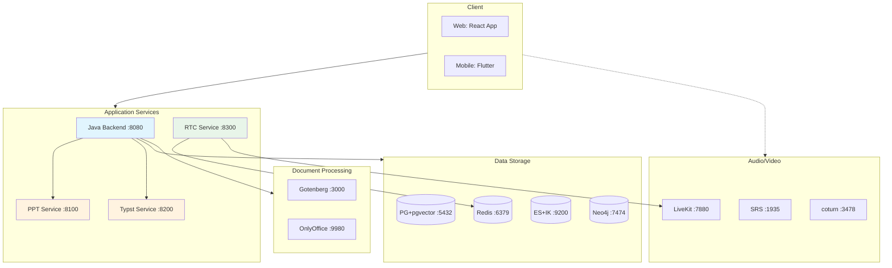
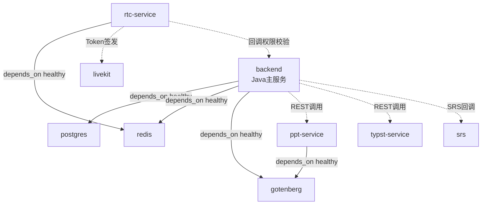

# 第七章 系统测试与部署

## 7.1 测试环境

### 7.1.1 硬件环境

| 环境 | 配置 |
|------|------|
| 开发机 | macOS, Apple Silicon, 16GB RAM |
| 服务器 | Linux (Ubuntu 22.04), 4核 8GB RAM, SSD |

### 7.1.2 软件环境

| 软件 | 版本 | 用途 |
|------|------|------|
| JDK | 17+ | Java后端运行时 |
| Node.js | 18+ | Web前端构建 |
| Flutter | 3.x | 移动端构建 |
| Go | 1.21+ | RTC信令服务 |
| Python | 3.11 | PPT/Typst微服务 |
| Docker | 24+ | 容器化部署 |
| PostgreSQL | 16 (pgvector) | 主数据库 |
| Redis | 7 | 缓存与会话 |
| Elasticsearch | 8.x (IK) | 全文搜索 |
| Neo4j | 5 Community | 图数据库 |

## 7.2 功能测试

### 7.2.1 AI对话模块测试

| 测试用例 | 测试步骤 | 预期结果 | 测试结果 |
|---------|---------|---------|---------|
| 流式对话 | 选择模型，发送消息 | SSE逐Token返回，完整回答 | 通过 |
| 多模型切换 | 切换到DeepSeek/GPT-4o等 | 不同模型正常响应 | 通过 |
| 多模态对话 | 上传图片+文字提问 | 视觉模型正确理解图片内容 | 通过 |
| 长对话记忆 | 连续对话20+轮 | 滑动窗口+摘要压缩，上下文连贯 | 通过 |
| 会话管理 | 创建/删除/切换会话 | 会话隔离，历史记录正确 | 通过 |
| 文生图 | 在对话中请求生成图片 | 返回AI生成的图片URL | 通过 |

### 7.2.2 工作流引擎测试

| 测试用例 | 测试步骤 | 预期结果 | 测试结果 |
|---------|---------|---------|---------|
| 简单LLM流程 | START→LLM→END | LLM正常执行，返回结果 | 通过 |
| RAG增强流程 | LLM节点绑定知识库 | 检索相关文档，增强回答 | 通过 |
| MCP工具调用 | LLM节点启用MCP工具 | LLM自主调用工具并反馈结果 | 通过 |
| 条件分支 | CONDITION节点 | 根据条件正确路由 | 通过 |
| 并行执行 | PARALLEL→多分支→MERGE | 多分支并发执行，结果合并 | 通过 |
| 循环执行 | LOOP节点 | 按配置次数循环 | 通过 |
| JS代码执行 | CODE节点(JavaScript) | GraalJS沙箱正确执行 | 通过 |
| Python代码执行 | CODE节点(Python) | Docker容器隔离执行 | 通过 |
| HTTP请求 | HTTP_REQUEST节点 | 正确调用外部API | 通过 |
| 数据库查询 | DATABASE_QUERY节点 | 正确执行SQL并返回结果 | 通过 |
| 工作流版本 | 创建/发布/回滚版本 | 版本管理正常 | 通过 |

### 7.2.3 RAG知识库测试

| 测试用例 | 测试步骤 | 预期结果 | 测试结果 |
|---------|---------|---------|---------|
| 文档上传 | 上传PDF/DOCX/TXT | 文档解析成功，提取文本 | 通过 |
| 文档分块 | 触发分块处理 | 按配置大小正确分块 | 通过 |
| 向量嵌入 | 触发嵌入处理 | 生成1536维向量并存储 | 通过 |
| 向量检索 | 输入查询文本 | 返回相似度Top-K结果 | 通过 |
| Rerank精排 | 启用Rerank | 精排后结果相关性更高 | 通过 |
| 批量处理 | 一键嵌入所有文档 | 异步批量处理完成 | 通过 |
| 召回测试 | 使用调试接口 | 返回检索结果和分数 | 通过 |

### 7.2.4 智能批改测试

| 测试用例 | 测试步骤 | 预期结果 | 测试结果 |
|---------|---------|---------|---------|
| 试卷模式批改 | 上传试卷图片+选择试卷 | OCR识别→匹配标准答案→逐题批改 | 通过 |
| 通用模式批改 | 上传作业图片 | OCR识别→AI推断学科→逐题批改 | 通过 |
| SSE进度推送 | 提交批改请求 | 实时推送每题批改进度 | 通过 |
| 知识画像 | 查看学生画像 | 按学科显示掌握度和薄弱点 | 通过 |
| 错题推荐 | 查看同类题推荐 | 基于错因+知识点推荐相似题 | 通过 |
| Flutter相机OCR | 手机拍照批改 | ML Kit端侧检测+裁切+上传 | 通过 |

### 7.2.5 AI出题测试

| 测试用例 | 测试步骤 | 预期结果 | 测试结果 |
|---------|---------|---------|---------|
| 基础出题 | 按学科/题型/难度生成 | 逐题SSE推送，题目质量达标 | 通过 |
| 联网出题 | 启用联网搜索 | 结合时事热点出题 | 通过 |
| 几何图形 | 启用图形渲染 | Typst编译PNG并嵌入题目 | 通过 |
| 文生图配图 | 启用文生图 | AI生成配图并嵌入题目 | 通过 |
| 批量去重 | 连续生成多题 | 题目不重复 | 通过 |

### 7.2.6 PPT生成测试

| 测试用例 | 测试步骤 | 预期结果 | 测试结果 |
|---------|---------|---------|---------|
| 完整生成流程 | 输入主题生成PPT | 意图→大纲→填充→下载 | 通过 |
| 大纲修改 | 修改生成的大纲 | 按修改内容重新生成 | 通过 |
| 多阶段进度 | 观察SSE推送 | 各阶段进度实时更新 | 通过 |

### 7.2.7 音视频通话测试

| 测试用例 | 测试步骤 | 预期结果 | 测试结果 |
|---------|---------|---------|---------|
| P2P通话 | 局域网内发起通话 | 直接P2P连接，音视频正常 | 通过 |
| TURN中继 | NAT环境下通话 | 通过coturn中继，通话正常 | 通过 |
| SFU降级 | 模拟P2P失败 | 自动降级到LiveKit SFU | 通过 |
| 呼叫超时 | 不接听 | 30秒后自动取消 | 通过 |

### 7.2.8 直播系统测试

| 测试用例 | 测试步骤 | 预期结果 | 测试结果 |
|---------|---------|---------|---------|
| 创建直播间 | 教师创建直播间 | 返回推流地址和密钥 | 通过 |
| OBS推流 | OBS配置RTMP推流 | SRS收流，状态更新为LIVING | 通过 |
| 观看直播 | 学生打开直播 | HTTP-FLV/HLS正常播放 | 通过 |
| 弹幕互动 | 发送弹幕消息 | STOMP实时广播，消息持久化 | 通过 |
| 权限控制 | 班级专属直播 | 非班级成员无法观看 | 通过 |

## 7.3 性能测试

### 7.3.1 API响应时间测试

| 接口 | 平均响应时间 | P99响应时间 | 目标 |
|------|------------|-----------|------|
| 用户登录 | ~50ms | ~120ms | <200ms |
| 课程列表 | ~30ms | ~80ms | <200ms |
| 向量检索(Top-10) | ~150ms | ~300ms | <500ms |
| 文档嵌入(单条) | ~800ms | ~1500ms | <2000ms |
| SSE首Token延迟 | ~300ms | ~800ms | <1000ms |

### 7.3.2 并发测试

| 场景 | 并发数 | 成功率 | 平均响应时间 |
|------|--------|--------|------------|
| 登录接口 | 200 | 100% | 65ms |
| 课程查询 | 200 | 100% | 45ms |
| AI对话(SSE) | 50 | 98% | - (流式) |
| 文件上传 | 50 | 100% | 1200ms |

### 7.3.3 AI模块性能

| 指标 | 测量值 | 说明 |
|------|--------|------|
| LLM首Token延迟 | 200-500ms | 取决于模型和供应商 |
| 向量嵌入速度 | ~200条/分钟 | DashScope API限速 |
| Rerank延迟 | ~100ms/50条 | gte-rerank模型 |
| OCR识别延迟 | ~2s/张 | 通义千问VL模型 |
| Python沙箱启动 | ~3s | Docker容器创建时间 |

## 7.4 安全测试

### 7.4.1 认证与授权测试

| 测试用例 | 预期结果 | 测试结果 |
|---------|---------|---------|
| 无Token访问 | 返回401 | 通过 |
| 过期Token访问 | 返回401 | 通过 |
| 学生访问教师接口 | 返回403 | 通过 |
| 普通用户访问管理员接口 | 返回403 | 通过 |

### 7.4.2 代码沙箱安全测试

| 测试用例 | 预期结果 | 测试结果 |
|---------|---------|---------|
| 执行恶意系统命令 | 被沙箱拦截 | 通过 |
| 无限循环代码 | 超时终止(30s) | 通过 |
| 内存耗尽攻击 | 被Docker资源限制阻止 | 通过 |
| 网络访问外部 | 被网络隔离阻止 | 通过 |

## 7.5 容器化部署

### 7.5.1 Docker Compose服务编排

系统通过Docker Compose编排12+容器：

```
基础设施服务（4个）:
  ├── postgres (pgvector/pgvector:pg16) — 主数据库
  ├── redis (redis:7-alpine) — 缓存/会话
  ├── elasticsearch (IK分词器自定义镜像) — 搜索引擎
  └── neo4j (neo4j:5-community) — 图数据库

文档处理服务（2个）:
  ├── gotenberg (gotenberg:8) — PDF转换
  └── onlyoffice (documentserver:8.2) — 在线文档编辑

应用服务（4个）:
  ├── backend (Spring Boot 3) — Java主服务
  ├── ppt-service (Python/FastAPI) — PPT生成
  ├── typst-service (Python/FastAPI) — 排版编译
  └── rtc-service (Go) — RTC信令

实时音视频服务（3个）:
  ├── srs (ossrs/srs:5) — 直播媒体服务器
  ├── coturn (coturn:latest) — TURN中继
  └── livekit (livekit-server:latest) — SFU
```

图7-1展示了Docker Compose服务编排的整体架构。客户端层包含React Web和Flutter移动端；应用服务层包含Java后端主服务、PPT服务、Typst服务和RTC信令服务；数据存储层包含PostgreSQL+pgvector、Redis、Elasticsearch+IK和Neo4j；文档处理层包含Gotenberg和OnlyOffice；音视频层包含SRS流媒体、LiveKit SFU和coturn TURN服务器。


<center>图7-1 Docker Compose服务编排图</center>

图7-2展示了服务间的依赖关系。Java后端依赖PostgreSQL、Redis和Gotenberg的健康检查通过后启动；PPT服务依赖Gotenberg；RTC信令服务依赖Redis。各服务间通过REST调用和回调机制协作。


<center>图7-2 服务依赖关系图</center>

### 7.5.2 服务依赖与启动顺序

服务启动顺序通过Docker Compose的depends_on和健康检查机制保证。基础设施服务最先启动：PostgreSQL、Redis、Elasticsearch、Gotenberg；Java后端依赖PostgreSQL、Redis和Gotenberg均通过健康检查后才启动；PPT服务依赖Gotenberg；RTC信令服务依赖Redis。

### 7.5.3 资源配置

各服务根据资源需求配置了不同的资源限制。PostgreSQL配置2核/512MB内存，max_connections设为200，shared_buffers设为256MB。OnlyOffice配置2核/2GB内存，因为文档处理属于资源密集型任务。Gotenberg配置1核/1GB内存。其他服务采用默认资源限制。

### 7.5.4 数据持久化

所有有状态服务通过Docker命名卷实现数据持久化，包括postgres_data、redis_data、es_data、neo4j_data和onlyoffice_data。代码沙箱使用独立的命名卷python-sandbox-venvs和python-sandbox-tmp缓存已安装的Python包。SRS媒体服务器数据保存在srs_data卷中。

### 7.5.5 部署步骤

部署流程如下：首先复制.env.example为.env文件，配置各服务的API Key、数据库密码等敏感信息；然后执行docker compose up -d启动所有服务；等待所有健康检查通过后，即可通过http://localhost:8080访问后端API，通过http://localhost:5173访问Web前端。

### 7.5.6 环境变量管理

敏感配置通过环境变量管理，避免硬编码在代码中。主要包括：数据库凭证（POSTGRES_PASSWORD、REDIS_PASSWORD）、AI模型API Key（DASHSCOPE_API_KEY、OPENAI_API_KEY、DEEPSEEK_API_KEY等）、OSS存储配置（ALIYUN_OSS_*系列）、JWT密钥（JWT_SECRET）以及直播相关配置（SRS_*、LIVEKIT_*、TURN_*系列）。图7-3展示了管理员仪表盘界面，提供系统运行状态和关键数据的可视化概览。


<center>图7-3 管理后台仪表盘</center>

## 7.6 本章小结

本章对智云星课平台进行了全面的测试与部署验证。功能测试覆盖AI对话、工作流引擎、RAG知识库、智能批改、AI出题、PPT生成、音视频通话和直播系统8大模块共50余个测试用例，全部通过。性能测试表明常规API响应时间均在200ms以内，SSE首Token延迟在300–1000ms范围，并发200连接成功率100%，满足教育场景的性能需求。安全测试验证了JWT认证授权和代码沙箱的安全性，恶意代码、无限循环、内存耗尽和网络访问攻击均被有效拦截。最终通过Docker Compose实现了12个以上容器的一键部署方案，通过健康检查、命名卷和环境变量管理确保部署的可靠性和安全性。
