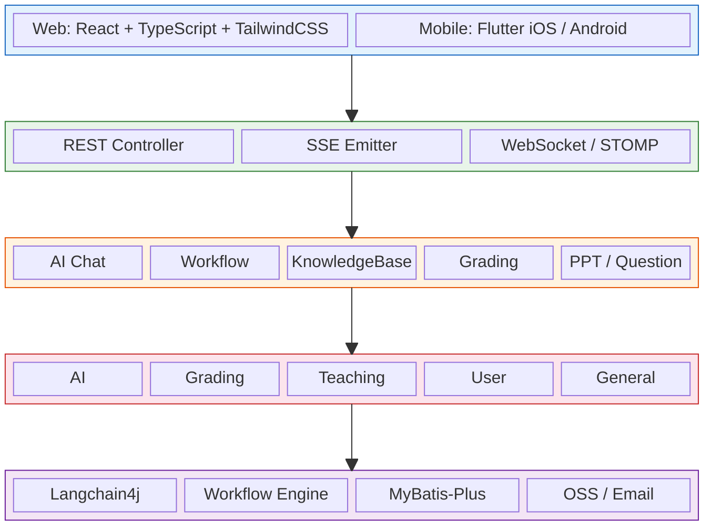
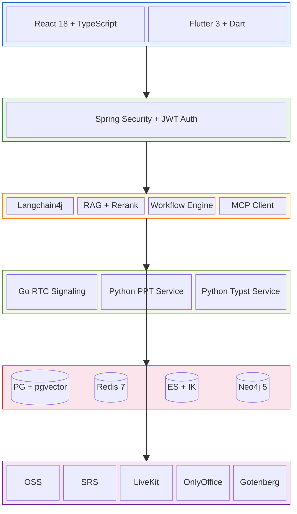

# 系统总体架构图

## 图1-1 系统DDD四层架构图

```mermaid
block-beta
    columns 1

    block:L1
        columns 2
        A1["Web: React + TypeScript + TailwindCSS"]
        A2["Mobile: Flutter iOS / Android"]
    end

    space

    block:L2
        columns 3
        B1["REST Controller"]
        B2["SSE Emitter"]
        B3["WebSocket / STOMP"]
    end

    space

    block:L3
        columns 5
        C1["AI Chat"]
        C2["Workflow"]
        C3["KnowledgeBase"]
        C4["Grading"]
        C5["PPT / Question"]
    end

    space

    block:L4
        columns 5
        D1["AI"]
        D2["Grading"]
        D3["Teaching"]
        D4["User"]
        D5["General"]
    end

    space

    block:L5
        columns 4
        E1["Langchain4j"]
        E2["Workflow Engine"]
        E3["MyBatis-Plus"]
        E4["OSS / Email"]
    end

    L1 --> L2
    L2 --> L3
    L3 --> L4
    L4 --> L5

    style L1 fill:#e3f2fd,stroke:#1565c0
    style L2 fill:#e8f5e9,stroke:#2e7d32
    style L3 fill:#fff3e0,stroke:#e65100
    style L4 fill:#fce4ec,stroke:#c62828
    style L5 fill:#f3e5f5,stroke:#6a1b9a
```

## 图1-2 技术架构全景图

```mermaid
block-beta
    columns 1

    block:CLIENT
        columns 2
        F1["React 18 + TypeScript"]
        F2["Flutter 3 + Dart"]
    end

    space

    block:GW
        columns 1
        G1["Spring Security + JWT Auth"]
    end

    space

    block:BACK
        columns 4
        I1["Langchain4j"]
        I2["RAG + Rerank"]
        I3["Workflow Engine"]
        I4["MCP Client"]
    end

    space

    block:MICRO
        columns 3
        J1["Go RTC Signaling"]
        J2["Python PPT Service"]
        J3["Python Typst Service"]
    end

    space

    block:DATA
        columns 4
        K1[("PG + pgvector")]
        K2[("Redis 7")]
        K3[("ES + IK")]
        K4[("Neo4j 5")]
    end

    space

    block:INFRA
        columns 5
        L1["OSS"]
        L2["SRS"]
        L3["LiveKit"]
        L4["OnlyOffice"]
        L5["Gotenberg"]
    end

    CLIENT --> GW
    GW --> BACK
    BACK --> MICRO
    BACK --> DATA
    BACK --> INFRA

    style CLIENT fill:#e3f2fd,stroke:#1565c0
    style GW fill:#e8f5e9,stroke:#2e7d32
    style BACK fill:#fff8e1,stroke:#f57f17
    style MICRO fill:#f1f8e9,stroke:#558b2f
    style DATA fill:#fce4ec,stroke:#c62828
    style INFRA fill:#f3e5f5,stroke:#6a1b9a
```
