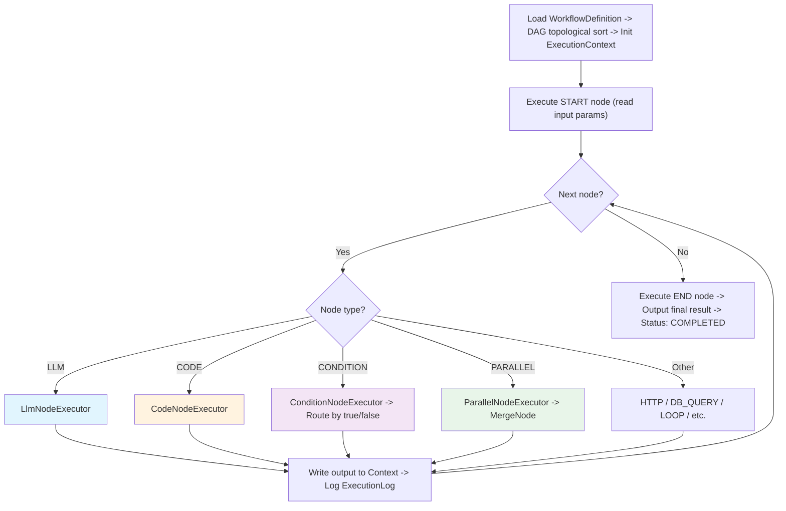
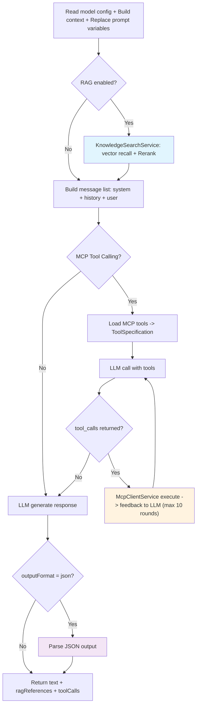
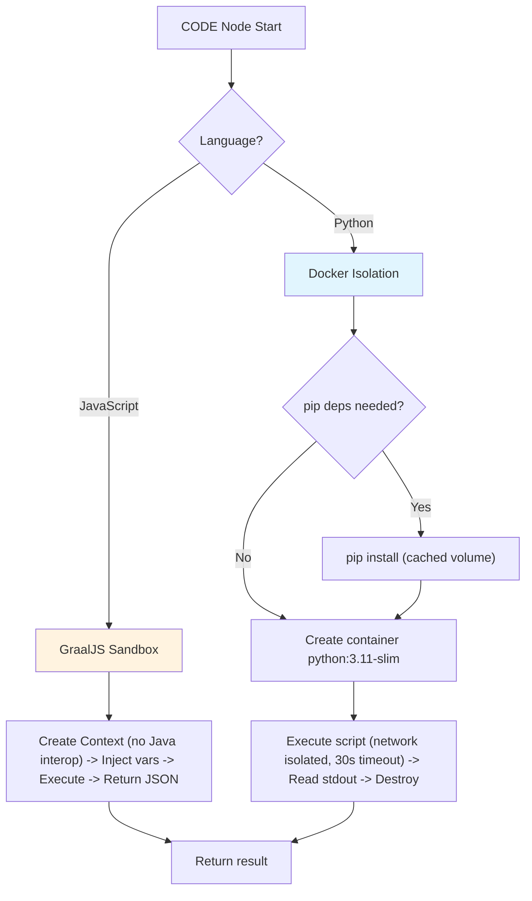

# AI工作流引擎流程图

## 图2-1 工作流引擎执行流程

```mermaid
flowchart TD
    A["Load WorkflowDefinition -> DAG topological sort -> Init ExecutionContext"] --> B["Execute START node (read input params)"]
    B --> C{"Next node?"}
    C -->|Yes| D{"Node type?"}
    C -->|No| E["Execute END node -> Output final result -> Status: COMPLETED"]

    D -->|LLM| F["LlmNodeExecutor"]
    D -->|CODE| G["CodeNodeExecutor"]
    D -->|CONDITION| H["ConditionNodeExecutor -> Route by true/false"]
    D -->|PARALLEL| I["ParallelNodeExecutor -> MergeNode"]
    D -->|Other| J["HTTP / DB_QUERY / LOOP / etc."]

    F & G & H & I & J --> K["Write output to Context -> Log ExecutionLog"]
    K --> C

    style F fill:#e1f5fe
    style G fill:#fff3e0
    style H fill:#f3e5f5
    style I fill:#e8f5e9
```

## 图2-2 LLM节点详细执行流程

```mermaid
flowchart TD
    A["Read model config + Build context + Replace prompt variables"] --> B{RAG enabled?}
    B -->|Yes| C["KnowledgeSearchService: vector recall + Rerank"]
    B -->|No| D["Build message list: system + history + user"]
    C --> D

    D --> E{MCP Tool Calling?}
    E -->|No| F["LLM generate response"]
    E -->|Yes| G["Load MCP tools -> ToolSpecification"]
    G --> H["LLM call with tools"]
    H --> I{"tool_calls returned?"}
    I -->|Yes| J["McpClientService execute -> feedback to LLM (max 10 rounds)"]
    J --> H
    I -->|No| F

    F --> K{"outputFormat = json?"}
    K -->|Yes| L["Parse JSON output"]
    K -->|No| M["Return text + ragReferences + toolCalls"]
    L --> M

    style C fill:#e1f5fe
    style J fill:#fff3e0
    style L fill:#f3e5f5
```

## 图2-3 CODE节点执行流程

```mermaid
flowchart TD
    A[CODE Node Start] --> B{Language?}

    B -->|JavaScript| C["GraalJS Sandbox"]
    C --> C1["Create Context (no Java interop) -> Inject vars -> Execute -> Return JSON"]

    B -->|Python| D["Docker Isolation"]
    D --> D1{"pip deps needed?"}
    D1 -->|Yes| D2["pip install (cached volume)"]
    D1 -->|No| D3["Create container python:3.11-slim"]
    D2 --> D3
    D3 --> D4["Execute script (network isolated, 30s timeout) -> Read stdout -> Destroy"]

    C1 --> E[Return result]
    D4 --> E

    style C fill:#fff3e0
    style D fill:#e1f5fe
```
