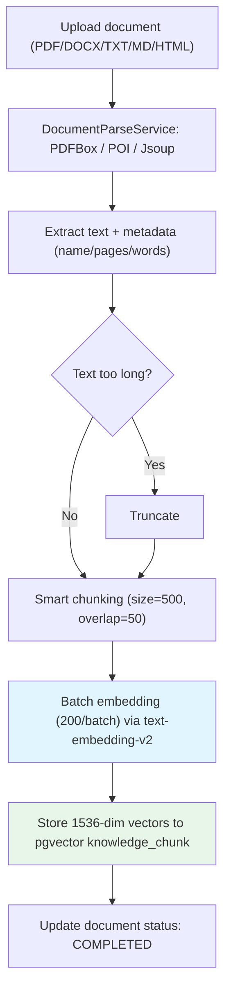
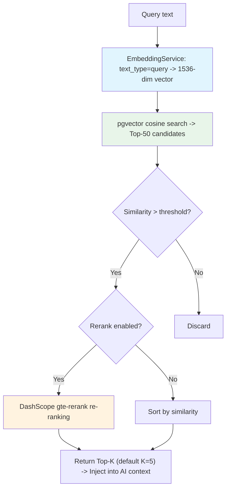
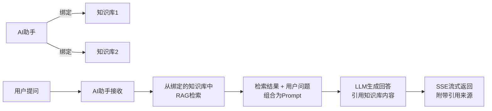

# RAG知识库检索流程图

## 图3-1 文档入库流程

```mermaid
flowchart TD
    A["Upload document (PDF/DOCX/TXT/MD/HTML)"] --> B["DocumentParseService: PDFBox / POI / Jsoup"]
    B --> C["Extract text + metadata (name/pages/words)"]
    C --> D{"Text too long?"}
    D -->|Yes| E["Truncate"]
    D -->|No| F["Smart chunking (size=500, overlap=50)"]
    E --> F
    F --> G["Batch embedding (200/batch) via text-embedding-v2"]
    G --> H["Store 1536-dim vectors to pgvector knowledge_chunk"]
    H --> I["Update document status: COMPLETED"]

    style G fill:#e1f5fe
    style H fill:#e8f5e9
```

## 图3-2 RAG检索流程

```mermaid
flowchart TD
    A["Query text"] --> B["EmbeddingService: text_type=query -> 1536-dim vector"]
    B --> C["pgvector cosine search -> Top-50 candidates"]
    C --> D{"Similarity > threshold?"}
    D -->|Yes| E{"Rerank enabled?"}
    D -->|No| F["Discard"]
    E -->|Yes| G["DashScope gte-rerank re-ranking"]
    E -->|No| H["Sort by similarity"]
    G --> I["Return Top-K (default K=5) -> Inject into AI context"]
    H --> I

    style B fill:#e1f5fe
    style C fill:#e8f5e9
    style G fill:#fff3e0
```

## 图3-3 知识库与AI助手集成

```mermaid
flowchart LR
    A[AI助手] -->|绑定| B[知识库1]
    A -->|绑定| C[知识库2]
    
    D[用户提问] --> E[AI助手接收]
    E --> F[从绑定的知识库中<br/>RAG检索]
    F --> G[检索结果 + 用户问题<br/>组合为Prompt]
    G --> H[LLM生成回答<br/>引用知识库内容]
    H --> I[SSE流式返回<br/>附带引用来源]
```
