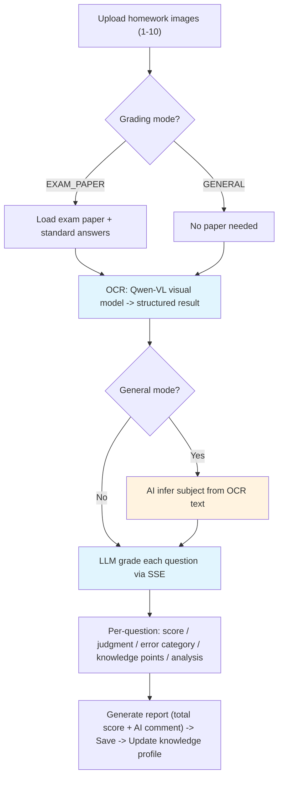
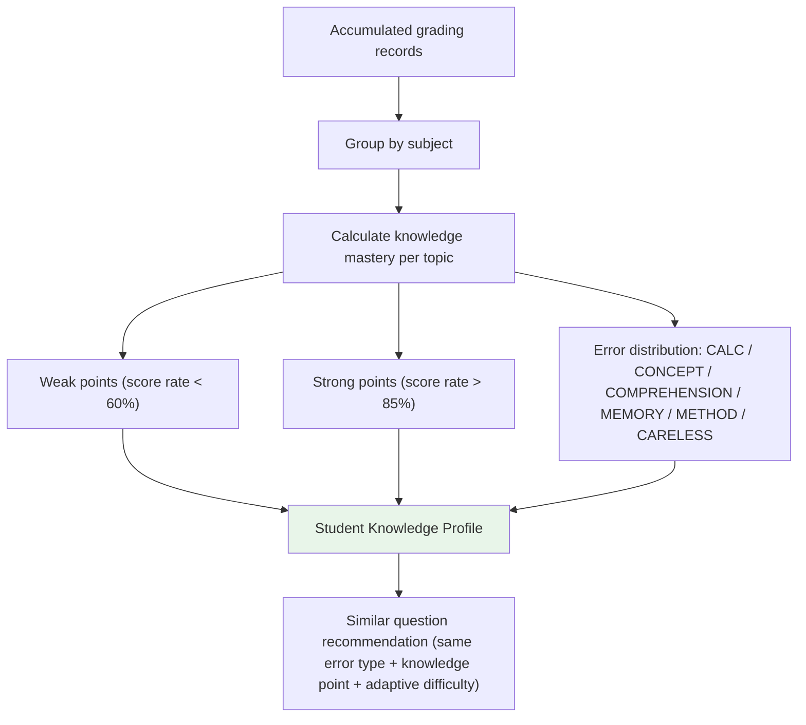
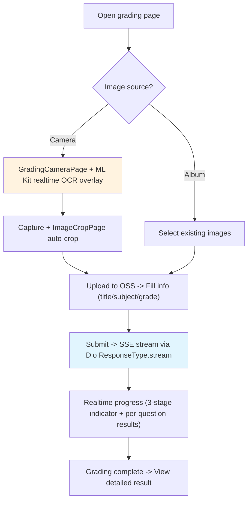

# 智能批改系统流程图

## 图4-1 智能批改总体流程

```mermaid
flowchart TD
    A["Upload homework images (1-10)"] --> B{"Grading mode?"}
    B -->|EXAM_PAPER| C["Load exam paper + standard answers"]
    B -->|GENERAL| D["No paper needed"]
    C & D --> E["OCR: Qwen-VL visual model -> structured result"]
    E --> F{"General mode?"}
    F -->|Yes| G["AI infer subject from OCR text"]
    F -->|No| H["LLM grade each question via SSE"]
    G --> H
    H --> I["Per-question: score / judgment / error category / knowledge points / analysis"]
    I --> J["Generate report (total score + AI comment) -> Save -> Update knowledge profile"]

    style E fill:#e1f5fe
    style G fill:#fff3e0
    style H fill:#e1f5fe
```

## 图4-2 学生知识画像构建

```mermaid
flowchart TD
    A["Accumulated grading records"] --> B["Group by subject"]
    B --> C["Calculate knowledge mastery per topic"]
    C --> D["Weak points (score rate < 60%)"]
    C --> E["Strong points (score rate > 85%)"]
    C --> F["Error distribution: CALC / CONCEPT / COMPREHENSION / MEMORY / METHOD / CARELESS"]
    D & E & F --> G["Student Knowledge Profile"]
    G --> H["Similar question recommendation (same error type + knowledge point + adaptive difficulty)"]

    style G fill:#e8f5e9
```

## 图4-3 Flutter端拍照批改流程

```mermaid
flowchart TD
    A["Open grading page"] --> B{"Image source?"}
    B -->|Camera| C["GradingCameraPage + ML Kit realtime OCR overlay"]
    C --> D["Capture + ImageCropPage auto-crop"]
    B -->|Album| E["Select existing images"]
    D & E --> F["Upload to OSS -> Fill info (title/subject/grade)"]
    F --> G["Submit -> SSE stream via Dio ResponseType.stream"]
    G --> H["Realtime progress (3-stage indicator + per-question results)"]
    H --> I["Grading complete -> View detailed result"]

    style C fill:#fff3e0
    style G fill:#e1f5fe
```
