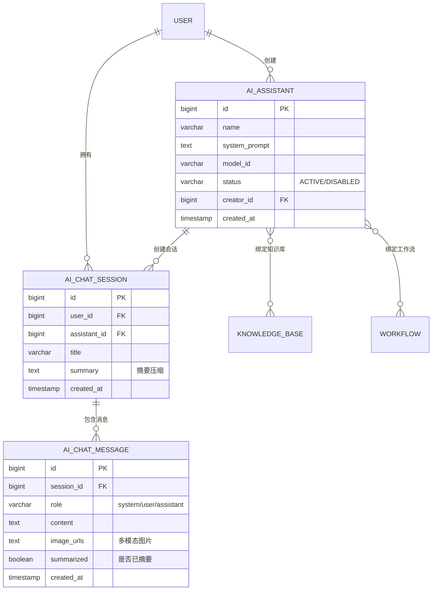
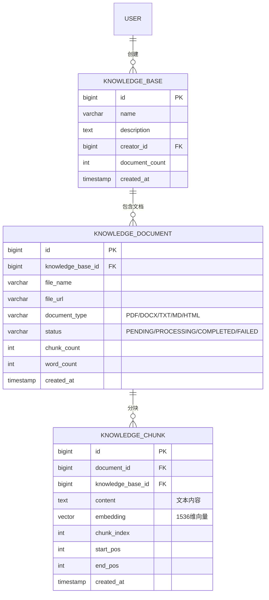
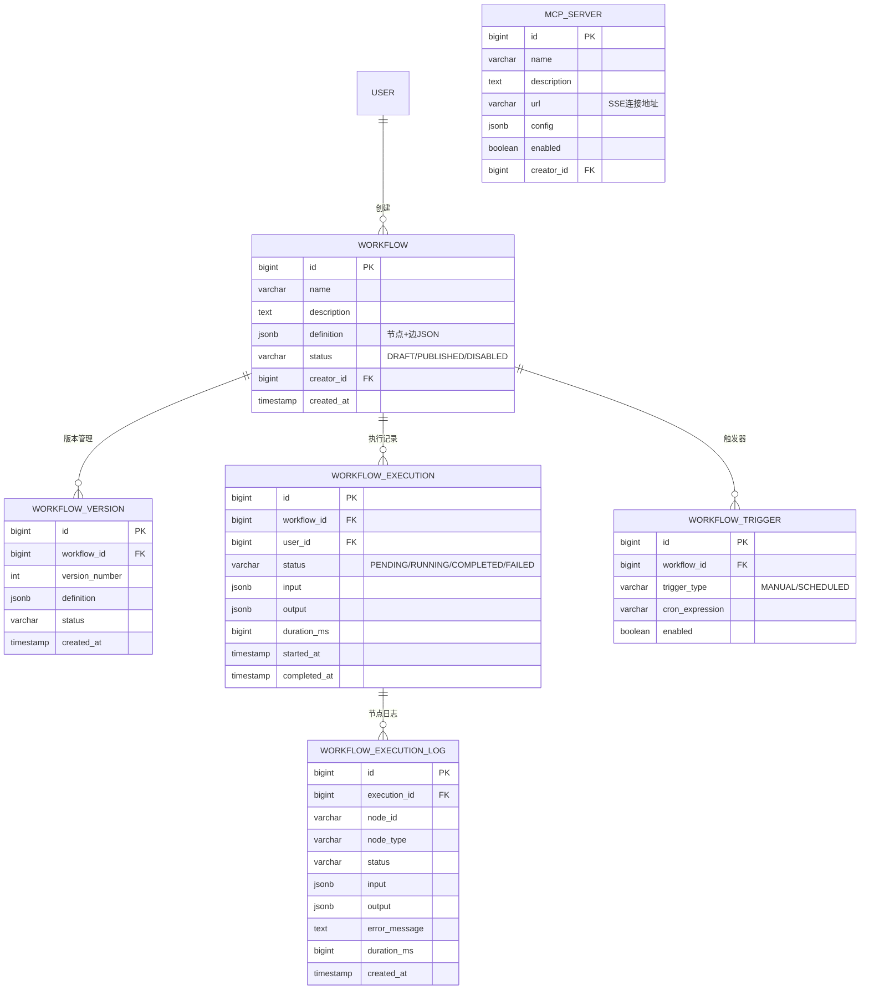

# E-R图 - AI模块

## 图5-1 AI聊天与助手E-R图

```mermaid
erDiagram
    AI_ASSISTANT ||--o{ AI_CHAT_SESSION : "创建会话"
    AI_ASSISTANT }o--o{ KNOWLEDGE_BASE : "绑定知识库"
    AI_ASSISTANT }o--o{ WORKFLOW : "绑定工作流"
    AI_CHAT_SESSION ||--o{ AI_CHAT_MESSAGE : "包含消息"
    USER ||--o{ AI_CHAT_SESSION : "拥有"
    USER ||--o{ AI_ASSISTANT : "创建"

    AI_ASSISTANT {
        bigint id PK
        varchar name
        text system_prompt
        varchar model_id
        varchar status "ACTIVE/DISABLED"
        bigint creator_id FK
        timestamp created_at
    }

    AI_CHAT_SESSION {
        bigint id PK
        bigint user_id FK
        bigint assistant_id FK
        varchar title
        text summary "摘要压缩"
        timestamp created_at
    }

    AI_CHAT_MESSAGE {
        bigint id PK
        bigint session_id FK
        varchar role "system/user/assistant"
        text content
        text image_urls "多模态图片"
        boolean summarized "是否已摘要"
        timestamp created_at
    }
```

## 图5-2 知识库E-R图

```mermaid
erDiagram
    KNOWLEDGE_BASE ||--o{ KNOWLEDGE_DOCUMENT : "包含文档"
    KNOWLEDGE_DOCUMENT ||--o{ KNOWLEDGE_CHUNK : "分块"
    USER ||--o{ KNOWLEDGE_BASE : "创建"

    KNOWLEDGE_BASE {
        bigint id PK
        varchar name
        text description
        bigint creator_id FK
        int document_count
        timestamp created_at
    }

    KNOWLEDGE_DOCUMENT {
        bigint id PK
        bigint knowledge_base_id FK
        varchar file_name
        varchar file_url
        varchar document_type "PDF/DOCX/TXT/MD/HTML"
        varchar status "PENDING/PROCESSING/COMPLETED/FAILED"
        int chunk_count
        int word_count
        timestamp created_at
    }

    KNOWLEDGE_CHUNK {
        bigint id PK
        bigint document_id FK
        bigint knowledge_base_id FK
        text content "文本内容"
        vector embedding "1536维向量"
        int chunk_index
        int start_pos
        int end_pos
        timestamp created_at
    }
```

## 图5-3 工作流E-R图

```mermaid
erDiagram
    WORKFLOW ||--o{ WORKFLOW_VERSION : "版本管理"
    WORKFLOW ||--o{ WORKFLOW_EXECUTION : "执行记录"
    WORKFLOW ||--o{ WORKFLOW_TRIGGER : "触发器"
    WORKFLOW_EXECUTION ||--o{ WORKFLOW_EXECUTION_LOG : "节点日志"
    USER ||--o{ WORKFLOW : "创建"

    WORKFLOW {
        bigint id PK
        varchar name
        text description
        jsonb definition "节点+边JSON"
        varchar status "DRAFT/PUBLISHED/DISABLED"
        bigint creator_id FK
        timestamp created_at
    }

    WORKFLOW_VERSION {
        bigint id PK
        bigint workflow_id FK
        int version_number
        jsonb definition
        varchar status
        timestamp created_at
    }

    WORKFLOW_EXECUTION {
        bigint id PK
        bigint workflow_id FK
        bigint user_id FK
        varchar status "PENDING/RUNNING/COMPLETED/FAILED"
        jsonb input
        jsonb output
        bigint duration_ms
        timestamp started_at
        timestamp completed_at
    }

    WORKFLOW_EXECUTION_LOG {
        bigint id PK
        bigint execution_id FK
        varchar node_id
        varchar node_type
        varchar status
        jsonb input
        jsonb output
        text error_message
        bigint duration_ms
        timestamp created_at
    }

    WORKFLOW_TRIGGER {
        bigint id PK
        bigint workflow_id FK
        varchar trigger_type "MANUAL/SCHEDULED"
        varchar cron_expression
        boolean enabled
    }

    MCP_SERVER {
        bigint id PK
        varchar name
        text description
        varchar url "SSE连接地址"
        jsonb config
        boolean enabled
        bigint creator_id FK
    }
```
