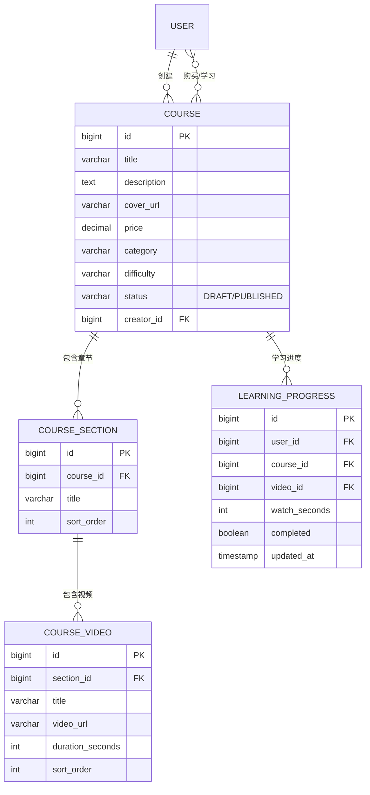
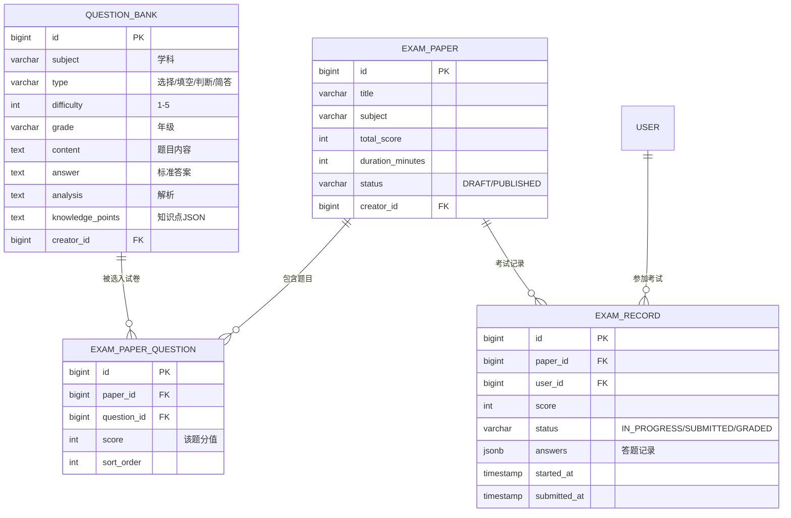
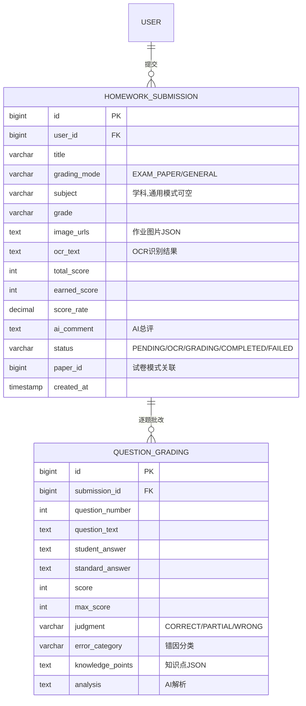

# E-R图 - 教学与批改模块

## 图6-1 课程与考试E-R图

```mermaid
erDiagram
    COURSE ||--o{ COURSE_SECTION : "包含章节"
    COURSE_SECTION ||--o{ COURSE_VIDEO : "包含视频"
    USER ||--o{ COURSE : "创建"
    USER }o--o{ COURSE : "购买/学习"
    COURSE ||--o{ LEARNING_PROGRESS : "学习进度"

    COURSE {
        bigint id PK
        varchar title
        text description
        varchar cover_url
        decimal price
        varchar category
        varchar difficulty
        varchar status "DRAFT/PUBLISHED"
        bigint creator_id FK
    }

    COURSE_SECTION {
        bigint id PK
        bigint course_id FK
        varchar title
        int sort_order
    }

    COURSE_VIDEO {
        bigint id PK
        bigint section_id FK
        varchar title
        varchar video_url
        int duration_seconds
        int sort_order
    }

    LEARNING_PROGRESS {
        bigint id PK
        bigint user_id FK
        bigint course_id FK
        bigint video_id FK
        int watch_seconds
        boolean completed
        timestamp updated_at
    }
```

## 图6-2 题库与试卷E-R图

```mermaid
erDiagram
    QUESTION_BANK ||--o{ EXAM_PAPER_QUESTION : "被选入试卷"
    EXAM_PAPER ||--o{ EXAM_PAPER_QUESTION : "包含题目"
    EXAM_PAPER ||--o{ EXAM_RECORD : "考试记录"
    USER ||--o{ EXAM_RECORD : "参加考试"

    QUESTION_BANK {
        bigint id PK
        varchar subject "学科"
        varchar type "选择/填空/判断/简答"
        int difficulty "1-5"
        varchar grade "年级"
        text content "题目内容"
        text answer "标准答案"
        text analysis "解析"
        text knowledge_points "知识点JSON"
        bigint creator_id FK
    }

    EXAM_PAPER {
        bigint id PK
        varchar title
        varchar subject
        int total_score
        int duration_minutes
        varchar status "DRAFT/PUBLISHED"
        bigint creator_id FK
    }

    EXAM_PAPER_QUESTION {
        bigint id PK
        bigint paper_id FK
        bigint question_id FK
        int score "该题分值"
        int sort_order
    }

    EXAM_RECORD {
        bigint id PK
        bigint paper_id FK
        bigint user_id FK
        int score
        varchar status "IN_PROGRESS/SUBMITTED/GRADED"
        jsonb answers "答题记录"
        timestamp started_at
        timestamp submitted_at
    }
```

## 图6-3 智能批改E-R图

```mermaid
erDiagram
    HOMEWORK_SUBMISSION ||--o{ QUESTION_GRADING : "逐题批改"
    USER ||--o{ HOMEWORK_SUBMISSION : "提交"

    HOMEWORK_SUBMISSION {
        bigint id PK
        bigint user_id FK
        varchar title
        varchar grading_mode "EXAM_PAPER/GENERAL"
        varchar subject "学科,通用模式可空"
        varchar grade
        text image_urls "作业图片JSON"
        text ocr_text "OCR识别结果"
        int total_score
        int earned_score
        decimal score_rate
        text ai_comment "AI总评"
        varchar status "PENDING/OCR/GRADING/COMPLETED/FAILED"
        bigint paper_id "试卷模式关联"
        timestamp created_at
    }

    QUESTION_GRADING {
        bigint id PK
        bigint submission_id FK
        int question_number
        text question_text
        text student_answer
        text standard_answer
        int score
        int max_score
        varchar judgment "CORRECT/PARTIAL/WRONG"
        varchar error_category "错因分类"
        text knowledge_points "知识点JSON"
        text analysis "AI解析"
    }
```
