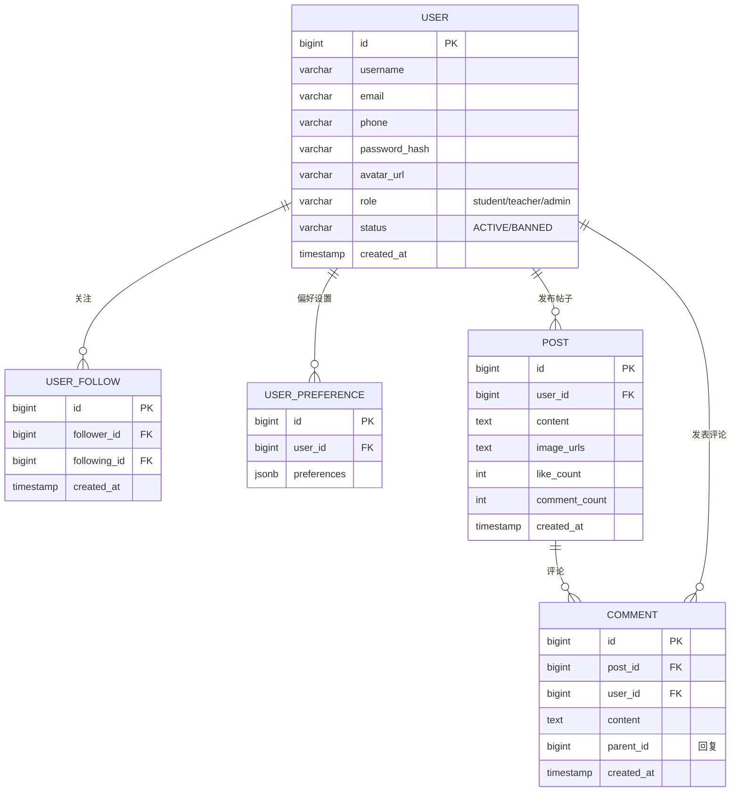
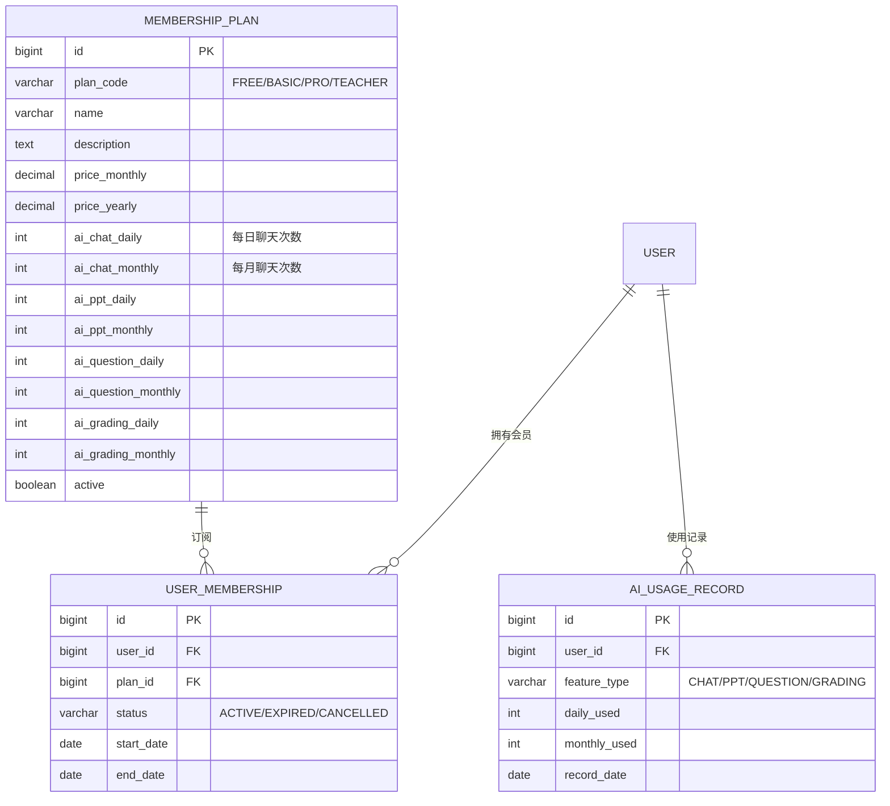
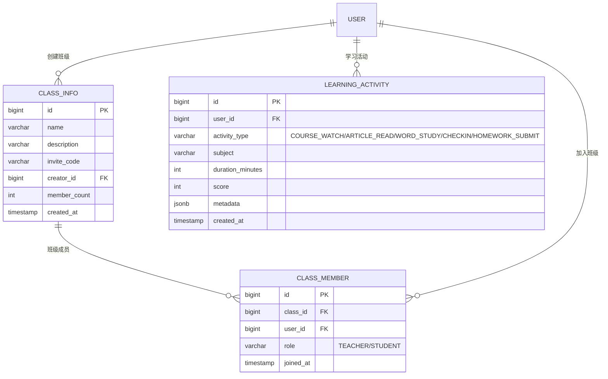

# E-R图 - 用户与会员模块

## 图7-1 用户与社交E-R图

```mermaid
erDiagram
    USER ||--o{ USER_FOLLOW : "关注"
    USER ||--o{ USER_PREFERENCE : "偏好设置"
    USER ||--o{ POST : "发布帖子"
    POST ||--o{ COMMENT : "评论"
    USER ||--o{ COMMENT : "发表评论"

    USER {
        bigint id PK
        varchar username
        varchar email
        varchar phone
        varchar password_hash
        varchar avatar_url
        varchar role "student/teacher/admin"
        varchar status "ACTIVE/BANNED"
        timestamp created_at
    }

    USER_FOLLOW {
        bigint id PK
        bigint follower_id FK
        bigint following_id FK
        timestamp created_at
    }

    USER_PREFERENCE {
        bigint id PK
        bigint user_id FK
        jsonb preferences
    }

    POST {
        bigint id PK
        bigint user_id FK
        text content
        text image_urls
        int like_count
        int comment_count
        timestamp created_at
    }

    COMMENT {
        bigint id PK
        bigint post_id FK
        bigint user_id FK
        text content
        bigint parent_id "回复"
        timestamp created_at
    }
```

## 图7-2 会员与配额E-R图

```mermaid
erDiagram
    MEMBERSHIP_PLAN ||--o{ USER_MEMBERSHIP : "订阅"
    USER ||--o{ USER_MEMBERSHIP : "拥有会员"
    USER ||--o{ AI_USAGE_RECORD : "使用记录"

    MEMBERSHIP_PLAN {
        bigint id PK
        varchar plan_code "FREE/BASIC/PRO/TEACHER"
        varchar name
        text description
        decimal price_monthly
        decimal price_yearly
        int ai_chat_daily "每日聊天次数"
        int ai_chat_monthly "每月聊天次数"
        int ai_ppt_daily
        int ai_ppt_monthly
        int ai_question_daily
        int ai_question_monthly
        int ai_grading_daily
        int ai_grading_monthly
        boolean active
    }

    USER_MEMBERSHIP {
        bigint id PK
        bigint user_id FK
        bigint plan_id FK
        varchar status "ACTIVE/EXPIRED/CANCELLED"
        date start_date
        date end_date
    }

    AI_USAGE_RECORD {
        bigint id PK
        bigint user_id FK
        varchar feature_type "CHAT/PPT/QUESTION/GRADING"
        int daily_used
        int monthly_used
        date record_date
    }
```

## 图7-3 班级与学情E-R图

```mermaid
erDiagram
    CLASS_INFO ||--o{ CLASS_MEMBER : "班级成员"
    USER ||--o{ CLASS_INFO : "创建班级"
    USER ||--o{ CLASS_MEMBER : "加入班级"
    USER ||--o{ LEARNING_ACTIVITY : "学习活动"

    CLASS_INFO {
        bigint id PK
        varchar name
        varchar description
        varchar invite_code
        bigint creator_id FK
        int member_count
        timestamp created_at
    }

    CLASS_MEMBER {
        bigint id PK
        bigint class_id FK
        bigint user_id FK
        varchar role "TEACHER/STUDENT"
        timestamp joined_at
    }

    LEARNING_ACTIVITY {
        bigint id PK
        bigint user_id FK
        varchar activity_type "COURSE_WATCH/ARTICLE_READ/WORD_STUDY/CHECKIN/HOMEWORK_SUBMIT"
        varchar subject
        int duration_minutes
        int score
        jsonb metadata
        timestamp created_at
    }
```
