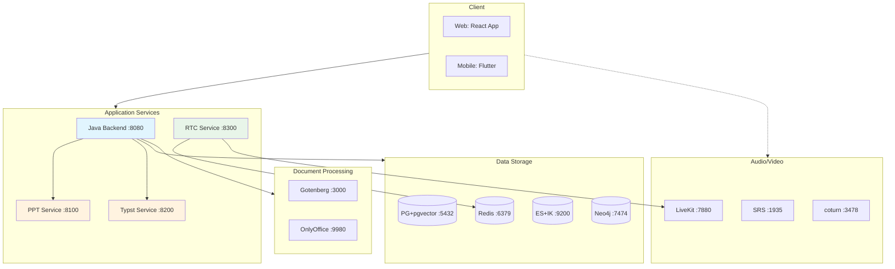
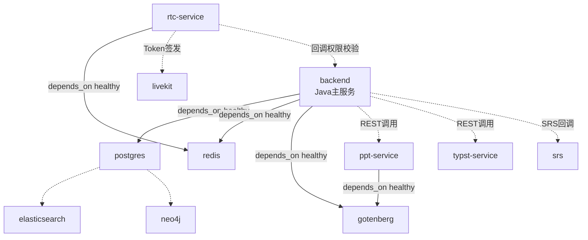
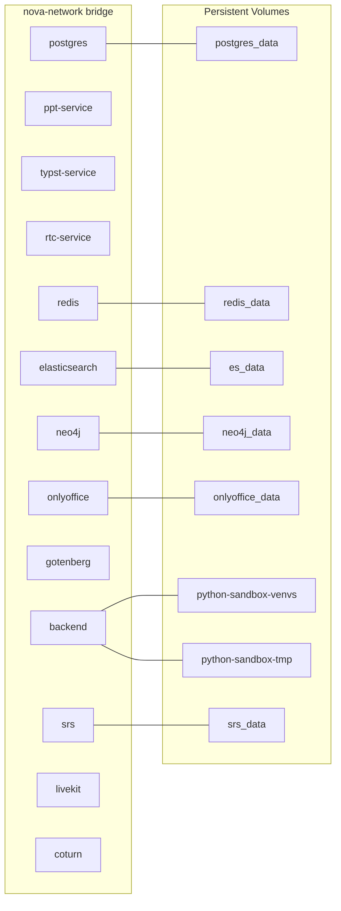

# 微服务部署架构图

## 图8-1 Docker Compose服务编排图

```mermaid
graph TB
    subgraph CLIENT [Client]
        C1["Web: React App"]
        C2["Mobile: Flutter"]
    end

    subgraph APP [Application Services]
        A1["Java Backend :8080"]
        A2["PPT Service :8100"]
        A3["Typst Service :8200"]
        A4["RTC Service :8300"]
    end

    subgraph DB [Data Storage]
        D1[("PG+pgvector :5432")]
        D2[("Redis :6379")]
        D3[("ES+IK :9200")]
        D4[("Neo4j :7474")]
    end

    subgraph DOC [Document Processing]
        E1["Gotenberg :3000"]
        E2["OnlyOffice :9980"]
    end

    subgraph AV [Audio/Video]
        F1["SRS :1935"]
        F2["LiveKit :7880"]
        F3["coturn :3478"]
    end

    CLIENT --> APP
    A1 --> DB
    A1 --> DOC
    A1 --> A2 & A3
    A4 --> D2
    A4 --> F2
    CLIENT -.-> AV

    style A1 fill:#e1f5fe
    style A4 fill:#e8f5e9
    style A2 fill:#fff3e0
    style A3 fill:#fff3e0
```

## 图8-2 服务依赖关系图

```mermaid
graph TD
    A1[backend<br/>Java主服务] -->|depends_on healthy| D1[postgres]
    A1 -->|depends_on healthy| D2[redis]
    A1 -->|depends_on healthy| E1[gotenberg]
    A2[ppt-service] -->|depends_on healthy| E1
    A4[rtc-service] -->|depends_on healthy| D2

    A1 -.->|REST调用| A2
    A1 -.->|REST调用| A3[typst-service]
    A1 -.->|SRS回调| F1[srs]
    A4 -.->|Token签发| F2[livekit]
    A4 -.->|回调权限校验| A1

    D1 -.-> D3[elasticsearch]
    D1 -.-> D4[neo4j]
```

## 图8-3 网络与数据卷

```mermaid
graph LR
    subgraph NET [nova-network bridge]
        A1[backend]
        A2[ppt-service]
        A3[typst-service]
        A4[rtc-service]
        D1[postgres]
        D2[redis]
        D3[elasticsearch]
        D4[neo4j]
        E1[gotenberg]
        E2[onlyoffice]
        F1[srs]
        F2[livekit]
        F3[coturn]
    end

    subgraph VOL [Persistent Volumes]
        V1[postgres_data]
        V2[redis_data]
        V3[es_data]
        V4[neo4j_data]
        V5[onlyoffice_data]
        V6[python-sandbox-venvs]
        V7[python-sandbox-tmp]
        V8[srs_data]
    end

    D1 --- V1
    D2 --- V2
    D3 --- V3
    D4 --- V4
    E2 --- V5
    A1 --- V6 & V7
    F1 --- V8
```
