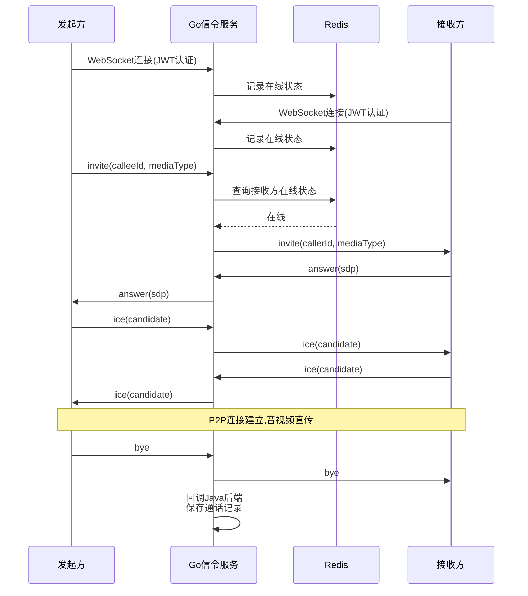
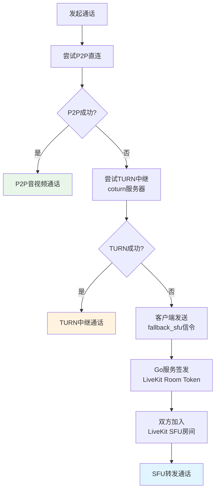
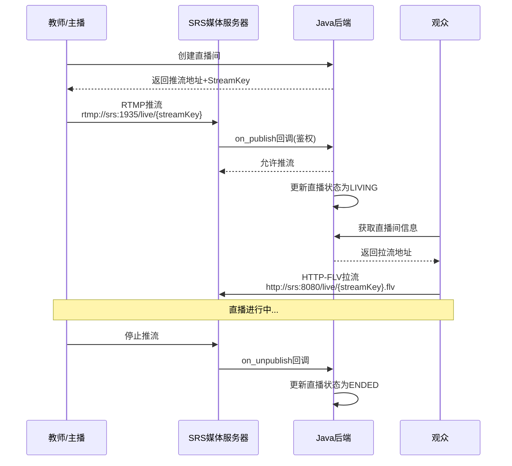

# 音视频通话信令流程图

## 图9-1 P2P通话信令流程

```mermaid
sequenceDiagram
    participant A as 发起方
    participant G as Go信令服务
    participant R as Redis
    participant B as 接收方

    A->>G: WebSocket连接(JWT认证)
    G->>R: 记录在线状态
    B->>G: WebSocket连接(JWT认证)
    G->>R: 记录在线状态

    A->>G: invite(calleeId, mediaType)
    G->>R: 查询接收方在线状态
    R-->>G: 在线
    G->>B: invite(callerId, mediaType)
    
    B->>G: answer(sdp)
    G->>A: answer(sdp)
    
    A->>G: ice(candidate)
    G->>B: ice(candidate)
    B->>G: ice(candidate)
    G->>A: ice(candidate)
    
    Note over A,B: P2P连接建立,音视频直传

    A->>G: bye
    G->>B: bye
    G->>G: 回调Java后端<br/>保存通话记录
```

## 图9-2 三级降级策略

```mermaid
flowchart TD
    A[发起通话] --> B[尝试P2P直连]
    B --> C{P2P成功?}
    C -->|是| D[P2P音视频通话]
    C -->|否| E[尝试TURN中继<br/>coturn服务器]
    E --> F{TURN成功?}
    F -->|是| G[TURN中继通话]
    F -->|否| H[客户端发送<br/>fallback_sfu信令]
    H --> I[Go服务签发<br/>LiveKit Room Token]
    I --> J[双方加入<br/>LiveKit SFU房间]
    J --> K[SFU转发通话]

    style D fill:#e8f5e9
    style G fill:#fff3e0
    style K fill:#e1f5fe
```

## 图9-3 直播推拉流架构

```mermaid
sequenceDiagram
    participant T as 教师/主播
    participant S as SRS媒体服务器
    participant J as Java后端
    participant V as 观众

    T->>J: 创建直播间
    J-->>T: 返回推流地址+StreamKey

    T->>S: RTMP推流<br/>rtmp://srs:1935/live/{streamKey}
    S->>J: on_publish回调(鉴权)
    J-->>S: 允许推流
    J->>J: 更新直播状态为LIVING

    V->>J: 获取直播间信息
    J-->>V: 返回拉流地址
    V->>S: HTTP-FLV拉流<br/>http://srs:8080/live/{streamKey}.flv

    Note over T,V: 直播进行中...

    T->>S: 停止推流
    S->>J: on_unpublish回调
    J->>J: 更新直播状态为ENDED
```
