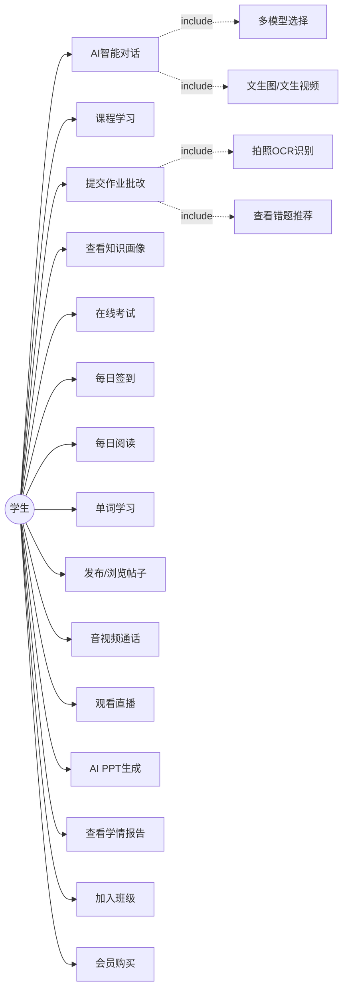
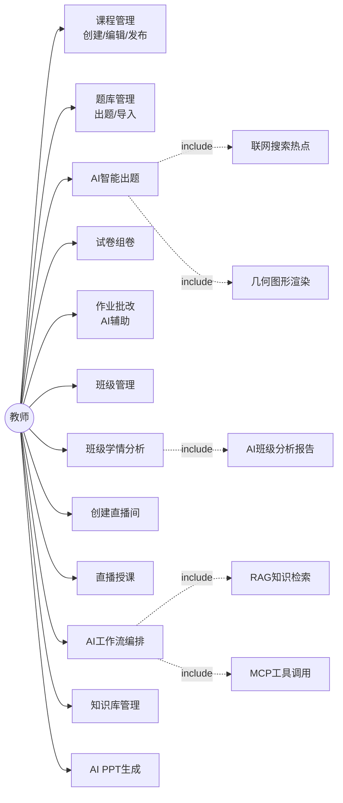
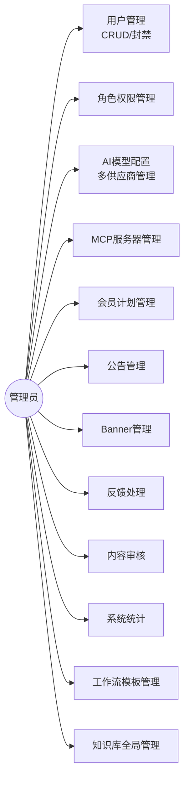

# 用例图

## 图10-1 学生用例图

```mermaid
graph LR
    S((学生))
    
    S --> UC1[AI智能对话]
    S --> UC2[课程学习]
    S --> UC3[提交作业批改]
    S --> UC4[查看知识画像]
    S --> UC5[在线考试]
    S --> UC6[每日签到]
    S --> UC7[每日阅读]
    S --> UC8[单词学习]
    S --> UC9[发布/浏览帖子]
    S --> UC10[音视频通话]
    S --> UC11[观看直播]
    S --> UC12[AI PPT生成]
    S --> UC13[查看学情报告]
    S --> UC14[加入班级]
    S --> UC15[会员购买]

    UC1 -.->|include| UC1a[多模型选择]
    UC1 -.->|include| UC1b[文生图/文生视频]
    UC3 -.->|include| UC3a[拍照OCR识别]
    UC3 -.->|include| UC3b[查看错题推荐]
```

## 图10-2 教师用例图

```mermaid
graph LR
    T((教师))
    
    T --> UC1[课程管理<br/>创建/编辑/发布]
    T --> UC2[题库管理<br/>出题/导入]
    T --> UC3[AI智能出题]
    T --> UC4[试卷组卷]
    T --> UC5[作业批改<br/>AI辅助]
    T --> UC6[班级管理]
    T --> UC7[班级学情分析]
    T --> UC8[创建直播间]
    T --> UC9[直播授课]
    T --> UC10[AI工作流编排]
    T --> UC11[知识库管理]
    T --> UC12[AI PPT生成]

    UC3 -.->|include| UC3a[联网搜索热点]
    UC3 -.->|include| UC3b[几何图形渲染]
    UC7 -.->|include| UC7a[AI班级分析报告]
    UC10 -.->|include| UC10a[RAG知识检索]
    UC10 -.->|include| UC10b[MCP工具调用]
```

## 图10-3 管理员用例图

```mermaid
graph LR
    A((管理员))
    
    A --> UC1[用户管理<br/>CRUD/封禁]
    A --> UC2[角色权限管理]
    A --> UC3[AI模型配置<br/>多供应商管理]
    A --> UC4[MCP服务器管理]
    A --> UC5[会员计划管理]
    A --> UC6[公告管理]
    A --> UC7[Banner管理]
    A --> UC8[反馈处理]
    A --> UC9[内容审核]
    A --> UC10[系统统计]
    A --> UC11[工作流模板管理]
    A --> UC12[知识库全局管理]
```
