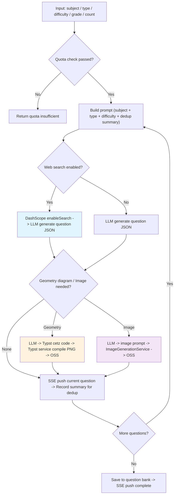
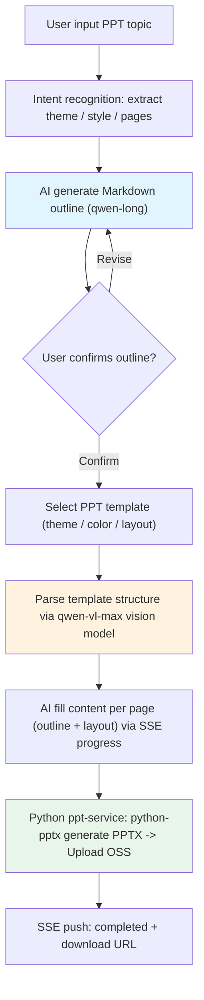
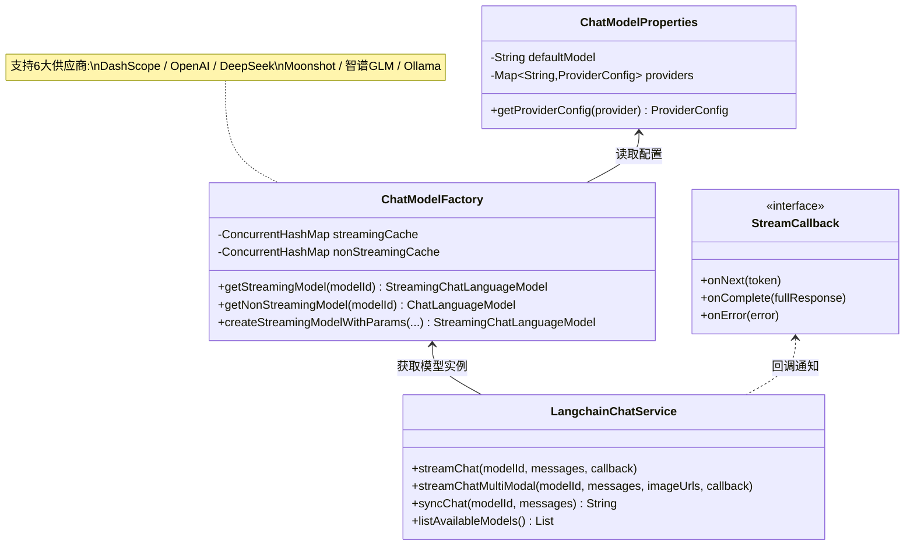

# AI出题与PPT生成流程图

## 图11-1 AI智能出题流程

```mermaid
flowchart TD
    A["Input: subject / type / difficulty / grade / count"] --> B{"Quota check passed?"}
    B -->|No| C["Return quota insufficient"]
    B -->|Yes| D["Build prompt (subject + type + difficulty + dedup summary)"]
    D --> E{"Web search enabled?"}
    E -->|Yes| F["DashScope enableSearch -> LLM generate question JSON"]
    E -->|No| G["LLM generate question JSON"]
    F & G --> H{"Geometry diagram / Image needed?"}
    H -->|Geometry| I["LLM -> Typst cetz code -> Typst service compile PNG -> OSS"]
    H -->|Image| J["LLM -> image prompt -> ImageGenerationService -> OSS"]
    H -->|None| K["SSE push current question -> Record summary for dedup"]
    I & J --> K
    K --> L{"More questions?"}
    L -->|Yes| D
    L -->|No| M["Save to question bank -> SSE push complete"]

    style F fill:#e1f5fe
    style I fill:#fff3e0
    style J fill:#f3e5f5
```

## 图11-2 AI PPT生成多步骤流程

```mermaid
flowchart TD
    A["User input PPT topic"] --> B["Intent recognition: extract theme / style / pages"]
    B --> C["AI generate Markdown outline (qwen-long)"]
    C --> D{"User confirms outline?"}
    D -->|Revise| C
    D -->|Confirm| E["Select PPT template (theme / color / layout)"]
    E --> F["Parse template structure via qwen-vl-max vision model"]
    F --> G["AI fill content per page (outline + layout) via SSE progress"]
    G --> H["Python ppt-service: python-pptx generate PPTX -> Upload OSS"]
    H --> I["SSE push: completed + download URL"]

    style C fill:#e1f5fe
    style F fill:#fff3e0
    style H fill:#e8f5e9
```

## 图11-3 多模型适配层类图

```mermaid
classDiagram
    class ChatModelProperties {
        -String defaultModel
        -Map~String,ProviderConfig~ providers
        +getProviderConfig(provider) ProviderConfig
    }
    
    class ChatModelFactory {
        -ConcurrentHashMap streamingCache
        -ConcurrentHashMap nonStreamingCache
        +getStreamingModel(modelId) StreamingChatLanguageModel
        +getNonStreamingModel(modelId) ChatLanguageModel
        +createStreamingModelWithParams(...) StreamingChatLanguageModel
    }
    
    class LangchainChatService {
        +streamChat(modelId, messages, callback)
        +streamChatMultiModal(modelId, messages, imageUrls, callback)
        +syncChat(modelId, messages) String
        +listAvailableModels() List
    }
    
    class StreamCallback {
        <<interface>>
        +onNext(token)
        +onComplete(fullResponse)
        +onError(error)
    }

    ChatModelProperties <-- ChatModelFactory : 读取配置
    ChatModelFactory <-- LangchainChatService : 获取模型实例
    StreamCallback <.. LangchainChatService : 回调通知
    
    note for ChatModelFactory "支持6大供应商:\nDashScope / OpenAI / DeepSeek\nMoonshot / 智谱GLM / Ollama"
```
