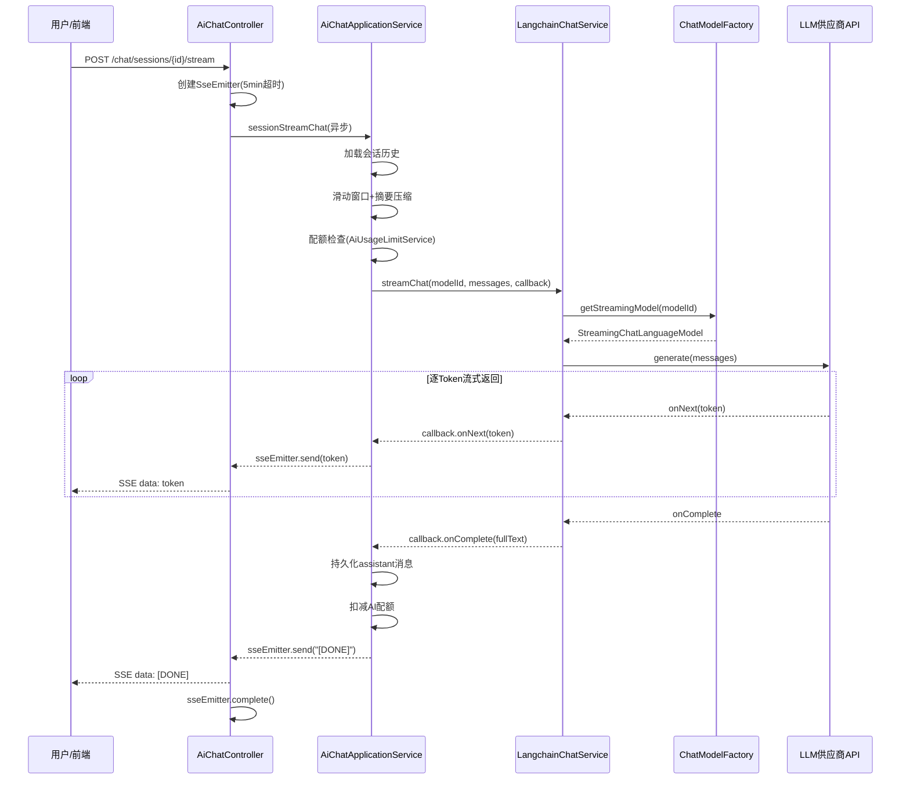
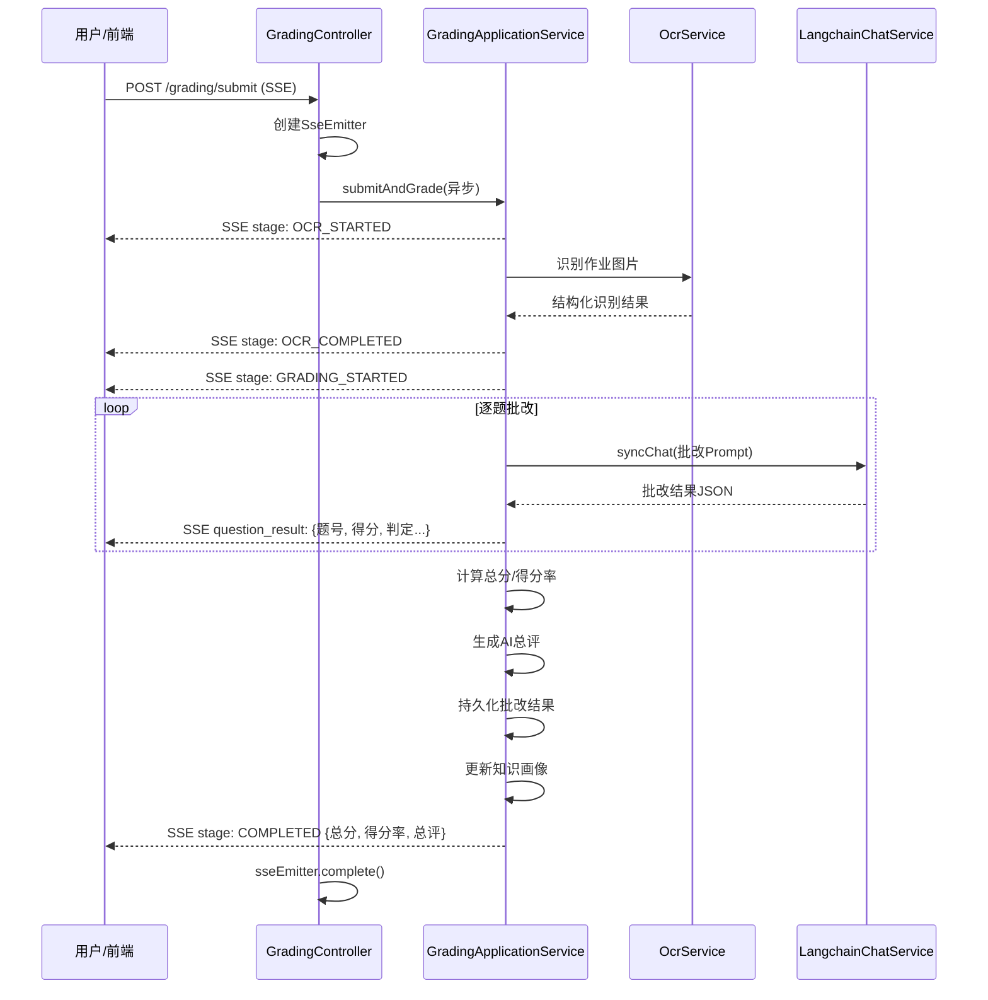
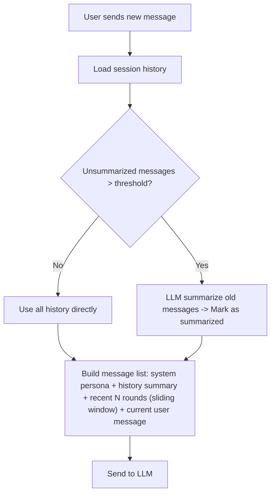

# SSE流式交互时序图

## 图12-1 AI对话SSE流式时序图

```mermaid
sequenceDiagram
    participant U as 用户/前端
    participant C as AiChatController
    participant S as AiChatApplicationService
    participant L as LangchainChatService
    participant F as ChatModelFactory
    participant M as LLM供应商API

    U->>C: POST /chat/sessions/{id}/stream
    C->>C: 创建SseEmitter(5min超时)
    C->>S: sessionStreamChat(异步)
    
    S->>S: 加载会话历史
    S->>S: 滑动窗口+摘要压缩
    S->>S: 配额检查(AiUsageLimitService)
    S->>L: streamChat(modelId, messages, callback)
    L->>F: getStreamingModel(modelId)
    F-->>L: StreamingChatLanguageModel
    L->>M: generate(messages)
    
    loop 逐Token流式返回
        M-->>L: onNext(token)
        L-->>S: callback.onNext(token)
        S-->>C: sseEmitter.send(token)
        C-->>U: SSE data: token
    end
    
    M-->>L: onComplete
    L-->>S: callback.onComplete(fullText)
    S->>S: 持久化assistant消息
    S->>S: 扣减AI配额
    S-->>C: sseEmitter.send("[DONE]")
    C-->>U: SSE data: [DONE]
    C->>C: sseEmitter.complete()
```

## 图12-2 智能批改SSE时序图

```mermaid
sequenceDiagram
    participant U as 用户/前端
    participant C as GradingController
    participant G as GradingApplicationService
    participant O as OcrService
    participant L as LangchainChatService

    U->>C: POST /grading/submit (SSE)
    C->>C: 创建SseEmitter
    C->>G: submitAndGrade(异步)
    
    G-->>U: SSE stage: OCR_STARTED
    G->>O: 识别作业图片
    O-->>G: 结构化识别结果
    G-->>U: SSE stage: OCR_COMPLETED
    
    G-->>U: SSE stage: GRADING_STARTED
    
    loop 逐题批改
        G->>L: syncChat(批改Prompt)
        L-->>G: 批改结果JSON
        G-->>U: SSE question_result: {题号, 得分, 判定...}
    end
    
    G->>G: 计算总分/得分率
    G->>G: 生成AI总评
    G->>G: 持久化批改结果
    G->>G: 更新知识画像
    G-->>U: SSE stage: COMPLETED {总分, 得分率, 总评}
    C->>C: sseEmitter.complete()
```

## 图12-3 AI对话记忆策略示意图

```mermaid
flowchart TD
    A["User sends new message"] --> B["Load session history"]
    B --> C{"Unsummarized messages > threshold?"}
    C -->|No| D["Use all history directly"]
    C -->|Yes| E["LLM summarize old messages -> Mark as summarized"]
    D & E --> F["Build message list: system persona + history summary + recent N rounds (sliding window) + current user message"]
    F --> G["Send to LLM"]
```
