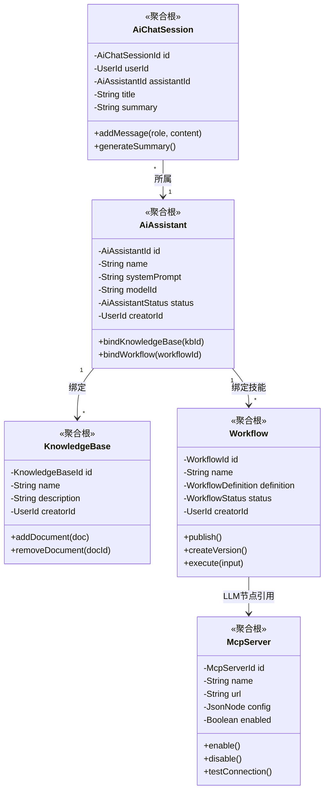
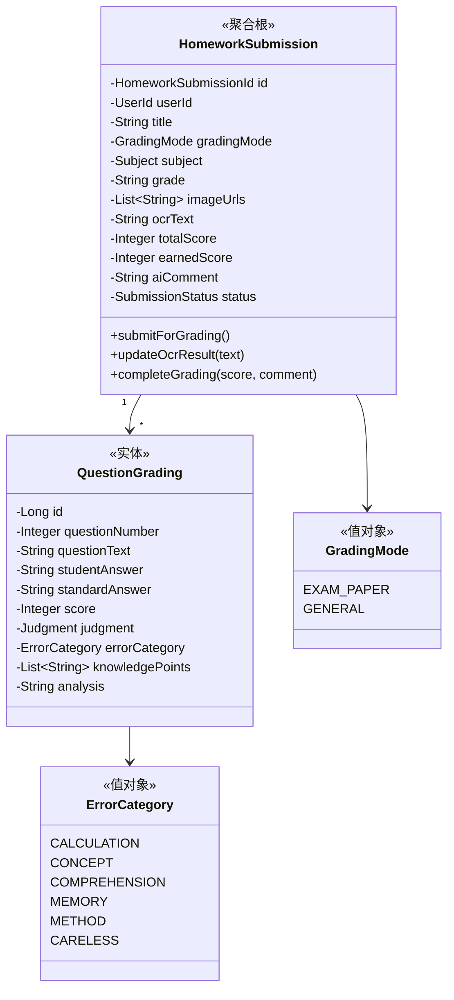

# 领域模块划分图

## 图13-1 DDD领域模块全景图

```mermaid
graph TB
    subgraph 核心域
        A1[ai<br/>AI助手/聊天/工作流/MCP]
        A2[grading<br/>智能批改/知识画像]
        A3[exam<br/>题库/试卷/考试]
        A4[course<br/>课程/章节/视频]
    end

    subgraph 支撑域
        B1[user<br/>注册/登录/信息]
        B2[membership<br/>会员/配额]
        B3[clazz<br/>班级/成员]
        B4[teacher<br/>教师认证]
        B5[order<br/>订单管理]
        B6[payment<br/>支付网关]
    end

    subgraph 通用域
        C1[file<br/>OSS文件上传]
        C2[analytics<br/>学情分析]
        C3[social<br/>关注/粉丝]
        C4[post<br/>帖子/评论]
        C5[book<br/>电子书/向量]
        C6[livestream<br/>直播间/弹幕]
        C7[ppt<br/>PPT生成]
        C8[dailylearning<br/>阅读/单词]
        C9[checkin<br/>签到打卡]
        C10[knowledge<br/>知识点]
        C11[schedule<br/>课程表]
        C12[recommendation<br/>推荐]
    end

    subgraph 通用域-系统
        D1[announcement<br/>公告]
        D2[banner<br/>轮播图]
        D3[feedback<br/>意见反馈]
        D4[event<br/>领域事件]
        D5[scraper<br/>内容抓取]
        D6[progress<br/>学习进度]
    end

    A1 --> B2
    A2 --> A3
    A2 --> B2
    A4 --> D6
    C2 --> B3
    C6 --> B3
```

## 图13-2 AI域聚合根与值对象

```mermaid
classDiagram
    class AiAssistant {
        <<聚合根>>
        -AiAssistantId id
        -String name
        -String systemPrompt
        -String modelId
        -AiAssistantStatus status
        -UserId creatorId
        +bindKnowledgeBase(kbId)
        +bindWorkflow(workflowId)
    }
    
    class AiChatSession {
        <<聚合根>>
        -AiChatSessionId id
        -UserId userId
        -AiAssistantId assistantId
        -String title
        -String summary
        +addMessage(role, content)
        +generateSummary()
    }
    
    class KnowledgeBase {
        <<聚合根>>
        -KnowledgeBaseId id
        -String name
        -String description
        -UserId creatorId
        +addDocument(doc)
        +removeDocument(docId)
    }
    
    class Workflow {
        <<聚合根>>
        -WorkflowId id
        -String name
        -WorkflowDefinition definition
        -WorkflowStatus status
        -UserId creatorId
        +publish()
        +createVersion()
        +execute(input)
    }
    
    class McpServer {
        <<聚合根>>
        -McpServerId id
        -String name
        -String url
        -JsonNode config
        -Boolean enabled
        +enable()
        +disable()
        +testConnection()
    }

    AiAssistant "1" --> "*" KnowledgeBase : 绑定
    AiAssistant "1" --> "*" Workflow : 绑定技能
    AiChatSession "*" --> "1" AiAssistant : 所属
    Workflow --> McpServer : LLM节点引用
```

## 图13-3 批改域聚合设计

```mermaid
classDiagram
    class HomeworkSubmission {
        <<聚合根>>
        -HomeworkSubmissionId id
        -UserId userId
        -String title
        -GradingMode gradingMode
        -Subject subject
        -String grade
        -List~String~ imageUrls
        -String ocrText
        -Integer totalScore
        -Integer earnedScore
        -String aiComment
        -SubmissionStatus status
        +submitForGrading()
        +updateOcrResult(text)
        +completeGrading(score, comment)
    }

    class QuestionGrading {
        <<实体>>
        -Long id
        -Integer questionNumber
        -String questionText
        -String studentAnswer
        -String standardAnswer
        -Integer score
        -Judgment judgment
        -ErrorCategory errorCategory
        -List~String~ knowledgePoints
        -String analysis
    }

    class GradingMode {
        <<值对象>>
        EXAM_PAPER
        GENERAL
    }

    class ErrorCategory {
        <<值对象>>
        CALCULATION
        CONCEPT
        COMPREHENSION
        MEMORY
        METHOD
        CARELESS
    }

    HomeworkSubmission "1" --> "*" QuestionGrading
    HomeworkSubmission --> GradingMode
    QuestionGrading --> ErrorCategory
```
